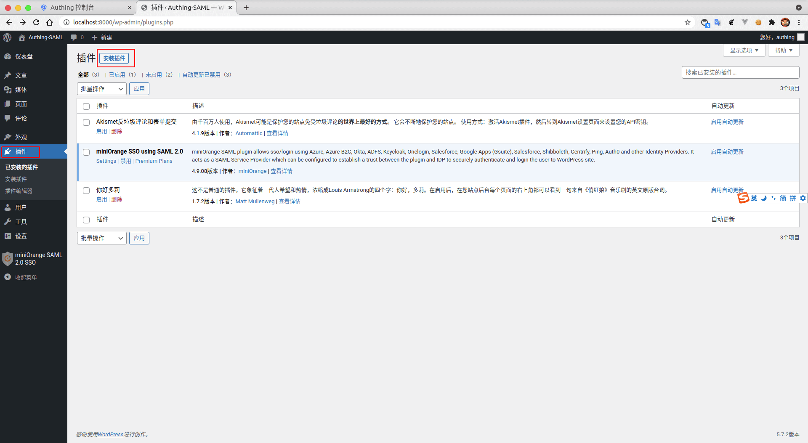
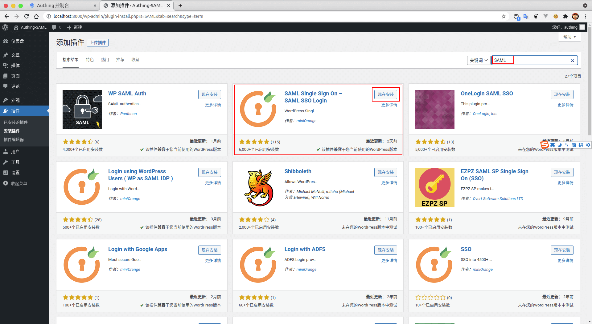
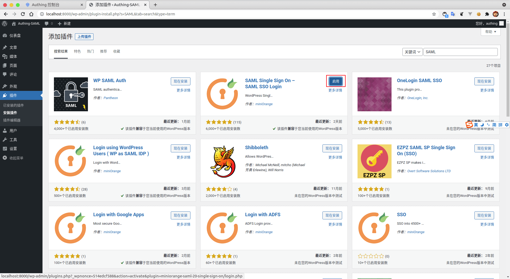
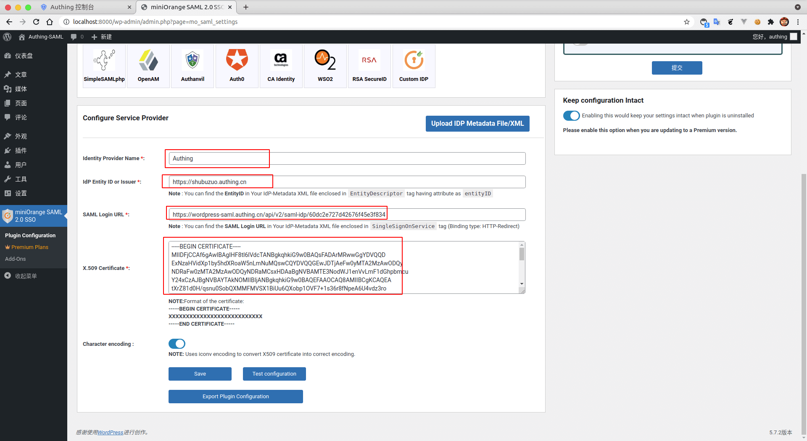
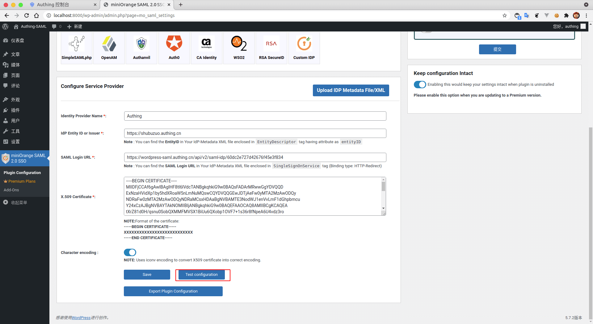
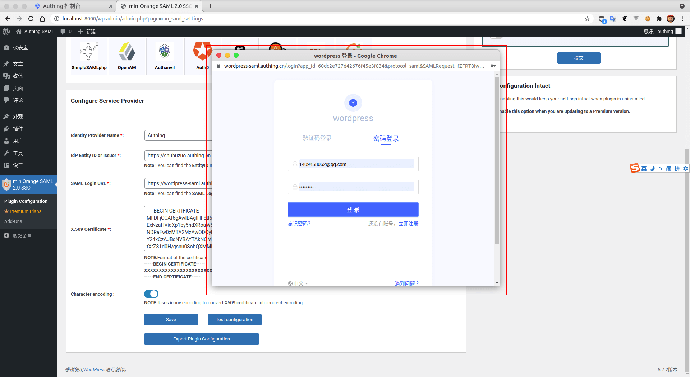
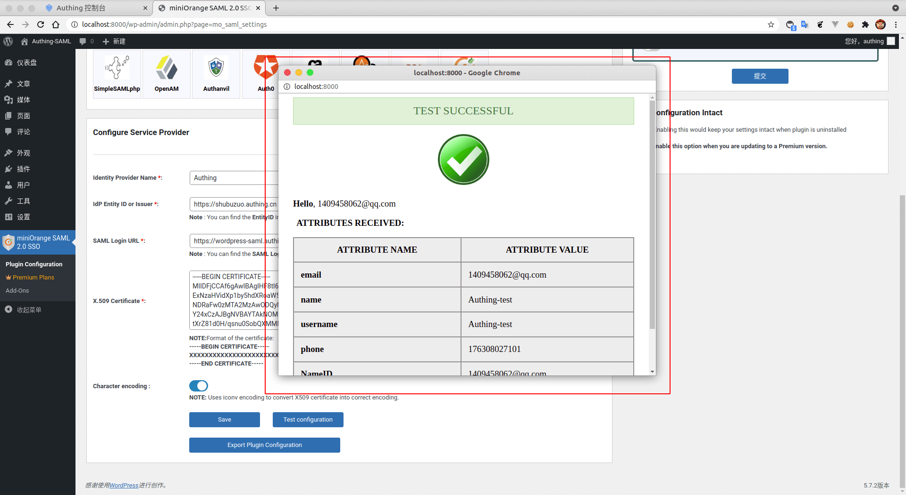
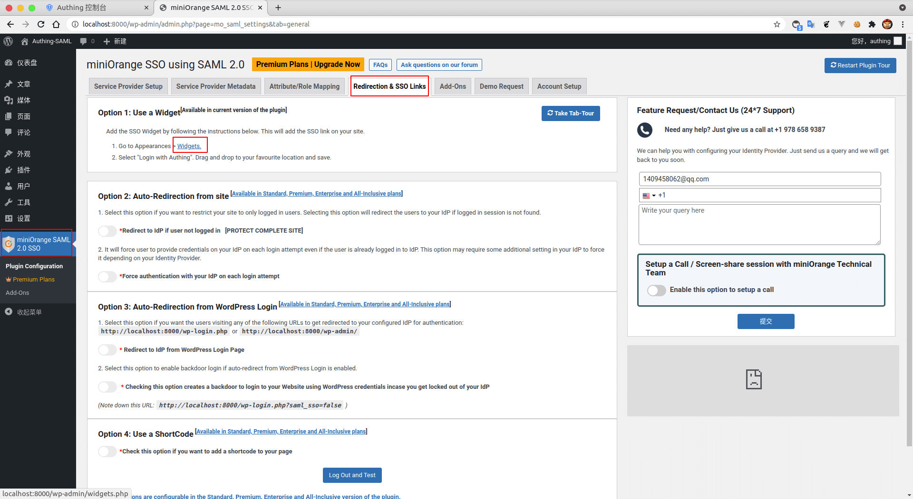
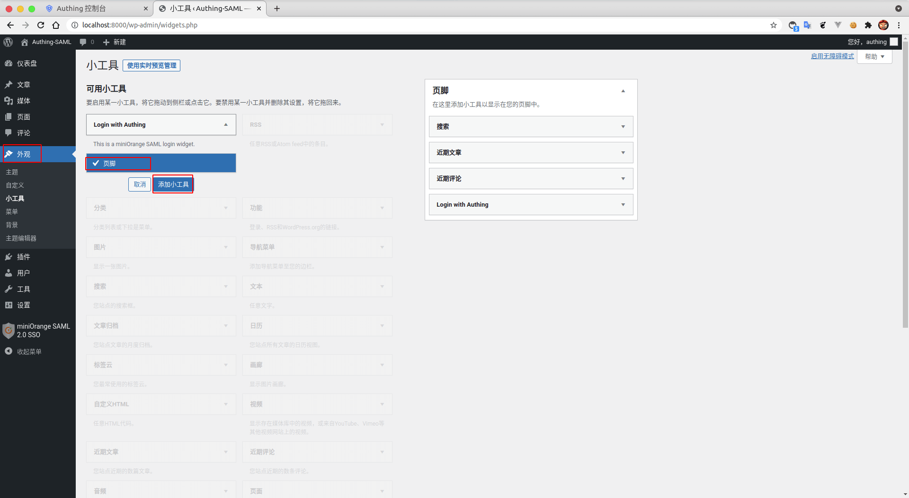

<IntegrationDetailCard title="Configure Wordpress SSO login">

Configuring Wordpress SSO login, you need to have administrator privileges. Enter **Management Console**, enter the **plugin**, find **installation plugin**.

Search box Enter keywords `SAML`, Enter to search,`Select` Sequel insert, and do **installation**.

**Enable** current plugin.

Fill in {{$localeConfig.brandName}} **Identity Provider Name** 、**IdP Entity ID or Issuer**、**SAML Login URL**; additional, will download **SAML visa book**, copy its contents to **X.509 Certificate**.

click **Test configuration**, Configure the configuration test.

Pop up `verification window`, fill in the `correspondence account information`.

Complete `test`.

**Save** deploy

**choose** `miniOrange SAML 2.0 SSO`, enter `Redirection & SSO Link`， **click** `Widgets`。

**enter** appearance, view **Login with Authing**, Expand view components, add it to **Footage**, completed`Add`.

Use **Real-time preview management**.

View the correspondence `component`.

</IntegrationDetailCard>
