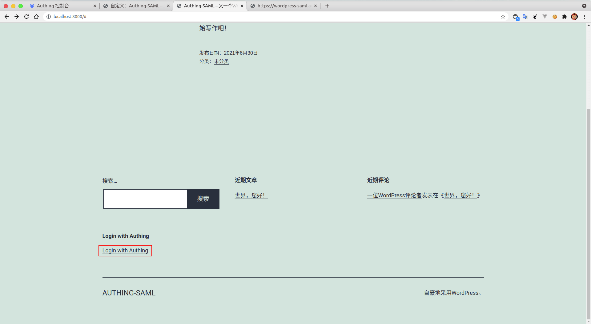
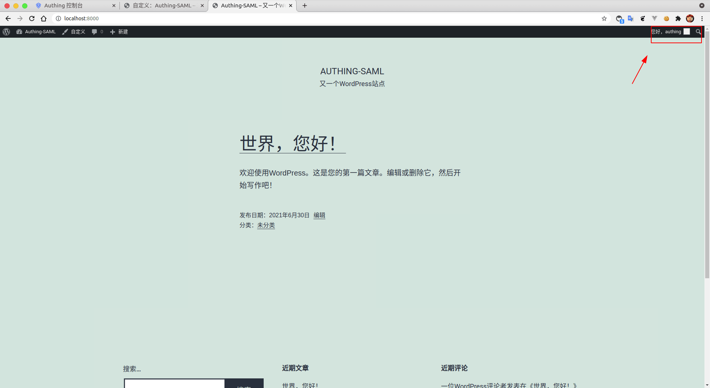

<IntegrationDetailCard title="Experience login">

Complete the `current user` logout in **Wordpress**.

Fill in the user-related information, click **login**.

**SAML login successful**。

</IntegrationDetailCard>
