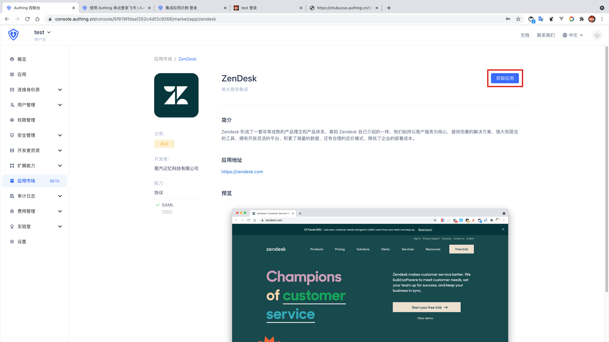
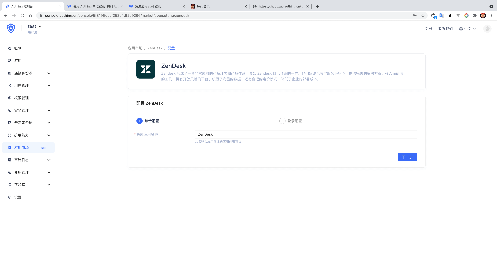
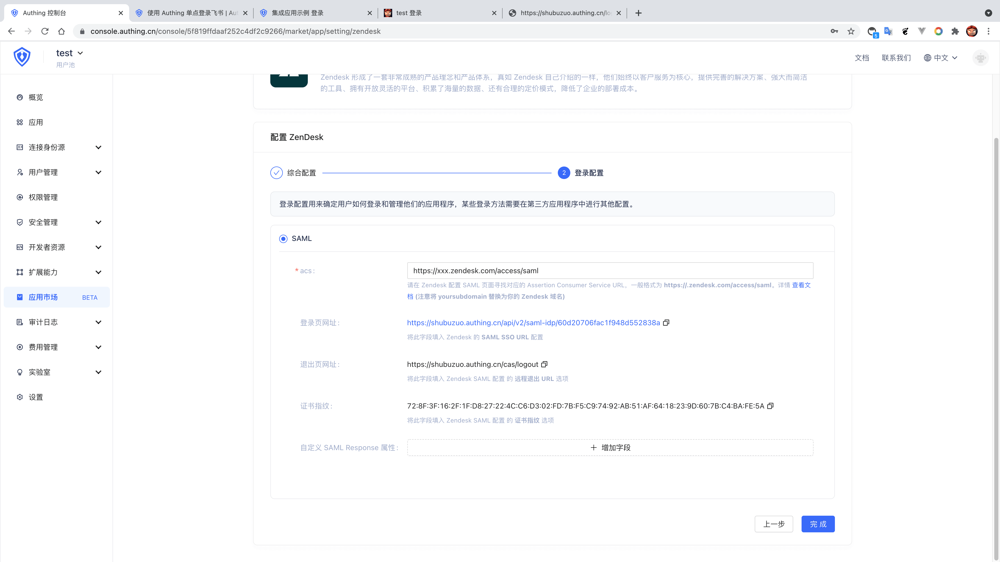
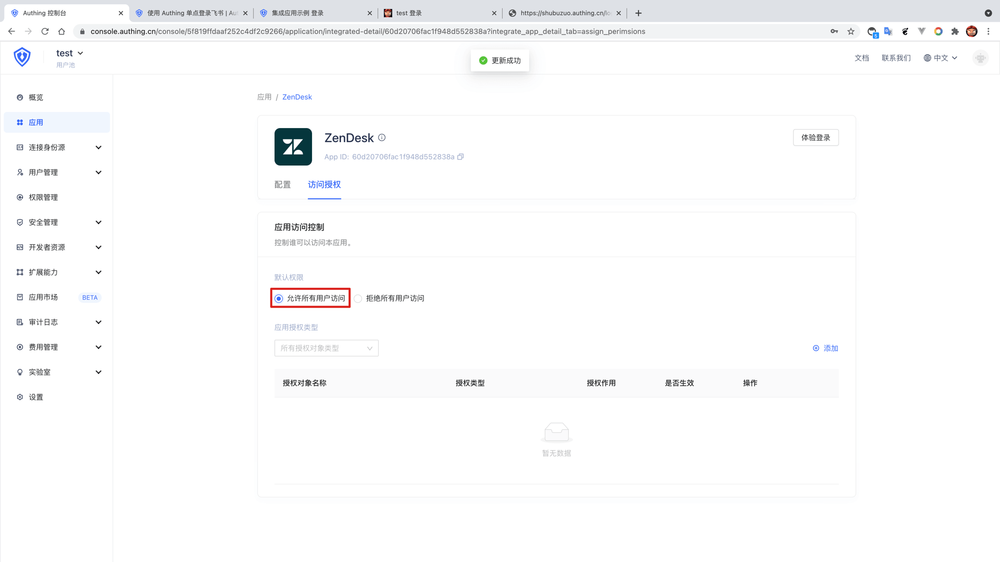
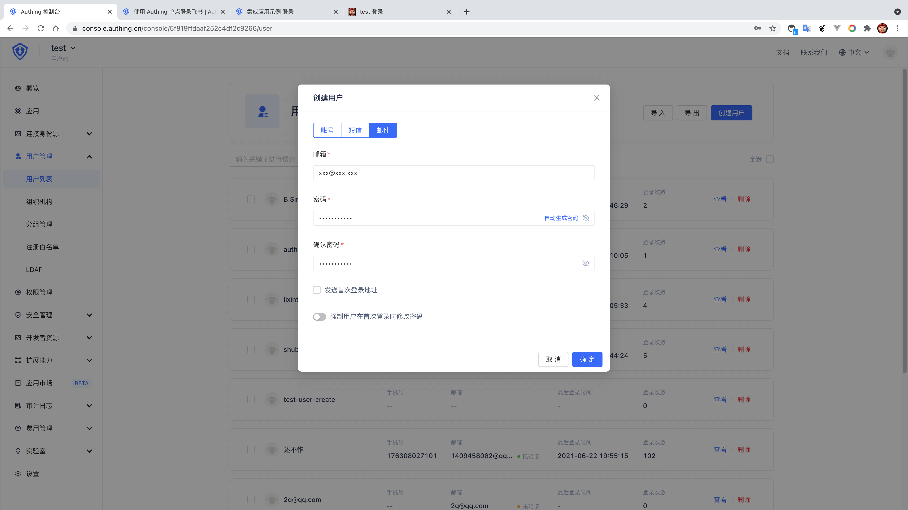

<IntegrationDetailCard :title="`Create an app in ${$localeConfig.brandName}`">

Enter[**console**](https://console.authing.cn) > **Application market**, turn up **ZenDesk**, Click to enter the details, then click Get Apply.

Enter the app name and click Next.

Enter your **ACS**, **SAML SSO consumer service URL** the general format is **https://<your_sub_doamin>/access/saml**, at the same time「**Copy certificate fingerprint**」.

Click Finish, click "Allow all user access" on the Access Authorization Page.

Then return to the user list, create a **mailbox already exists in the Zendesk team**.

</IntegrationDetailCard>
