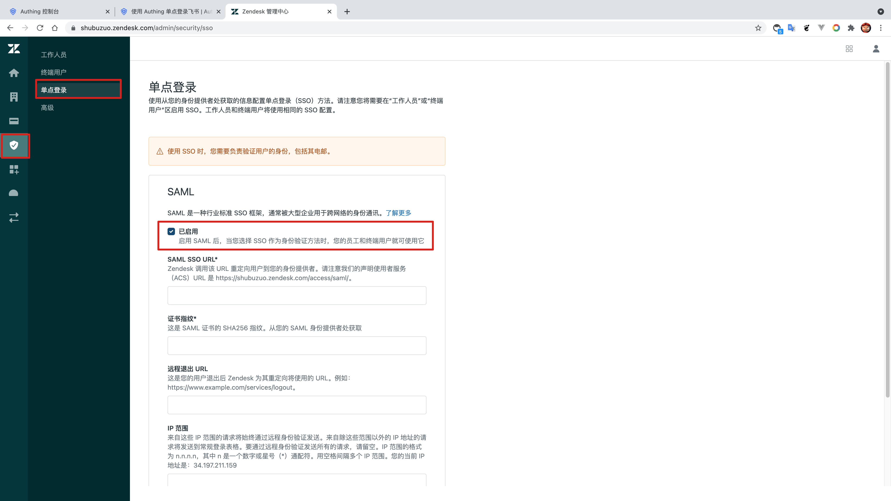
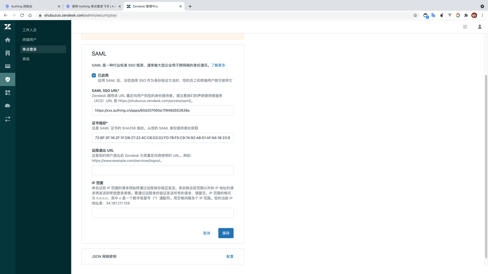
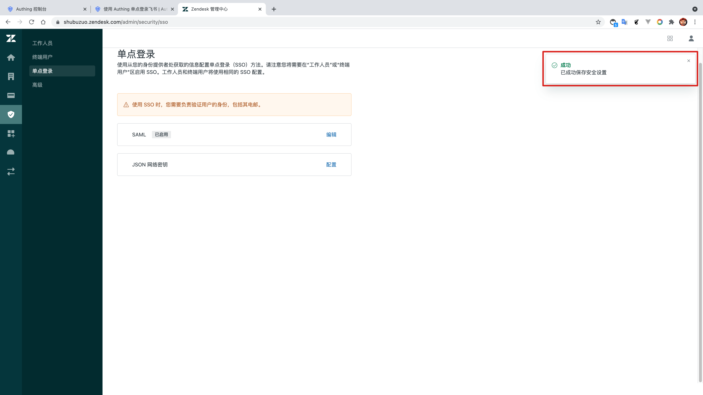
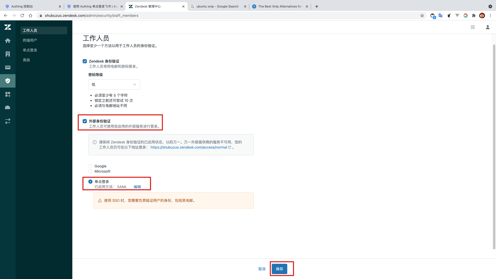

<IntegrationDetailCard title="Configure ZenDesk SSO login">

Configure ZenDesk SSO login, you need to have administrator privileges. Enter the **management station**, click **security**, find **single sign-on** -> **SAML**, enable **SAML single sign-on**.

Fill in {{$localeConfig.brandName}} **SAML SSO URL**; additional, copy **certificate fingerprint**, paste to **ZenDesk certificate fingerprint**, click "Save".

**Saved successfully**。

Enter**Management station**, Click **Safety**, turn up **staff member** -> **external authentication** -> **sign in**, Confirm the selection in turn **External authentication**, **sign in**.

</IntegrationDetailCard>
