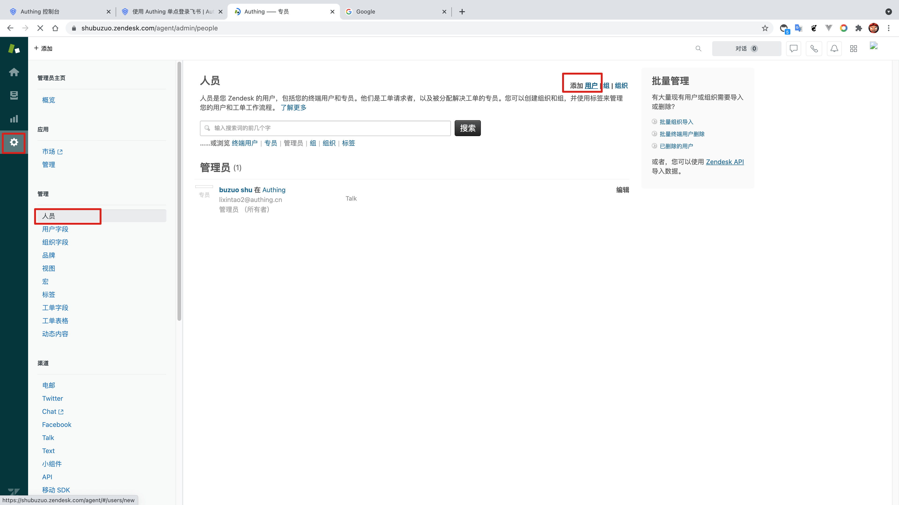
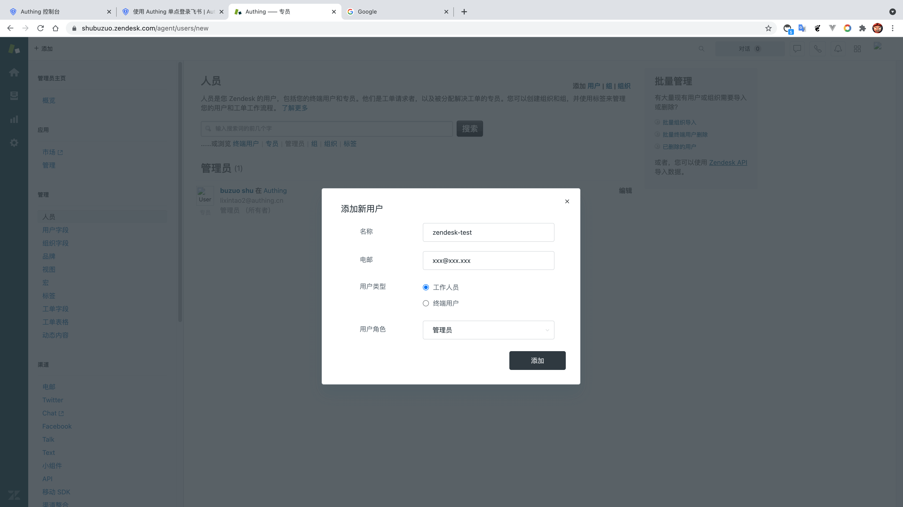
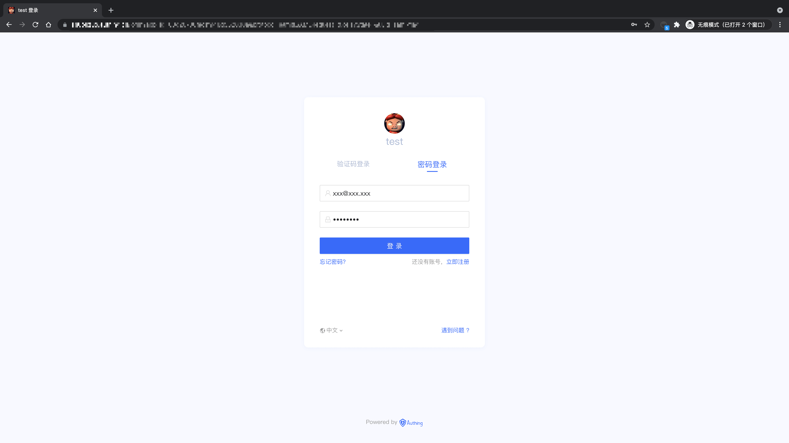
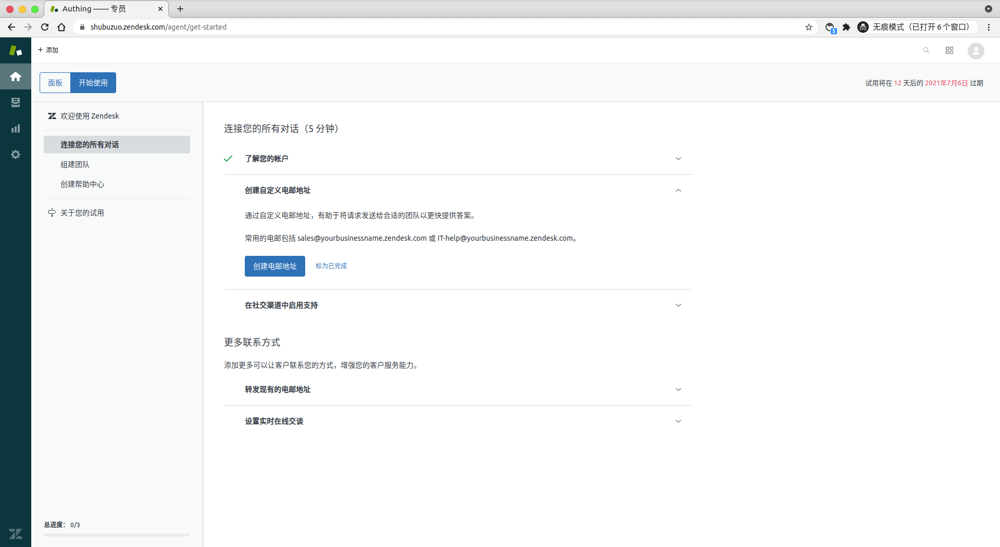

<IntegrationDetailCard title="Experience login">

Enter **ZenDesk**, choose **set up** -> **manage** -> **personnel**, conduct **Add user** operate.

Select the corresponding role for the user, complete the **user added**.

Copy the application access link, open in the new browser stealth window.

Enter **Authing** log in page.

You can successfully log in to **Zendesk** in the user account password created before the login interface.

</IntegrationDetailCard>
