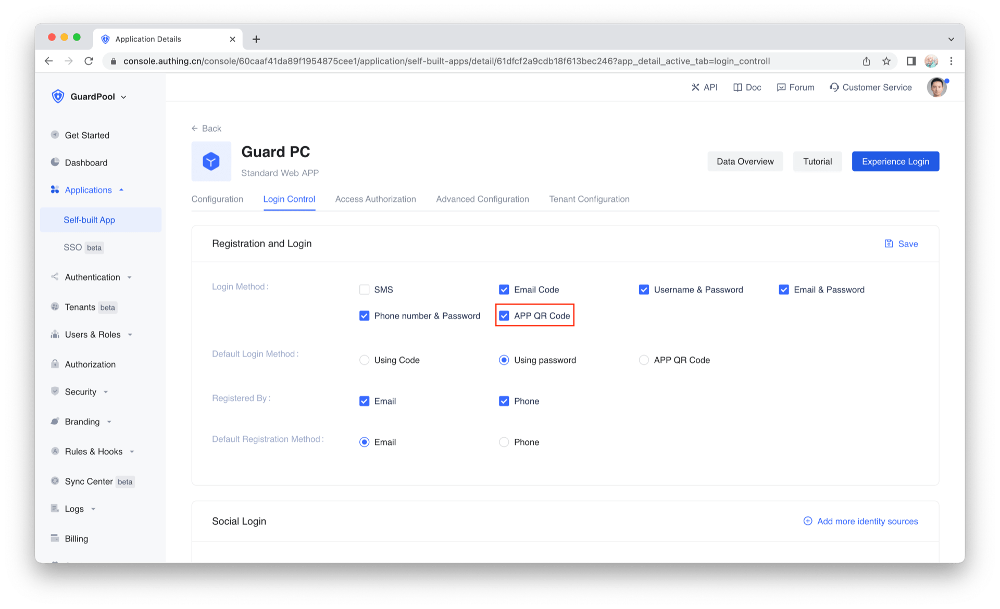
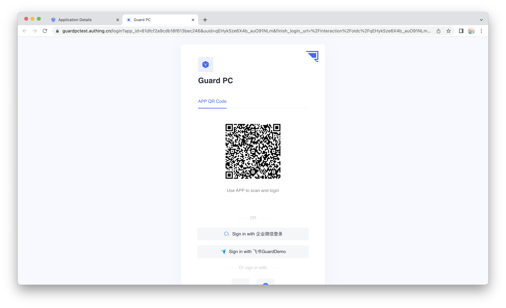

# Scan API

<LastUpdated/>

To use scan to login functionality, please check 'APP QR Code' at our console.



When web application needs to authenticate user, a QR code will be popped up:



The QR code has the following data structure：

```json
{
    "scene": "APP_AUTH",
    "random": "5e05f0c57fde537d950f7da5",
    "userPoolId": "5e04ae0d5f3cee22fb37612b",
    "createdAt": "2019-12-27T11:53:41.260Z",
    "expireAt": "2019-12-27T11:55:41.260Z"
}
```

In your mobile App, first make sure user is already logged in, then call following API when scan to login is requried:

## Mark QR code

When this API succeed, the web login page will show user picture on top of the QR code


```java
public static void markQRCodeScanned(String ticket, @NotNull AuthCallback<JSONObject> callback)
```

**param**

* *ticket* the random field in the QR code data

**example**

```java
AuthClient.markQRCodeScanned(random, (code, message, data) -> {
    if (code == 200) {
        // notify user to authorize
    }
});
```

**error**

* 500 invalid QR code
* 2020 not logged

<br>

## Confirm log in by QR code

This API do the actual login. The reason we split it into two steps is that right after scanning and marking, the mobile app can show a dialog, asking user to confirm the authentication.

>Note: Before calling this API, you must first call [Mark QR code](#mark-qr-code)


```java
public static void loginByScannedTicket(String ticket, @NotNull AuthCallback<JSONObject> callback)
```

**param**

* *ticket* the random field in the QR code data

**example**

```java
AuthClient.loginByScannedTicket(random, (code, message, data) -> {
    if (code == 200) {
        // logged in
    }
});
```

**error**

* 500 invalid QR code
* 2020 not logged

<br>
