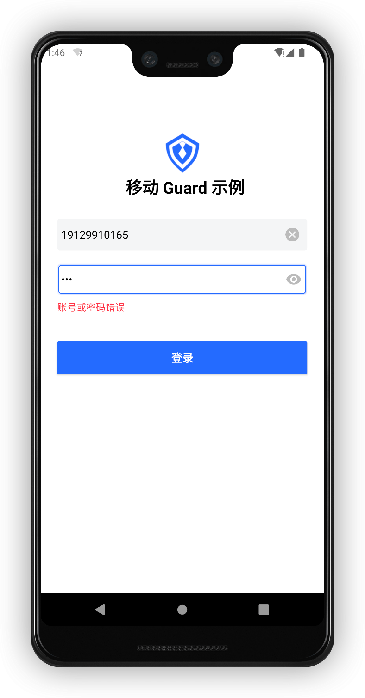
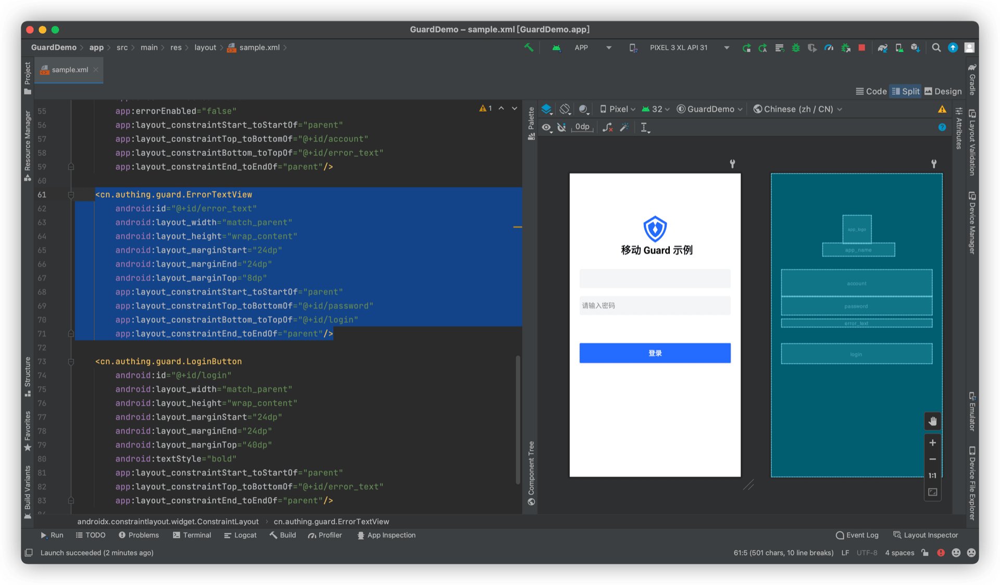

# ErrorTextView

<LastUpdated/>

此组件可以 Use 红色字体显示认证过程中的错误信息。Guard 内部所有其他组件都会尝试将错误信息设置给 ErrorTextView。

> 给定页面只能有一个 ErrorTextView。如果出现多个，只有第一个组件有效。

## 示例



## 创建

放置一个 ErrorTextView

```xml
<cn.authing.guard.ErrorTextView
    android:id="@+id/error_text"
    android:layout_width="match_parent"
    android:layout_height="wrap_content"
    android:layout_marginStart="24dp"
    android:layout_marginEnd="24dp"
    android:layout_marginTop="8dp"
    app:layout_constraintStart_toStartOf="parent"
    app:layout_constraintTop_toBottomOf="@+id/password"
    app:layout_constraintBottom_toTopOf="@+id/login"
    app:layout_constraintEnd_toEndOf="parent"/>
```


