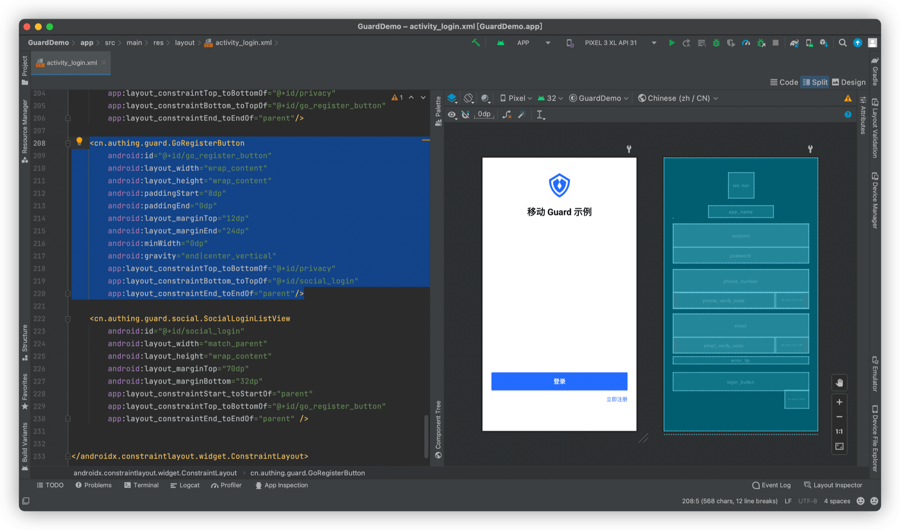

# 登录注册转场

<LastUpdated/>

阅读此教程之前，确保已经完成了 [开发准备](/reference/sdk-for-android/quick.md)、[基础登录示例](./basic-login.md)、[基础注册示例](./basic-register.md)

## 在 xml 上放置超组件

在自定义的登录布局中放置 GoRegisterButton



## Use AuthFlow 启动登录界面

Use AuthFlow 设置自定义的登录布局启动，并设置自定义的注册布局

```java
AuthFlow authFlow = AuthFlow.start(this, R.layout.login);
authFlow.setRegisterLayoutId(R.layout.register);
```

## 运行


GoRegisterButton 除了提供默认的视觉效果以及国际化的文字，还可以根据控制台设置自动隐藏。[查看详情](./../basic/go-register-button.md)
