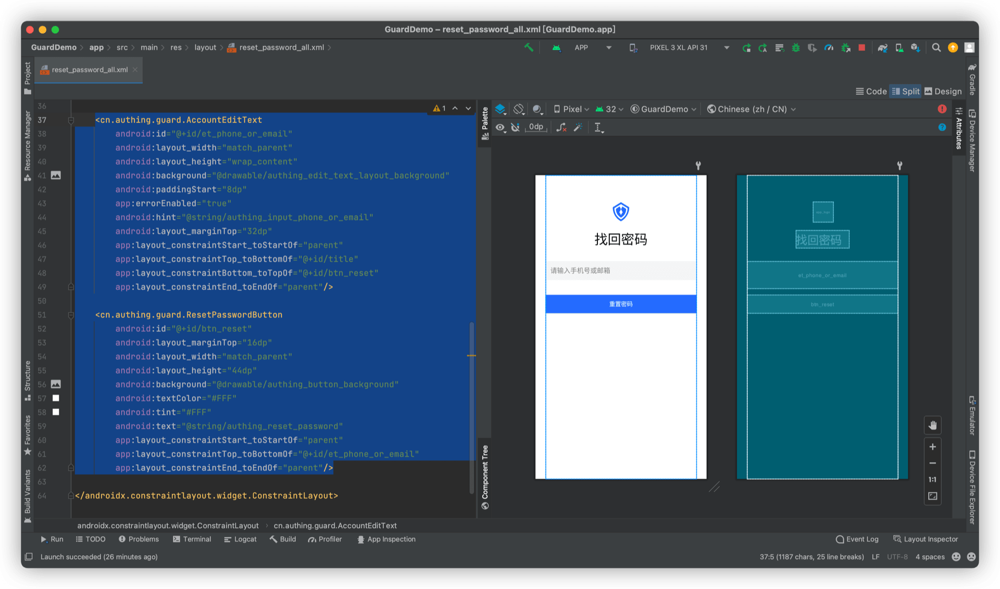

# 动态重置密码

<LastUpdated/>

阅读此教程之前，确保已经完成了 [开发准备](/reference/sdk-for-android/develop.md)、[手机号码重置密码](./reset-password-by-phone.md)、[邮箱地址重置密码](./reset-password-by-email.md)

为了方便用户 Use ，我们设计一个稍微复杂一点的重置密码流程。我们将根据用户的输入动态决定采用哪种方式重置密码。即：

- 如果用户输入了电话号码，则跳转到手机号码重置密码界面
- 如果用户输入了邮箱地址，则跳转到邮箱地址重置密码界面

## 界面设计

新增一个导航入口页面，放置 AccountEditText、ResetPasswordButton，如下图：



## 完成

重置密码的流程和界面就开发完了，可以根据用户的输入跳转到不同的页面，入口页面的帐号信息也会被带入到二级页面。

这是一个业务功能相对复杂的例子，通过 Guard 超组件，我们完成了快速构建。

## 完整示例代码

```xml
<?xml version="1.0" encoding="utf-8"?>
<androidx.constraintlayout.widget.ConstraintLayout
    xmlns:android="http://schemas.android.com/apk/res/android"
    xmlns:app="http://schemas.android.com/apk/res-auto"
    android:layout_width="match_parent"
    android:layout_height="match_parent"
    android:layout_marginStart="24dp"
    android:layout_marginEnd="24dp">

    <cn.authing.guard.AppLogo
        android:id="@+id/app_logo"
        android:layout_width="48dp"
        android:layout_height="48dp"
        android:layout_marginTop="64dp"
        android:layout_gravity="center_horizontal"
        app:layout_constraintStart_toStartOf="parent"
        app:layout_constraintEnd_toEndOf="parent"
        app:layout_constraintTop_toTopOf="parent"
        app:layout_constraintBottom_toTopOf="@+id/title"
        app:layout_constraintVertical_chainStyle="packed"
        android:src="@drawable/ic_authing_default_logo"/>

    <TextView
        android:id="@+id/title"
        android:layout_width="wrap_content"
        android:layout_height="wrap_content"
        android:text="@string/authing_find_password_back"
        android:textColor="#000"
        android:textSize="32sp"
        android:layout_gravity="center_horizontal"
        android:layout_marginTop="20dp"
        app:layout_constraintStart_toStartOf="parent"
        app:layout_constraintTop_toBottomOf="@+id/app_logo"
        app:layout_constraintBottom_toTopOf="@+id/et_phone_or_email"
        app:layout_constraintEnd_toEndOf="parent"/>

    <cn.authing.guard.AccountEditText
        android:id="@+id/et_phone_or_email"
        android:layout_width="match_parent"
        android:layout_height="wrap_content"
        android:background="@drawable/authing_edit_text_layout_background"
        android:paddingStart="8dp"
        app:errorEnabled="true"
        android:hint="@string/authing_input_phone_or_email"
        android:layout_marginTop="32dp"
        app:layout_constraintStart_toStartOf="parent"
        app:layout_constraintTop_toBottomOf="@+id/title"
        app:layout_constraintBottom_toTopOf="@+id/btn_reset"
        app:layout_constraintEnd_toEndOf="parent"/>

    <cn.authing.guard.ResetPasswordButton
        android:id="@+id/btn_reset"
        android:layout_marginTop="16dp"
        android:layout_width="match_parent"
        android:layout_height="44dp"
        android:background="@drawable/authing_button_background"
        android:textColor="#FFF"
        android:tint="#FFF"
        android:text="@string/authing_reset_password"
        app:layout_constraintStart_toStartOf="parent"
        app:layout_constraintTop_toBottomOf="@+id/et_phone_or_email"
        app:layout_constraintEnd_toEndOf="parent"/>

</androidx.constraintlayout.widget.ConstraintLayout>
```
