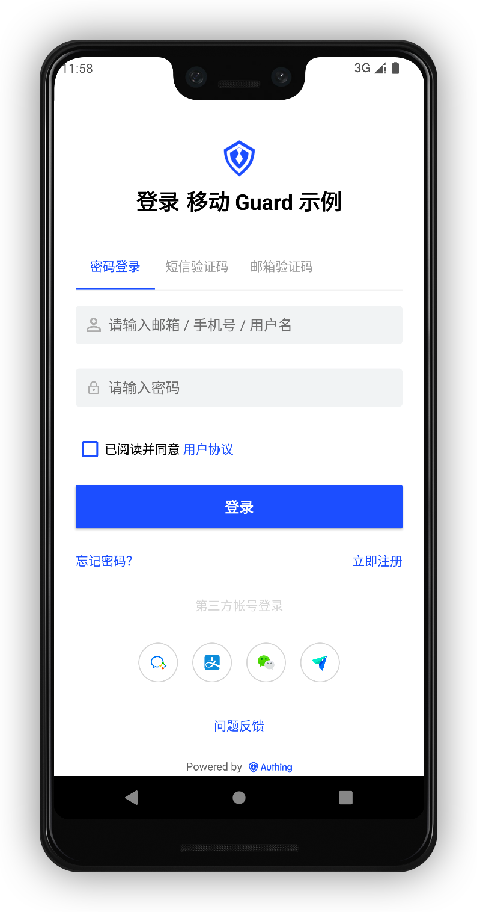

# Quick start

<LastUpdated/>

It takes only 1 minute if app uses UI provided by us.

Make sure you went over all the steps in [Get started](./develop.md), then call the following method where you want to authenticate user:

```java
AuthFlow.start(this); // 'this' is Activity
```

This is how it looks like:



Then, we can get authentication result using the following code:

```java
  @Override
  protected void onActivityResult(int requestCode, int resultCode, @Nullable Intent data) {
    super.onActivityResult(requestCode, resultCode, data);
    if (requestCode == RC_LOGIN && resultCode == OK && data != null) {
      //login success，do next task
    }
  }
```

If authentication success, we can get user info by:

```java
UserInfo userInfo = Authing.getCurrentUser();
```
