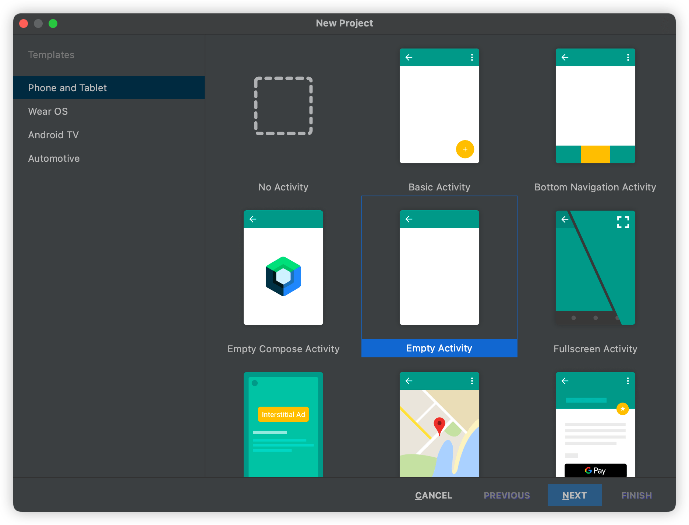
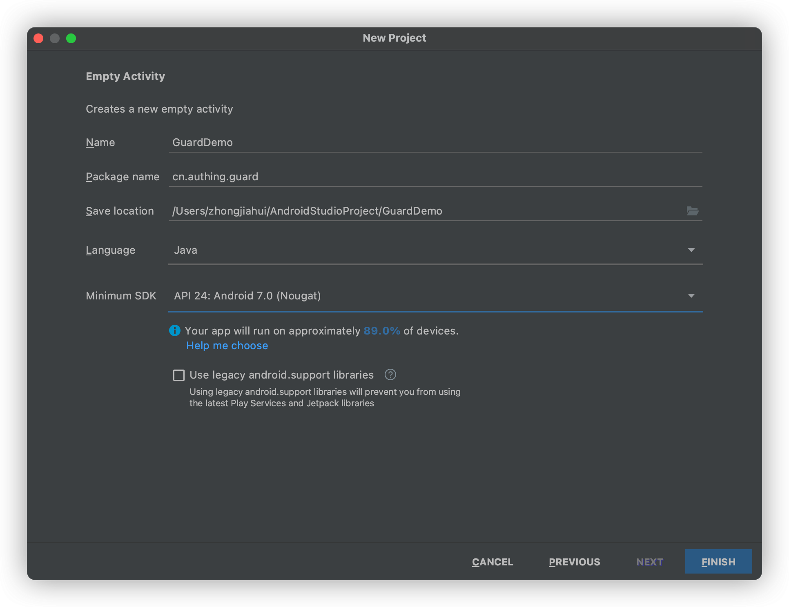
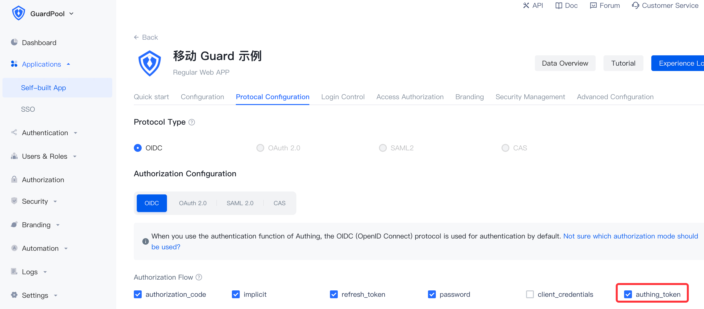

# Quick start

<LastUpdated/>

## Step 1: Create an Android project





:::hint-info
Note: Minimum OS version is Android 7.0
:::

## Step 2: Add dependency for Guard

make sure mavenCentral is present in project-level build.gradle:

 ```groovy
 buildscript {
    repositories {
        mavenCentral()
        // other repositories
    }
 }
 ```

Add dependencies to the build.gradle file of the main project:

```groovy
implementation 'cn.authing:guard:+'
```

## Step 3: Initialization

at app startup, call:

```java
// context is application or initial activity
// ”appId“ is obtained from the Authing console
Authing.init(context, "appId");
Authing.setAuthProtocol(Authing.AuthProtocol.EOIDC);
```

:::hint-info
Note：AUTHING_APP_ID application ID，not the user pool ID，Please go to the [console](https://docs.authing.cn/v2/guides/faqs/get-app-id-and-secret.html) first to obtain.
:::

Please select `authing_token` in Application Configuration-Authorization mode.



## Step 4: Common operations

###  1. Register/log in and get user information

- [Host pages using the SDK](./develop.md)
- [Use the SDK API](./apis/)

### 2. [Login from a third-party identity source](./social/)

### 3. [A typical scenario](./scenario/)

### 4. [Privatization deployment](./onpremise.md)

