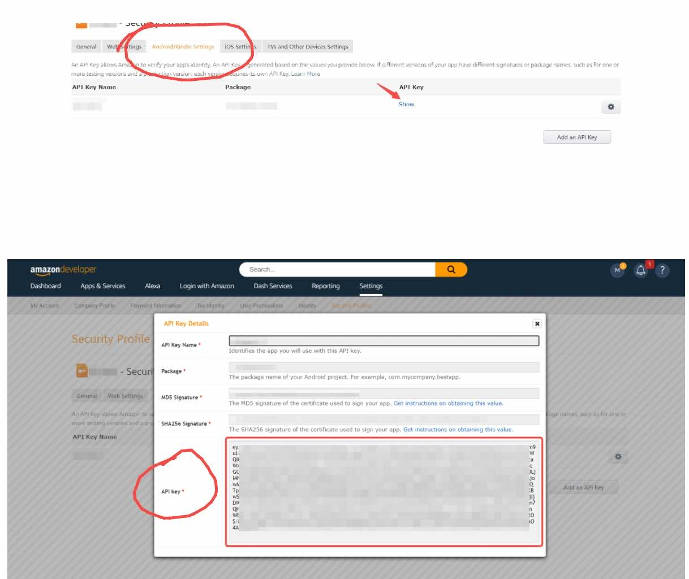

# Login by Amazon

<LastUpdated/>

## Preparatory work

**Configuration work**：Configure In [Amazon developer platform](https://developer.amazon.com) and [Authing Console](https://authing.cn/), please refer to the [Preparing for Amazon](../../../guides/connections/social/amazon-mobile/README.md)。

**Development reference**：See [Login with amazon](https://developer.amazon.com/zh/docs/login-with-amazon/android-docs.html)。

:::hint-info
This feature was added in android guard sdk 1.5.6 version.
:::

<br>

## Integrate steps

### Step 1：Download Login with Amazon SDK

Download it on this page [Login with Amazon SDK](https://amzndevresources.com/login-with-amazon/sdk/LoginWithAmazon_Android.zip)

:::hint-info
Extract the file, find the `login-with-amazon-sdk.jar` file and copy it to the libs directory of the app.
:::

### Step 2：Add dependency

```groovy
dependencies {
    implementation 'cn.authing:guard:+'
    implementation files('libs/login-with-amazon-sdk.jar')
}
```

:::hint-info
The Guard compileOnly relies on Login with Amazon SDK, which allows apps to import on demand, preventing the Guard aar package from getting bigger as more third party logins are supported. Therefore, every time a third-party identity source is added, the App needs to manually add the dependency of the identity source.
:::

### Step 3：Add API key

When your Android application registers with Amazon, it will be assigned one. API keys. Amazon Authorization Manager will use this identifier to identify your application to Login with Amazon. Authorize services.

If you sign an app using the Amazon App Store, the Amazon App Store automatically provides an API key. If you are not using the Amazon App Store, the Amazon license Manager will load this value at runtime from the 'api_key.txt' file in the 'assets' directory.

You can get the API key in the following place:



1. In the main directory of the app project, create the assets folder.
2. Create a file in the assets folder and name it **api_key.txt**.
3. Add your API key to the text file to save.

### Step 4：Configuration AndroidManifest

In the application of the `AndroidManifest.xml` file add:

```xml
<activity android:name="com.amazon.identity.auth.device.workflow.WorkflowActivity"
        android:theme="@android:style/Theme.NoDisplay"
        android:allowTaskReparenting="true"
        android:launchMode="singleTask">
        <intent-filter>
            <action android:name="android.intent.action.VIEW"/>
            <category android:name="android.intent.category.DEFAULT"/>
            <category android:name="android.intent.category.BROWSABLE"/>
            <!-- android:host must use the full package name found in Manifest General Attributes -->
            <data android:host="${applicationId}" android:scheme="amzn"/>
        </intent-filter>
</activity>
```

:::hint-info
If you are not building your system with Gradle, replace '${applicationId}' with the package name for this application.
:::

### Step 5：Initialization

Initialize Guard Android SDK in `Application` :

```java
// context is application or initial activity
// ”AUTHING_APP_ID“ is obtained from the Authing console
Authing.init(context, "AUTHING_APP_ID");
Authing.setAuthProtocol(Authing.AuthProtocol.EOIDC)
```

### Step 4：Use in different scenarios

#### Use in different scenarios

Start the managed page where login authentication is required:

```java
// this is the activity context
AuthFlow.start(this);
```

By following the preceding steps, you can quickly and easily configure the Authing management console to automatically have the Amazon login function. The login entry is displayed in the social login button list on the built-in login interface of the Guard.

#### Use the login button

If you use the Amazon login button we provide.

1. Add the following code to the layout file:

```xml
 <cn.authing.guard.social.view.AmazonLoginButton
    android:id="@+id/btn_login"
    android:background="@drawable/authing_button_background"
    android:textColor="@color/white"
    android:layout_width="match_parent"
    android:layout_height="wrap_content" />
```

2. Then handle the event in the code:

```java
AmazonLoginButton button = findViewById(R.id.btn_login);
button.setOnLoginListener(new AuthCallback<UserInfo>() {
    @Override
    public void call(int code, String message, UserInfo data) {
      	if (code == 200) {
        	// login success, data is user info.
       	} else {
        	// login fail
      	}
    }
});
```

#### Use the login authorization class 

If you don't want to use our built-in buttons and want to implement the UI entirely yourself, you can call the `Amazon` class authorization function inside the button click event, which integrates the business logic to pull up the Amazon authorization login:

```java
Amazon.getInstance().login(appContext, new AuthCallback<UserInfo>() {
    @Override
    public void call(int code, String message, UserInfo data) {
        if (code == 200) {
        	// login success, data is user info.
       	} else {
        	// login fail
      	}
    }
});
```

`data` contains `idToken` and user information (`user name`, `nickname`, `name`, etc.).

**Note: When using the login button or the login authorization class, you need to add the following code to the Activity's onCreate、onResume function:**

```java
@Override
protected void onCreate(Bundle savedInstanceState) {
    super.onCreate(savedInstanceState);
    Amazon.getInstance().onCreate(this);
}

@Override
protected void onResume() {
    super.onResume();
    Lark.getInstance().onResume(this);
    Amazon.getInstance().onResume();
}
```

#### Use the login API 

If you want to fully implement the Amazon login UI and obtain the authorization code logic yourself, after obtaining the authorization code, you can call the following API in exchange for user information:

```java
public static void loginByAmazon(String accessToken, @NotNull AuthCallback<UserInfo> callback)
```

**param**

*`accessToken`* Amazon accessToken

**example**

If you only need to get the user information (`username`, `nickname`, `name`, etc.) and `idToken`, call:

```java
AuthClient.loginByAmazon(accessToken, new AuthCallback<UserInfo>() {
    @Override
    public void call(int code, String message, UserInfo data) {
        if (code == 200) {
          // login success, data is user info, contains idToken.
        } else {
          // login fail
        }
    }
});
```

If you only need to get the user information (`username`, `nickname`, `name`, etc.) and `idToken`、`accessToken` 和 `refreshToken`，call：

```java
OIDCClient oidcClient = new OIDCClient();
oidcClient.loginByAmazon(accessToken, new AuthCallback<UserInfo>() {
    @Override
    public void call(int code, String message, UserInfo data) {
        if (code == 200) {
          // ogin success, data is user info, contains idToken、accessToken and refreshToken.
        } else {
          // login fail
        }
    }
});
```

