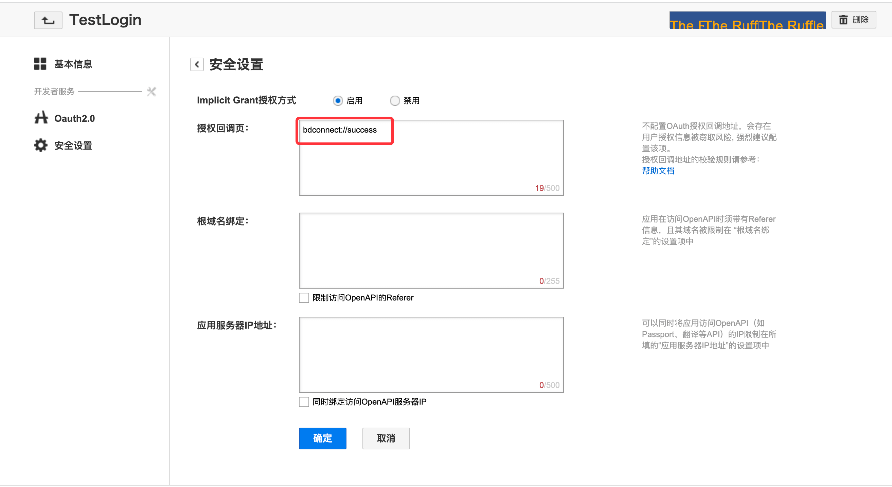

# Login by Weibo

<LastUpdated/>

## Preparatory work

Configure in [Baidu open platform](https://developer.baidu.com/) and [Authing Console](https://authing.cn/)，See [Preparing for  Baidu](../../../guides/connections/social/baidu-mobile/README.md)。

:::hint-info
This feature was added in android guard sdk 1.5.0 version.
:::

<br>

## Integrate Baidu login steps

### Step 1：Add dependency

1. To download the [baidu SDK](http://developer.baidu.com/wiki/index.php?title=docs/oauth/showcase) first, then on libs directory of the project.

2. Add dependencies to build.gradle's dependencies：

```groovy
implementation 'cn.authing:guard:+'
implementation files('libs/baidu-android-openapi-sdk.jar')
```

:::hint-info
The Guard compileOnly relies on baidu-android-openapi-sdk, which allows apps to import on demand, preventing the Guard aar package from getting bigger as more third party logins are supported. Therefore, every time a third-party identity source is added, the App needs to manually add the dependency of the identity source.
:::

### Step 2：Add the authorization callback page

Add authorization callback page in Baidu application background `bdconnect://success`：



### 

### Step 3：Initialization Guard Android SDK

To initialize when the application starts:

```java
// context is application or initial activity
// ”AUTHING_APP_ID“ is obtained from the Authing console
Authing.init(context, "AUTHING_APP_ID");
Authing.setAuthProtocol(Authing.AuthProtocol.EOIDC)
```

### Step 4：Use in different scenarios

- #### Use in different scenarios

  Start the managed page where login authentication is required:

```java
// this is the activity context
AuthFlow.start(this);
```

By following the preceding steps, you can quickly and easily configure the Authing management console to automatically have the Baidu login function. The login entry is displayed in the social login button list on the built-in login interface of the Guard.

- #### Use the Baidu sign In button

  If you use the Weibo login button we provide.

​		1. Add the following code to the layout file:

```xml
 <cn.authing.guard.social.BaiduLoginButton
    android:id="@+id/btn_baidu_login"
    android:background="@drawable/authing_button_background"
    android:textColor="@color/white"
    android:layout_width="match_parent"
    android:layout_height="wrap_content" />
```

​		2. Then handle the event in the code:

```java
BaiduLoginButton button = findViewById(R.id.btn_baidu_login);
button.setOnLoginListener(new AuthCallback<UserInfo>() {
    @Override
    public void call(int code, String message, UserInfo data) {
      	if (code == 200) {
        	// login success, data is user info.
       	} else {
        	// login fail
      	}
    }
});
```

- #### Log in to the authorization class using Baidu

  If you don't want to use our built-in buttons and want to implement the UI entirely yourself, you can call the `Baidu` class authorization function inside the button click event, which integrates the business logic to pull up the Weibo authorization login:

```java
Baidu.getInstance().login(appContext, new AuthCallback<UserInfo>() {
    @Override
    public void call(int code, String message, UserInfo data) {
        if (code == 200) {
        	// login success, data is user info.
       	} else {
        	// login fail
      	}
    }
});
```

​	`data` contains `idToken` and user information (`user name`, `nickname`, `name`, etc.).

- #### Log in to the API using Baidu

  If you want to fully implement the Baidu login UI and obtain the authorization code logic yourself, after obtaining the authorization code, you can call the following API in exchange for user information:

```java
public static void loginByBaidu(String accessToken, @NotNull AuthCallback<UserInfo> callback)
```

**param**

*`accessToken`* Baidu token

**example**

If you only need to get the user information (`username`, `nickname`, `name`, etc.) and `idToken`, call:

```java
AuthClient.loginByBaidu(accessToken, new AuthCallback<UserInfo>() {
    @Override
    public void call(int code, String message, UserInfo data) {
        if (code == 200) {
          // login success, data is user info, contains idToken.
        } else {
          // login fail
        }
    }
});
```

If you only need to get the user information (`username`, `nickname`, `name`, etc.) and `idToken`、`accessToken` 和 `refreshToken`，call：

```java
OIDCClient oidcClient = new OIDCClient();
oidcClient.loginByBaidu(accessToken, new AuthCallback<UserInfo>() {
    @Override
    public void call(int code, String message, UserInfo data) {
        if (code == 200) {
          // ogin success, data is user info, contains idToken、accessToken and refreshToken.
        } else {
          // login fail
        }
    }
});
```

