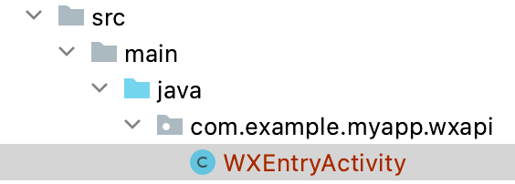

# Login by Wehcat Miniprogram

<LastUpdated/>

## Preparatory work

Configure in [Wechat open platform](https://open.weixin.qq.com/cgi-bin/index?t=home/index&lang=zh_CN) and  [Authing Console](https://authing.cn/) , See [ APP 拉起微信小程序](../../../guides/connections/social/wechat-miniprogram-applaunch/README.md)，Mobile apps need to be associated with small programs.

:::hint-info
This feature was added in android guard sdk 1.4.8 version.
:::

<br>

## Integrate APP to pull up wechat mini program login step

### Step 1：Add dependency

```groovy
implementation 'cn.authing:guard:+'
implementation 'com.tencent.mm.opensdk:wechat-sdk-android:6.8.0'
```

:::hint-info
The Guard compileOnly relies on gms, which allows apps to import on demand, preventing the Guard aar package from getting bigger as more third party logins are supported. Therefore, every time a third-party identity source is added, the App needs to manually add the dependency of the identity source.
:::

### Step 2：Initialization Guard Android SDK

To initialize when the application starts:

```java
// context is application or initial activity
// ”AUTHING_APP_ID“ is obtained from the Authing console
Authing.init(context, "AUTHING_APP_ID");
Authing.setAuthProtocol(Authing.AuthProtocol.EOIDC)
```

### Step 3：create WXEntryActivity

According to wechat rules, developer MUST create an Activity called WXEntryActivity and it MUST be put under a package call 'wxapi' and further more, the 'wxapi' package MUST be under your application's package directly. Here is an example, suppose your android application package is:

com.example.myapp

Then you need to create WXEntryActivity like this:



Good news is that the content of this WXEntryActivity is really simple, since we already did the heavy lifting, all you need to do is to extend our Activity, like this:

```java
package com.example.myapp.wxapi;

import cn.authing.guard.social.wechat.WXCallbackActivity;

public class WXEntryActivity extends WXCallbackActivity {
}
```

### Step 4：We need to declare this Activity in Manifest

Add the `exported`, `taskAffinity` and `launchMode` attributes to the manifest file with `exported` set to `true` and `taskAffinity` set to the name of your package, `launchMode` is set to `singleTask`, such as:

```xml
<activity
    android:name=".wxapi.WXEntryActivity"
    android:exported="true"
    android:taskAffinity="packge name"
    android:launchMode="singleTask"/>
```

**Precautions**

If you need to obfuscate code, add the following configuration to proguard.cfg to ensure proper use of the sdk:

```
-keep class com.tencent.mm.opensdk.** {
    *;
}

-keep class com.tencent.wxop.** {
    *;
}

-keep class com.tencent.mm.sdk.** {
    *;
}
```

### Step 5：Specification of the wechat miniprogram callback data format

The format of the data (extMsg) that the wechat miniprogram calls back to the APP should be restricted as follows:

```json
{
  "code": "001x691w398h8039gl0w3ERdyy1x691y",
  "phoneInfoCode": "geC88uOGAkjOeziTDu/iJA==",
}
```

The APP will get the data in the callback of `WXEntryActivity` :

```java
public void onResp(BaseResp resp) {
    if (resp.getType() == ConstantsAPI.COMMAND_LAUNCH_WX_MINIPROGRAM) {
        WXLaunchMiniProgram.Resp launchMiniProResp = (WXLaunchMiniProgram.Resp) resp;
        String extraData =launchMiniProResp.extMsg;
    }
}
```

### Step 6：Use in different scenarios

- #### Use in different scenarios
  Start the managed page where login authentication is required:
```java
// this is the activity context
AuthFlow.start(this);
```

By following the preceding steps, you can quickly and easily configure the Authing management console to automatically have the wehcat miniprogram login function. The login entry is displayed in the social login button list on the built-in login interface of the Guard.

- #### Use the login by wehcat miniprogram sign In button
    If you use the miniprogram login button we provide.

​		1. Add the following code to the layout file:

```xml
 <cn.authing.guard.social.WechatMiniProgramLoginButton
    android:id="@+id/btn_miniprogram_login"
    android:background="@drawable/authing_button_background"
    android:textColor="@color/white"
    android:layout_width="match_parent"
    android:layout_height="wrap_content" />
```

​		2. Then handle the event in the code:

```java
WechatMiniProgramLoginButton button = findViewById(R.id.btn_miniprogram_login);
button.setOnLoginListener(new AuthCallback<UserInfo>() {
    @Override
    public void call(int code, String message, UserInfo data) {
      	if (code == 200) {
        	// login success, data is user info.
       	} else {
        	// login fail
      	}
    }
});
```

- #### Log in to the authorization class using WechatMiniProgram
  If you don't want to use our built-in buttons and want to implement the UI entirely yourself, you can call the `WechatMiniProgram` class authorization function inside the button click event, which integrates the business logic to pull up the miniprofram authorization login:

```java
WechatMiniProgram wechatMiniProgram = new WechatMiniProgram();
wechatMiniProgram.login(appContext, new AuthCallback<UserInfo>() {
    @Override
    public void call(int code, String message, UserInfo data) {
        if (code == 200) {
        	// login success, data is user info.
       	} else {
        	// login fail
      	}
    }
});
```

​	`data` contains `idToken` and user information (`user name`, `nickname`, `name`, etc.).

- #### Log into the API using miniprogram

  If you want to fully implement the miniprogram login UI and obtain the authorization code logic yourself, after obtaining the authorization code, you can call the following API in exchange for user information:

```java
public static void loginByWechatMiniProgram(String code, String phoneInfoCode, @NotNull AuthCallback<UserInfo> callback)
```

**param**

- *`code`* The user `code`  returned by the `wx.login` interface

- *`phoneInfoCode`* Small program to obtain the user phone number returned `code`

**example**

If you only need to get the user information (`username`, `nickname`, `name`, etc.) and `idToken`, call:

```java
AuthClient.loginByWechatMiniProgram(code, phoneInfoCode, new AuthCallback<UserInfo>() {
    @Override
    public void call(int code, String message, UserInfo data) {
        if (code == 200) {
          // login success, data is user info, contains idToken.
        } else {
          // login fail
        }
    }
});
```

If you only need to get the user information (`username`, `nickname`, `name`, etc.) and `idToken`、`accessToken` 和 `refreshToken`，call：

```java
OIDCClient oidcClient = new OIDCClient();
oidcClient.loginByWechatMiniProgram(code, phoneInfoCode, new AuthCallback<UserInfo>() {
    @Override
    public void call(int code, String message, UserInfo data) {
        if (code == 200) {
          // ogin success, data is user info, contains idToken、accessToken and refreshToken.
        } else {
          // login fail
        }
    }
});
```

