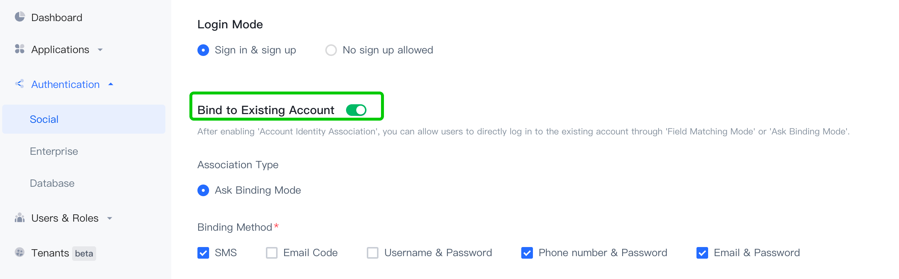

# Login by wechat

<LastUpdated/>

There are three major steps:
* Configurations on wechat open platform
* Steps at Authing console
* Integrate Authing Android SDK

<br>

## Configurations on [Wechat open platform](https://open.weixin.qq.com/)

:::hint-info
Note: Developer must be verified before using any service on wechat open platform. Wechat doesn't support personal usage, so developer must be part of some organization, commercial or governmental. And It costs 300 RMB to become a verified developer.
:::

1. Get wechat AppID and AppSecret


2. Setup android information


:::hint-info
Caution: The MD5 hashing MUST NOT contain any colon.
:::


<br>

## Steps at Authing console:

1. Click 'Authentication' on the left sidebar and choose 'Social', then click 'Wechat'


2. In the list select 'Wechat Mobile'


3. Set an ID for this connection. It can be anything as long as being unique across Authing's connections.

4. Enter your wechat AppID and AppSecret


5. Hit 'Create'. By default, there is no authing app associate with this connection. You can associate apps with this connection by turning on those switches.


6. Hit 'Save' and we are all set

<br>

## Integrate Android SDK

1. Add dependency:
```groovy
implementation 'cn.authing:guard:+'
implementation 'com.tencent.mm.opensdk:wechat-sdk-android:6.8.0'
```

2. Init Authing upon App startup. e.g. Application's onCreate:
```java
// AUTHING_APP_ID is Authing app id which can be obtained at Authing console
Authing.init(context, “AUTHING_APP_ID”);
```

3. According to wechat rules, developer MUST create an Activity called WXEntryActivity and it MUST be put under a package call 'wxapi' and further more, the 'wxapi' package MUST be under your application's package directly. Here is an example, suppose your android application package is:

com.example.myapp

Then you need to create WXEntryActivity like this:


Good news is that the content of this WXEntryActivity is really simple, since we already did the heavy lifting, all you need to do is to extend our Activity, like this:

```java
package com.example.myapp.wxapi;

import cn.authing.guard.social.wechat.WXCallbackActivity;

public class WXEntryActivity extends WXCallbackActivity {
}
```

4. We need to declare this Activity in Manifest

Add the `exported`, `taskAffinity` and `launchMode` attributes to the manifest file with `exported` set to `true` and `taskAffinity` set to the name of your package, `launchMode` is set to `singleTask`, such as:

```xml
<activity
    android:name=".wxapi.WXEntryActivity"
    android:exported="true"
 		android:taskAffinity="you package nmae"
    android:launchMode="singleTask"/>
```

**Precautions**

If you need to obfuscate code, add the following configuration to proguard.cfg to ensure proper use of the sdk:

```text
-keep class com.tencent.mm.opensdk.** {
    *;
}

-keep class com.tencent.wxop.** {
    *;
}

-keep class com.tencent.mm.sdk.** {
    *;
}
```


Next, we recommend to use our UI component, all you need to do is 'place' it on the layout xml where you think appropriate, you can also create an instance of this component via code

```xml
<cn.authing.guard.WechatLoginButton
    android:id="@+id/btn_wechat_login"
    android:layout_width="44dp"
    android:layout_height="44dp"
    app:layout_constraintLeft_toLeftOf="parent"
    app:layout_constraintRight_toRightOf="parent"/>
```

Then handle callback event after wechat login:

```java
WechatLoginButton wechatLoginButton = findViewById(R.id.btn_wechat_login);
wechatLoginButton.setOnLoginListener(new AuthCallback<UserInfo>() {
    @Override
    public void call(int code, String message, UserInfo data) {
      	if (code == 200) {
        	// login success, data is user info
       	} else {
        	// login fail
      	}
    }
});
```

<br>

In case you don't want to use our UI component, you can have your own Button, and then inside your Button's onClick event, you can start wechat authentication and handle callback event like this:

```java
Wechat wechat = new Wechat();
wechat.login(appContext, context, new AuthCallback<UserInfo>() {
    @Override
    public void call(int code, String message, UserInfo data) {
        if (code == 200) {
          // login successfully, data is user info.
        }  else if (code == 1640) {
        	// Only an existing account can be bound
        	// data.getSocialBindData() return methods(login method) and key(intermediate state key)
    		} else if (code == 1641) {
        	// Allows you to bind existing accounts or create new accounts
        	// data.getSocialBindData() return methods(login method) and key(intermediate state key)
    		} else if (code == 2921) {
        	// Select multiple accounts and bind them
        	// data.getSocialBindData() return accounts(account list) and key(intermediate state key)
    		} else {
          //login failure
        }
    }
});
```

`userInfo` contains  `idToken` and user information (`username`, `nickname`, `name`, etc.).

When you use component  `WechatLoginButton` or Login Authorization class `Wechat`, if you also want to get `accessToken` and `refreshToken`,  you need to call  `Authing.setAuthProtocol(Authing.AuthProtocol.EOIDC) ` after

` Authing.init(context, "AUTHING_APP_ID") ` , data included in the callback ` data `.

If you want to obtain only wechat authorization code:

```java
Wechat wechat = new Wechat();
wechat.getAuthCode(this, new AuthCallback<String>() {
    @Override
    public void call(int code, String message, String authCode) {
      	if (code == 200) {
      	  // successfully，authCode is wechat authorization code
       	} 
    }
});
```

<br>

If you want to achieve wechat login completely by yourself, after getting the `authorization code`, you can call the following API in exchange for user information like this:


```java
public static void loginByWechatWithBind(String authCode, String context, @NotNull AuthCallback<UserInfo> callback)
```

**param**

- *`authCode`* wechat authorization code.

- *`context`* Request context，where the `context` is available in [pipeline  context](/guides/pipeline/context-object.md).

**sample**

If all you need is access to user information (`username`, `nickname`, `name`, etc.) and `idToken`，call like this:

```java
AuthClient.loginByWechatWithBind(authCode, context, new AuthCallback<UserInfo>() {
    @Override
    public void call(int code, String message, UserInfo data) {
        if (code == 200) {
          // login success, data is user info, contains idToken.
        } else if (code == 1640) {
        	// Only an existing account can be bound
        	// data.getSocialBindData() return methods(login method) and key(intermediate state key)
    		} else if (code == 1641) {
        	// Allows you to bind existing accounts or create new accounts
        	// data.getSocialBindData() return methods(login method) and key(intermediate state key)
    		} else if (code == 2921) {
        	// Select multiple accounts and bind them
        	// data.getSocialBindData() return accounts(account list) and key(intermediate state key)
    		} else {
          //login failure
        }
    }
});
```

If you need to get user information (`username`, `nickname`, `name`, etc.) , `idToken`, `accessToken` and `refreshToken`, call like this:

```java
OIDCClient oidcClient = new OIDCClient();
oidcClient.loginByWechatWithBind(authCode, context, new AuthCallback<UserInfo>() {
    @Override
    public void call(int code, String message, UserInfo data) {
        if (code == 200) {
          // login success, data is user info, contains idToken、accessToken and refreshToken.
        } else if (code == 1640) {
        	// Only an existing account can be bound
        	// data.getSocialBindData() return methods(login method) and key(intermediate state key)
    		} else if (code == 1641) {
        	// Allows you to bind existing accounts or create new accounts
        	// data.getSocialBindData() return methods(login method) and key(intermediate state key)
    		} else if (code == 2921) {
        	// Select multiple accounts and bind them
        	// data.getSocialBindData() return accounts(account list) and key(intermediate state key)
    		} else {
          //login failure
        }
    }
});
```

**errorCode**

* `1640` Only an existing account can be bound.

* `1641` Allows you to bind existing accounts or create new accounts.

* `2921 ` Select and bind multiple accounts after inquiry.

* `602` An error was returned when requesting the third-party endpoint. Please check whether the configuration of wechat mobile identity source `appSecret` is correct on the console.

* `422` The external identity source connection type does not match and the identity source type is incorrect.

* `501` This identity source connection does not support inquiry binding, and the "Bind to Existing Account" association mode is not enabled.

* `403` Login mode is not allowed, please check the mobile identity source configuration in the console.

* `499` The app doesn't exist! 

* `404` The user group does not exist and the user has no permission to log in. If no user information is available during authentication, a new user and identity are created and login only mode is enabled.

* `403` If you do not have permission to log in, contact the administrator.

  

## Bind to Existing Account Apis

If you want to ask whether to bind an existing account when you log in with your wechat account, you can enable the query binding function in  [Authing Console](https://authing.cn/)，

**Authentication -> Social -> WeChat -> WeChat Mobile** **-> Bind to Existing Account：**



:::hint-info
If using our **AuthFlow** hosting page, after opening the **Bind to Existing Account**, relevant business processes are processed in the hosting page.
:::

If you have selected the  **Login Mode**  and enabled the **Bind to Existing Account** function, use the following API to build the subsequent business process:

### Creating an Account

If **Login Mode** is selected for **Sign in & sign up** and **Bind to Existing Account** is enabled, the `loginByWechatWithBind` interface will return `1641` status code and `key`. At this time, the  **Creating an Account**  interface can be called to directly create an account.

```java
public static void bindWechatWithRegister(String key, @NotNull AuthCallback<UserInfo> callback)
```

**param**

- `key` intermediate state key，Returned by the `loginByWechatWithBind` interface.

**sample**

```java
AuthClient.bindWechatWithRegister("key", new AuthCallback<UserInfo>() {
    @Override
    public void call(int code, String message, UserInfo data) {
      	if (code == 200) {
      	   // successfully, data is user info.
       	} 
    }
});
```

<br>

### Bind by account password

If **Login Mode** is selected，the `loginByWechatWithBind` interface will return `1640` or`1641` status code, supported binding modes and `key`，If the supported binding modes include `username-password`, `phone-password`, and `email-password,` you can invoke **Bind by account password** interface.

```java
public static void bindWechatByAccount(String key, String account, String password, @NotNull AuthCallback<UserInfo> callback)
```

**param**

- `key` intermediate state key，Returned by the `loginByWechatWithBind` interface.
- `account` Account (Authing user: User name, mobile number, and email address）.
- `password` Password, which must be encrypted by the rsa algorithm.

**sample**

```java
AuthClient.bindWechatByAccount("key", "张三", "xxxxxx", new AuthCallback<UserInfo>() {
    @Override
    public void call(int code, String message, UserInfo data) {
      	if (code == 200) {
      	   // successfully, data is user info.
       	} 
    }
});
```

**errorCode**

* `499` The rsa algorithm failed to decrypt the password. Please check the request parameters.

<br>

### Binding by phone number verification code

If **Login Mode** is selected，the `loginByWechatWithBind` interface will return `1640` or`1641` status code, supported binding modes and `key`，If the supported binding modes include `phone-code`, you can invoke **Binding by phone number verification code** interface.

```java
public static void bindWechatByPhoneCode(String key, String phoneCountryCode, String phone, String code, @NotNull AuthCallback<UserInfo> callback)
```

**param**

- `key` intermediate state key，Returned by the `loginByWechatWithBind` interface.
- `phoneCountryCode` Telephone country code. It can be empty. If it is empty, the default is `+86` 
- `phone` mobile phone number
- `code` sms verification code

**sample**

```java
AuthClient.bindWechatByPhoneCode("key", "+86", "188xxxx8888", "1234", new AuthCallback<UserInfo>() {
    @Override
    public void call(int code, String message, UserInfo data) {
      	if (code == 200) {
      	  // successfully, data is user info.
       	} 
    }
});
```

**errorCode**

* `2001` The verification code is incorrect.
* `2001` The verification code is invalid. Obtain the verification code again.

<br>

### Binding by email verification code

If **Login Mode** is selected，tthe `loginByWechatWithBind` interface will return `1640` or`1641` status code, supported binding modes and `key`，If the supported binding modes include `email-code`, you can invoke **Binding by email verification code** interface.

```java
public static void bindWechatByEmailCode(String key, String email, String code, @NotNull AuthCallback<UserInfo> callback)
```

**param**

- `key` intermediate state key，Returned by the `loginByWechatWithBind` interface.
- `email` email address
- `code`  email verification code

**sample**

```java
AuthClient.bindWechatByEmailCode("key", "test@example.com", "1234", new AuthCallback<UserInfo>() {
    @Override
    public void call(int code, String message, UserInfo data) {
      	if (code == 200) {
      	  // successfully, data is user info.
       	} 
    }
});
```

**errorCode**

* `2001` The verification code is incorrect.
* `2001` The verification code is invalid. Obtain the verification code again.

<br>

### Select binding by multiple accounts

If **Login Mode** is selected，the `loginByWechatWithBind` interface will return`2921` status code, supported binding account data and `key`，you can invoke **Select binding by multiple accounts** interface.

```java
public static void bindWechatByAccountId(String key, String account, @NotNull AuthCallback<UserInfo> callback)
```

**param**

- `key` intermediate state key，Returned by the `loginByWechatWithBind` interface.
- `account` the selected account ID (Authing user) is returned by the `loginByWechatWithBind` interface.

**sample**

```java
AuthClient.bindWechatByAccountId("key", "638xxxxxxxxxxxxxx", new AuthCallback<UserInfo>() {
    @Override
    public void call(int code, String message, UserInfo data) {
      	if (code == 200) {
      	  // successfully, data is user info.
       	} 
    }
});
```

<br>
