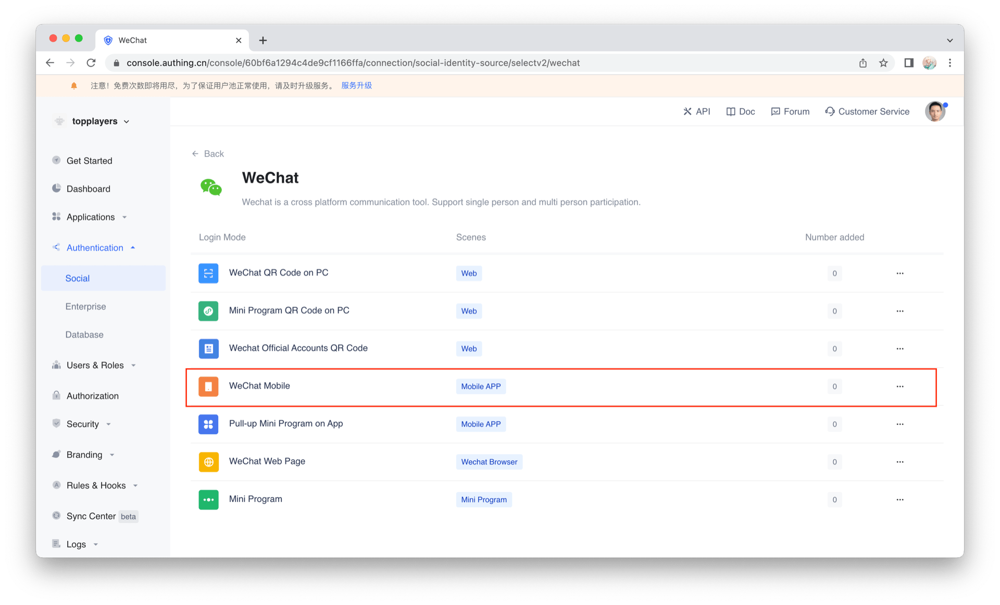
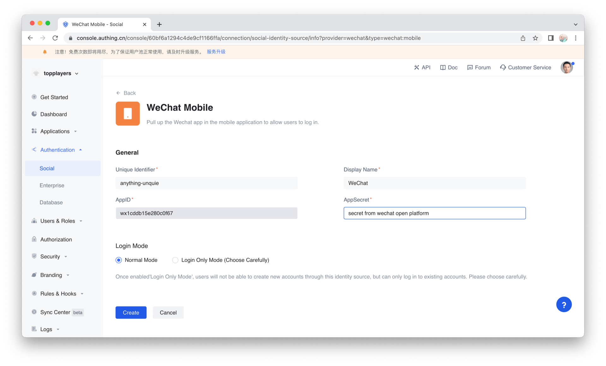
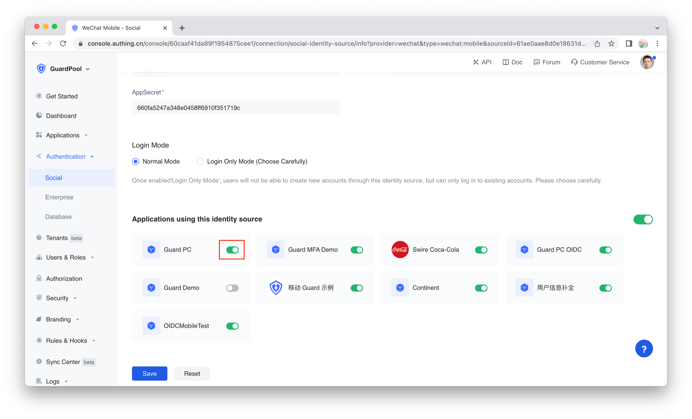

# Login by wechat

<LastUpdated/>

There are three major steps:
* Configurations on wechat open platform
* Steps at Authing console
* Integrate Authing Android SDK

<br>

## Configurations on [Wechat open platform](https://open.weixin.qq.com/)

:::hint-info
Note: Developer must be verified before using any service on wechat open platform. Wechat doesn't support personal usage, so developer must be part of some organization, commercial or governmental. And It costs 300 RMB to become a verified developer.
:::

1. Get wechat AppID and AppSecret


2. Setup android information



:::hint-info
Caution: The MD5 hashing MUST NOT contain any colon.
:::


<br>

## Steps at Authing console:

1. Click 'Authentication' on the left sidebar and choose 'Social', then click 'Wechat'


2. In the list select 'Wechat Mobile'


3. Set an ID for this connection. It can be anything as long as being unique across Authing's connections.

4. Enter your wechat AppID and AppSecret



5. Hit 'Create'. By default, there is no authing app associate with this connection. You can associate apps with this connection by turning on those switches.



6. Hit 'Save' and we are all set

<br>

## Integrate Android SDK

1. Add dependency:
```groovy
implementation 'cn.authing:guard:+'
implementation 'com.tencent.mm.opensdk:wechat-sdk-android:6.8.0'
```

2. Init Authing upon App startup. e.g. Application's onCreate:
```java
// AUTHING_APP_ID is Authing app id which can be obtained at Authing console
Authing.init(context, “AUTHING_APP_ID”);
```

3. According to wechat rules, developer MUST create an Activity called WXEntryActivity and it MUST be put under a package call 'wxapi' and further more, the 'wxapi' package MUST be under your application's package directly. Here is an example, suppose your android application package is:

com.example.myapp

Then you need to create WXEntryActivity like this:


Good news is that the content of this WXEntryActivity is really simple, since we already did the heavy lifting, all you need to do is to extend our Activity, like this:

```java
package com.example.myapp.wxapi;

import cn.authing.guard.social.wechat.WXCallbackActivity;

public class WXEntryActivity extends WXCallbackActivity {
}
```

4. We need to declare this Activity in Manifest

```xml
<activity
    android:name=".wxapi.WXEntryActivity"
    android:exported="true" />
```

Next, we recommend to use our UI component, all you need to do is 'place' it on the layout xml where you think appropriate, you can also create an instance of this component via code

```xml
<cn.authing.guard.WechatLoginButton
    android:id="@+id/btn_wechat_login"
    android:layout_width="44dp"
    android:layout_height="44dp"
    app:layout_constraintLeft_toLeftOf="parent"
    app:layout_constraintRight_toRightOf="parent"/>
```

Then handle callback event after wechat login:

```java
WechatLoginButton button = findViewById(R.id.btn_wechat_login);
button.setOnLoginListener((ok, data) -> {
    if (ok) {
        // login success, data is user info
    } else {
        // login fail
    }
});
```

<br>

In case you don't want to use our UI component, you can have your own Button, and then inside your Button's onClick event, you can start wechat authentication and handle callback event like this:

```java
Wechat wechat = new Wechat();
wechat.login(appContext, ((ok, data) -> {
    if (ok) {
        // login success, data is user info
    } else {
        // login fail
    }
}));
```

<br>

If you want to achieve wechat login completely by yourself, after getting the `authorization code`, you can call the following API in exchange for user information like this:


```java
public static void loginByWechat(String authCode, @NotNull AuthCallback<UserInfo> callback)
```

**param**

* *`authCode`* wechat authorization code

**sample**

```java
AuthClient.loginByWechat(authCode, (code, message, userInfo)->{
    if (code == 200) {
        // userInfo：User Information
    }
});
```

`userInfo` contains  `idToken` and user information (`username`, `nickname`, `name`, etc.), if you want to get `accessToken`  and `refreshToken`, you need to call

 `Authing.init(context, "AUTHING_APP_ID")`  after you call  `Authing.setAuthProtocol(Authing.AuthProtocol.EOIDC)`.
