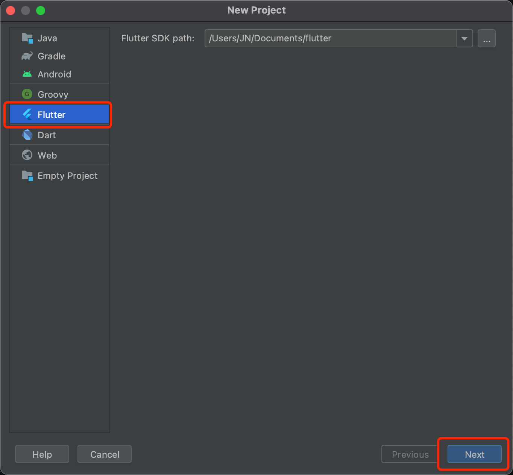
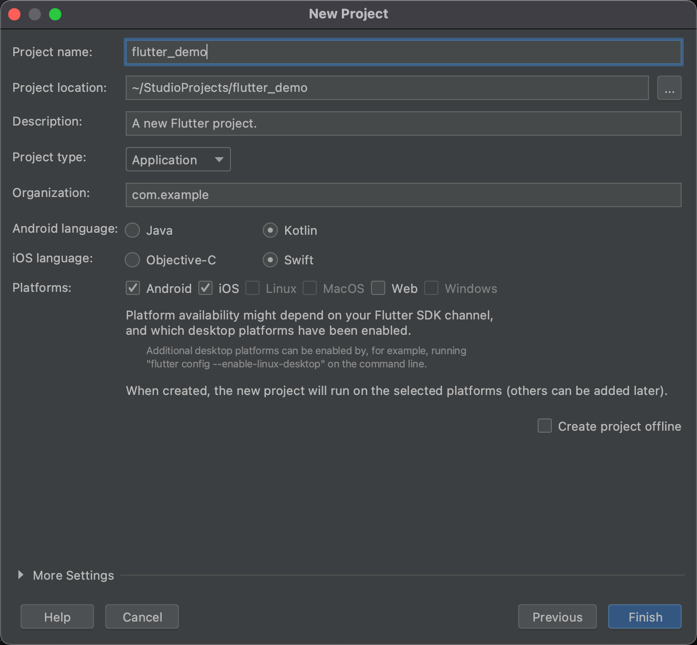

# Get started

<LastUpdated/>

## Step 1: Create a new Flutter project






## Add dependency 

in your pubspec.yaml, add the following dependency:

```yaml
authing_sdk: ^1.0.0
```

## SDK initialization 

Upon App start, call:

```dart
import 'package:authing_sdk/authing.dart';

Authing.init(String userPoolId, String appId)
```

where *userPoolId* is your Authing user pool id and *appId* is your Authing app id
