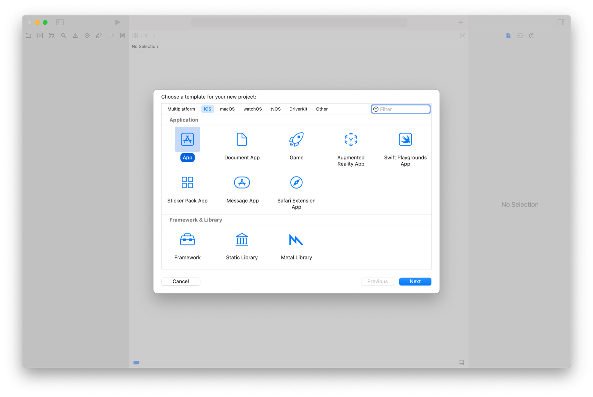
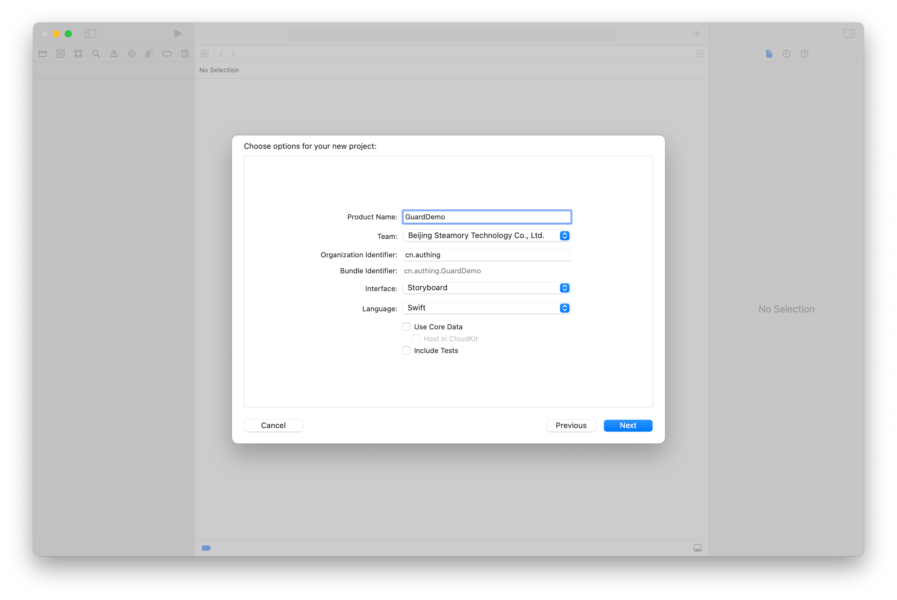
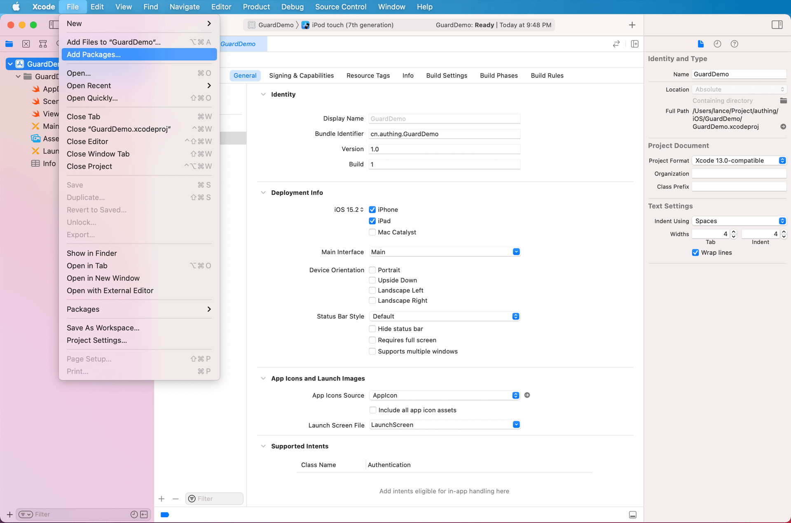
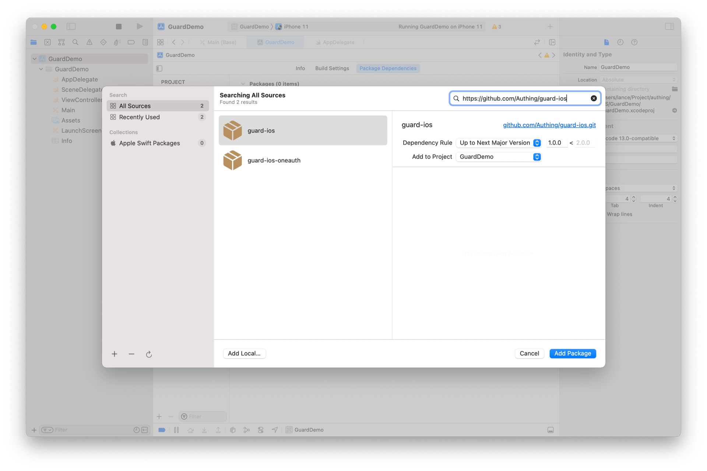
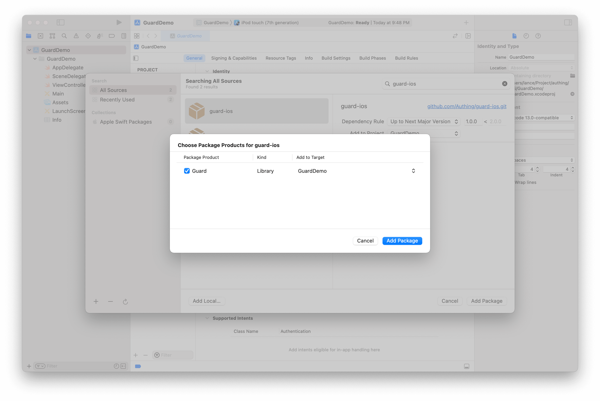
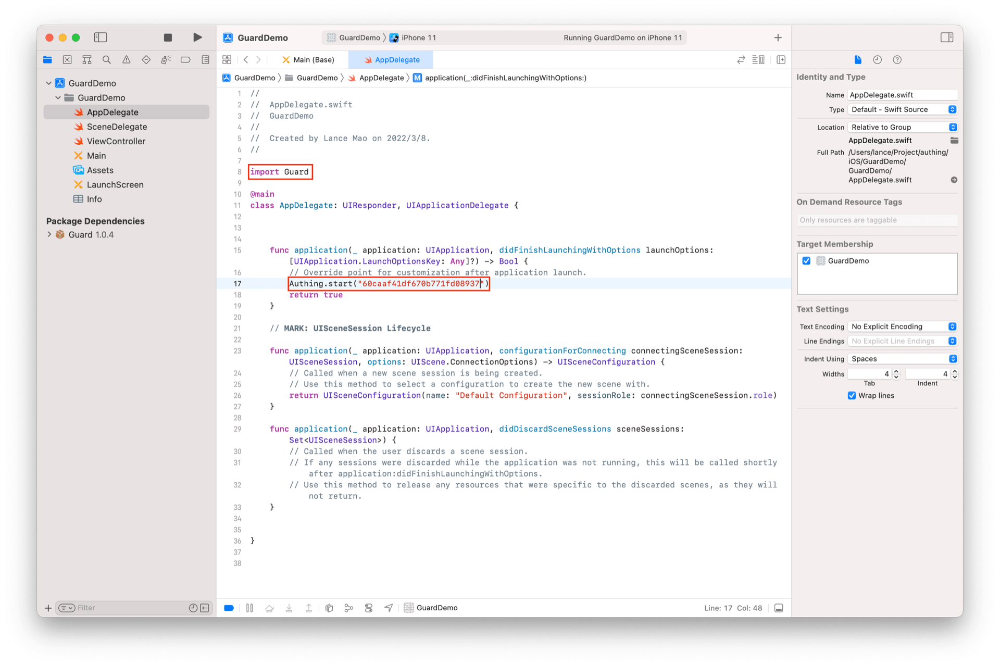

# Get started

<LastUpdated/>

## Step 1: Create a new Xcode project

## Step 2：Add Guard dependencies

Entering the package URL in the search field：https://github.com/Authing/guard-ios
Dependency rule select Up to Next Major Version 1.0.0

## Step 3: Initialization

The red part needs to be edited

 

Next, embed authentication flow and UI in 1 minute.

<a href="./quick.html" style="color:#FFF;">Quick start →</a>

 
