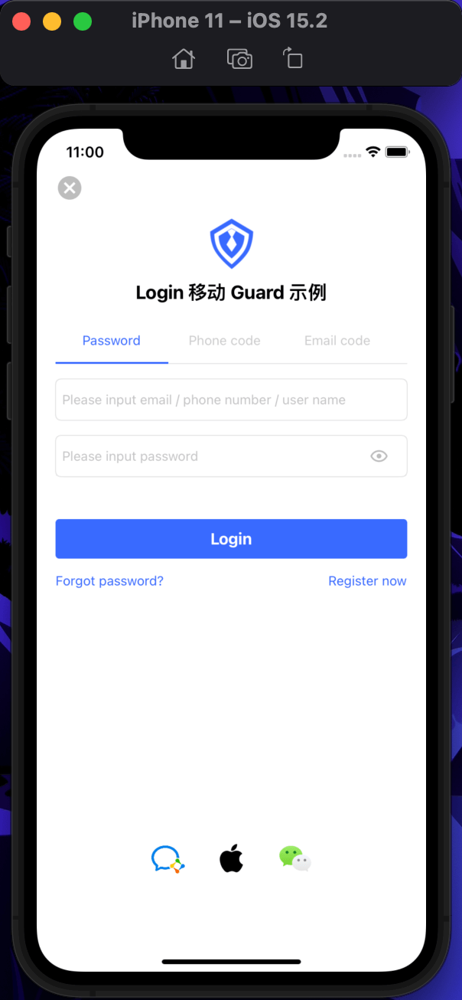

# Quick start

<LastUpdated/>

It takes only 1 minute if app uses UI provided by us.

Make sure you went over all the steps in [Get started](./develop.md), then call the following method where you want to authenticate user:

```swift
import Guard
AuthFlow().start { [weak self] code, message, userInfo in
    if code == 200 {
        // userInfo
    }
}
```

This is how it looks like:


