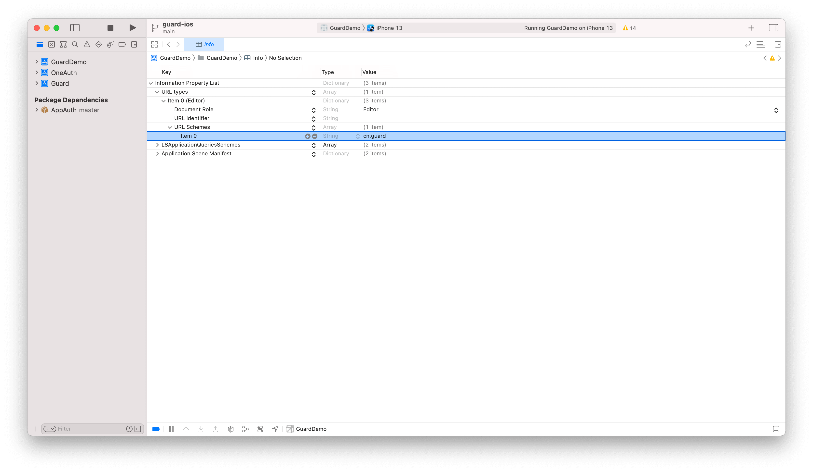

# Login by Alipay

<LastUpdated/>

## Initialize Guard SDK

Introduce Guard dependencies through Swift Package Manager and call the initialization function. [detailed steps](/reference/sdk-for-ios)

<br>

## Set callback information

Set the callback URL Scheme in the Info.plist



<br>

## Set up Alipay when the application starts:

```swift
import Guard
Authing.setupAlipay("your_alipay_appid", customScheme: "cn.guard")
```

>The first parameter is the Alipay App id; customScheme and the value filled in Info.plist in step 2 must be the same

<br>

## Handling Alipay Callbacks

After Alipay returns to the application, if SceneDelegate is used, you need to overload the following functions in SceneDelegate.swift:

```swift
func scene(_ scene: UIScene, openURLContexts URLContexts: Set<UIOpenURLContext>) {
    NotificationCenter.default.post(name: NSNotification.Name(rawValue: "alipayLoginOK"), object: URLContexts.first?.url)
}
```

If SceneDelegate is not used, you need to be overloaded in AppDelegate

```swift
func application(_ app: UIApplication, open url: URL, options: [UIApplication.OpenURLOptionsKey : Any] = [:]) -> Bool {
    NotificationCenter.default.post(name: NSNotification.Name(rawValue: "alipayLoginOK"), object: URLContexts.first?.url)
    return true
}
```

<br>

## Initiate Alipay authentication

With the semantic Hyper Component we provide, you only need to place one in the xib:

```swift
AlipayLoginButton
```

In case you don't want to use our UI component, you can have your own Button, and then inside your Button's onClick event, you can start alipay authentication and handle callback event like this:

```swift
let alipay: Alipay = Alipay()
alipay.login { code, message, userInfo in
    if (code == 200) {
        // logged in
    } else {
        // handle error
    }
}
```

If you want to implement the whole process by your own, right after you get auth code, please call this API to get Authing user info:

```swift
func loginByAlipay(_ code: String, completion: @escaping(Int, String?, UserInfo?) -> Void)
```

**Parameter**

* *authCode* auth code from alipay

**Example**

```swift
AuthClient().loginByAlipay(authCode) { code, message, userInfo in
    if (code == 200) {
        // userInfo
    }
}
```
