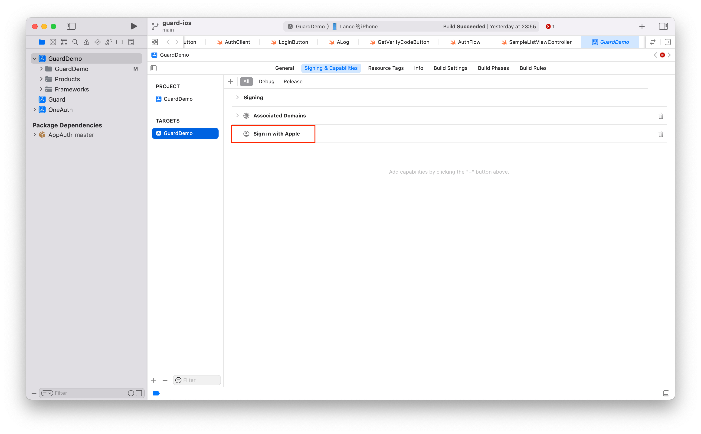

# Login by apple

<LastUpdated/>

## Configuring an Apple Account

First login to the Apple developer website, and then refer to here for configuration：[The detailed steps](/connections/apple/)

<br>

## Initialize Guard SDK

Introduce Guard dependencies through Swift Package Manager and call the initialization function.
[The detailed steps](/reference/sdk-for-ios/develop.html)

<br>

## Sign in with Apple



## Initiate Apple certification

With the semantic Hyper Component we provide, you only need to place one in the xib:

```swift
AppleLoginButton
```

If you want to implement the whole process by your own, right after you get auth code, please call this API to get Authing user info:

```swift
func loginByApple(_ code: String, completion: @escaping(Int, String?, UserInfo?) -> Void)
```

**Parameter**

* *authCode* auth code from apple

**Example**

```swift
AuthClient().loginByApple(authCode) { code, message, userInfo in
    if (code == 200) {
        // userInfo
    }
}
```
