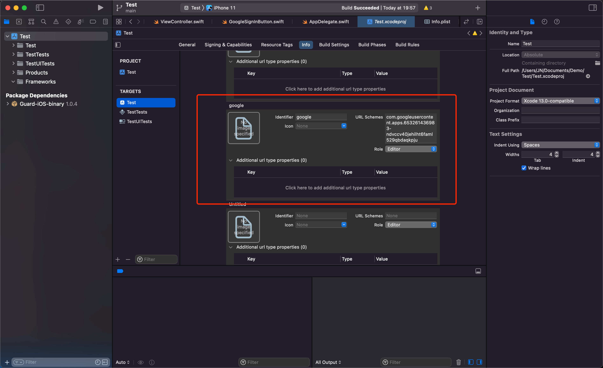
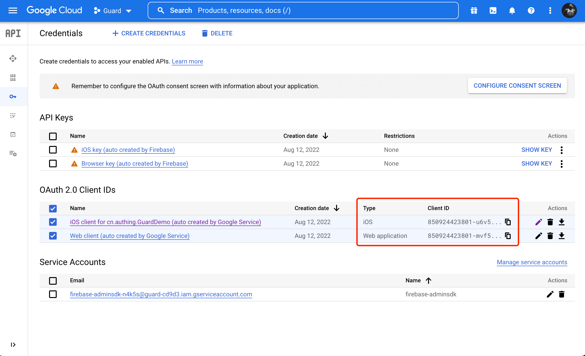

# Google account login

<LastUpdated/>

## Preparation

Configure in [Google API Console Credentials Console](https://console.cloud.google.com/apis/credentials) and [Authing Management Console](https://www.authing.cn/).


## Integrate Google login steps

### Step 1: Add Google Login Component Dependency

1. Enter: https://github.com/Authing/authing-binary in the swift package search bar.

2. Select [Authing-binary](https://github.com/Authing/authing-binary).
> [Authing-binary](https://github.com/Authing/authing-binary) depends on [Guard-iOS SDK](https://github.com/Authing/guard-ios).

2. Select **Up to Next Major Version 1.0.0** for the dependency rule.

3. Click **Add Package** and check **Google**.

<br>

### Step 2: Modify project configuration

Configure the Google Login component bounce URL:
1. Select the Xcode project, click the plus sign in **Targets** -> **Info** -> **URL Types**.
2. **URL Schemes** Add **iOS URL scheme** of Google console.


::: img-description
iOS URL schemes
:::



::: img-description
Add URL Types
:::

<br>

### Step 3: Initialize Google components

1. Add import Guard and import Google to AppDelegate or SceneDelegate.

2. Call Authing.start() to initialize Guard SDK.

3. Google.register needs to pass in the **clientID** and **serverClientId** issued by the Google console.



> **clientID** is the **ClientID** of the Google Console iOS app,
> **serverClientId** is the **ClientID** of the Google Console web application.

```swift
import Guard
import Google

Authing.start(<#AUTHING_APP_ID#>)
Google.register(clientID: <#iOS ClientId#>, serverClientId: <#Oauth Web ClientId#>)
  ```
 
<br>

### Step 4: Add callbacks

After successfully logging in and returning to the application, if SceneDelegate is used, the following functions need to be overloaded in SceneDelegate.swift:

```swift
func scene(_ scene: UIScene, openURLContexts URLContexts: Set<UIOpenURLContext>) {
     if let url = URLContexts.first?.url {
         _ = Google. handleURL(url: url)
     }
}
  ```

If SceneDelegate is not used, the following functions need to be overloaded in AppDelegate.

```swift
func application(_ app: UIApplication, open url: URL, options: [UIApplication. OpenURLOptionsKey : Any] = [:]) -> Bool {
    return Google. handleURL(url: url)
}
  ```

<br>

### Step 5: Initiate Google Authorization
The Google Sign-in component provides three authorization methods:

- The developer calls the one-click login API when login is required:

```swift
Google.login(viewController: <#ViewController that hosts the view#>) { code, message, userInfo in
     if (code == 200) {
         // userInfo: user information
     }
}
```

<br>

- With the semantic Hyper Component we provide, you only need to place one in the xib:

```swift
GoogleSignInButton
```

Set **Module** to Google, click **GoogleSignInButton** after Build success to log in.


<br>

- If you want to access the entire process of Google authorization yourself, after getting the authorization code, you can call the following API in exchange for Authing user information:

```swift
func loginByGoogle(_ code: String, completion: @escaping(Int, String?, UserInfo?) -> Void)
```

**parameter**

`authCode` Google authorization code

**example**

```swift
AuthClient().loginByGoogle(authCode) { code, message, userInfo in
     if (code == 200) {
         // userInfo: user information
     }
}
```