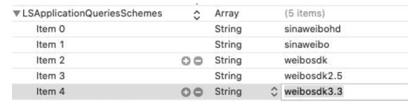

# Weibo login

<LastUpdated/>

## Preparation

Configure on [Weibo Development Platform](https://open.weibo.com/) and [Authing Console](https://authing.cn/).

<br>

## Integrated Weibo login

### Step 1: Add Weibo dependency

1. Enter: https://github.com/Authing/authing-binary in the swift package search bar.

2. Select [Authing-binary](https://github.com/Authing/authing-binary).
> [Authing-binary](https://github.com/Authing/authing-binary) depends on [Guard-iOS SDK](https://github.com/Authing/guard-ios).

3. Select **Up to Next Major Version 1.0.0** for the dependency rule.

4. Check **Weibo** after Add Package.

> **Weibo** depends on the version after [Guard-iOS 1.4.1](https://github.com/Authing/guard-ios).

<br>

### Step 2: Modify project configuration

Configure the callback URL of the Weibo login component:
1. Select the Xcode project, click the plus sign in **Targets** -> **Info** -> **URL Types**.
2. **Identifier** fill in com.weibo
3. **URL Schemes** fill in **wb** + **APP-ID** of the Weibo console, for example: wb884123079.
<br>

### Step 3: Add a whitelist to start WeChat in Info.plist

key: LSApplicationQueriesSchemes

value: sinaweibo, weibosdk, weibosdk2.5, weibosdk3.3, sinaweibohd

> Pay attention to capitalization



You can also open Info.plist via Source Code, and then copy and paste the following code:

```xml
<plist version="1.0">
<dict>
     ...
     <key>LSApplicationQueriesSchemes</key>
<array>
<string>sinaweibo</string>
<string>weibosdk</string>
         <string>weibosdk2.5</string>
<string>weibosdk3.3</string>
<string>sinaweibohd</string>
</array>
     ...
</dict>
</plist>
```

<br>

### Step 3: Set up Associated Domains:

> Fill in the host corresponding to the developer's Universal Link.


<br>

### Step 4: Initialize Weibo login
```swift
import Guard
import Weibo

func application(_ application: UIApplication, didFinishLaunchingWithOptions launchOptions: [UIApplication.LaunchOptionsKey: Any]?) -> Bool {
     Authing.start(<#AUTHING_APP_ID#>)
     // appId: Weibo open platform appId
     // scope: Weibo open platform scope, for example: all
     // redirectURI: the redirectURI filled in the Weibo open platform
     // universalLink: UniversalLink filled in on Weibo Open Platform
     Weibo.register(appId: <#your_weibo_appid#>, scope: <#your_weibo_scope#, redirectURI: <#your_weibo_redirecturi#>, universalLink: <#your_weibo_universalLink#>)
}
  ```
<br>


### Step 4: Handle Weibo login callback

After Weibo returns to the application, if SceneDelegate is used, the following functions need to be overloaded in SceneDelegate.swift:

```swift
func scene(_ scene: UIScene, continue userActivity: NSUserActivity) {
     _ = Weibo. handleUniversalLink(userActivity: userActivity)
}

func scene(_ scene: UIScene, openURLContexts URLContexts: Set<UIOpenURLContext>) {
     _ = Weibo. handleURL(url: url)
}
```

If SceneDelegate is not used, it needs to be overloaded in AppDelegate:

```swift
func application(_ application: UIApplication, continue userActivity: NSUserActivity, restorationHandler: @escaping ([UIUserActivityRestoring]?) -> Void) -> Bool {
     return Weibo. handleUniversalLink(userActivity: userActivity)
}

func application(_ app: UIApplication, open url: URL, options: [UIApplication. OpenURLOptionsKey : Any] = [:]) -> Bool {
     return Weibo. handleURL(url: url)
}
```

<br>

### Step 5: Initiate Weibo login authorization
#### Weibo authorized login

```swift
func login(completion: @escaping Authing.AuthCompletion) -> Void
```

**example**

```swift
Weibo.login { code, message, userInfo in
     if (code == 200) {
         // login successful
         // userInfo
     }
}
```

<br>

If the developer integrates Weibo login by himself, after getting the accessToken, he can call the following API in exchange for Authing user information:

#### Login via Baidu authorization code

```swift
func loginByWeibo(_ accessToken: String, completion: @escaping(Int, String?, UserInfo?) -> Void)
```

**parameter**

`accessToken` Weibo accessToken

**example**

```swift
AuthClient().loginByWeibo(accessToken) { code, message, userInfo in
     if (code == 200) {
         // userInfo: user information
     }
}
```