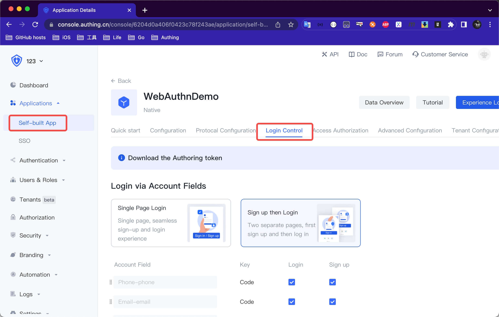
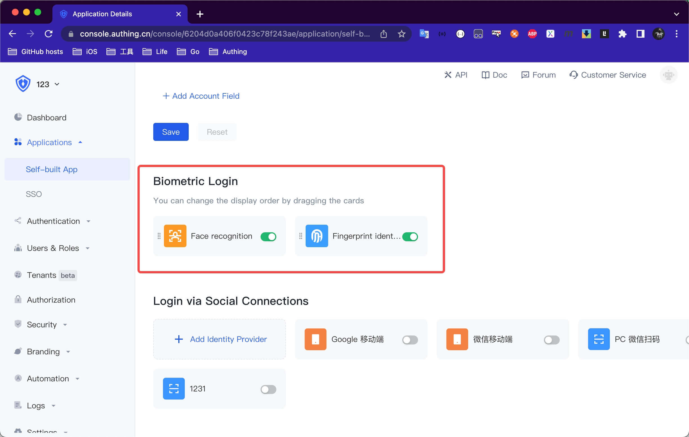

# Biometric authentication - WebAuthn passwordless authentication

<LastUpdated/>

## Integrated WebAuthn login

### Step 1: Open biometric authentication in [Authing Management Console](https://www.authing.cn/)
1. Find the client application that needs to be started under the self-built application.
2. Click Login Control.
3. Tap Biometrics Control and turn on the switch.
   




<br>

### Step 2: Add WebAuthn login dependency
1. Enter: https://github.com/Authing/authing-binary in the swift package search bar.

2. Select [Authing-binary](https://github.com/Authing/authing-binary).

3. Select **Up to Next Major Version 1.0.0** for the dependency rule.

4. Check **WebAuthn** after Add Package.

> **WebAuthn** depends on the version after [Guard-iOS 1.4.0](https://github.com/Authing/guard-ios).

<br>

## Login with WebAuthn

### Using the WebAuthn supercomponent

**Authing WebAuthn SDK** provides developers with the [Biometric Authentication Button](../../../reference/sdk-for-ios/component/basic/biometric-login-button.md) supercomponent, through which developers can integrate WebAuthn passwordless authentication within one minute.

### Using the WebAuthn API

If developers want to implement the WebAuthn authentication process by themselves, please refer to [Custom-WebAuthn-Authentication Process](../scenario/webauthn.md) and develop in combination with the following APIs.

#### Get WebAuthn credential creation initialization parameters

Obtain the initialization parameters for WebAuthn credential creation, and the user must be logged in before calling this interface.

```swift
public func getWebauthnRegistrationParam(completion: @escaping(Int, String?, NSDictionary?) -> Void)
```

**example**

```swift
AuthClient().getWebauthnRegistrationParam() { code, message, data in
     // data. registrationOptions
}
```

<br>

#### Verify WebAuthn Binding Registration Authenticator Credentials

Validate WebAuthn Binding Enrollment Authenticator Credentials

```swift
func webauthnRegistration(ticket: String, credentialId: String, rawId: String, attestationObject: String, clientDataJSON: String, authenticatorCode: String, completion: @escaping(Int, String?, NSDictionary?) -> Void)
```

**parameter**

* *ticket* Obtain the ticket when creating the initialization parameters of the credential
* *credentialId* Base64URL encoded credential ID
* *rawId* Base64URL original credential ID
* *attestationObject* Client data, including origin (that is, source of credential request), challenge and other information
* *creclientDataJSONdentialId* Base64URL encoded credential ID
* *authenticatorCode* credential information type: `"fingerprint"` `"face"` `"other"`

**example**

```swift
AuthClient().webauthnRegistration(ticket: ticket, credentialId: cid, rawId: rid, attestationObject: att, clientDataJSON: clidata, authenticatorCode: "face") { code, message, res in
}
```

<br>

#### The server verifies the WebAuthn authentication request credentials

```swift
func webauthnAuthentication(ticket: String, credentialId: String, rawId: String, authenticatorData: String, userHandle: String, clientDataJSON: String, signature: String, completion: @escaping(Int, String?, NSDictionary?) -> Void)
```

**parameter**

* *ticket* The ticket obtained from the Get WebAuthn authentication request initialization parameter interface
* *credentialId* Base64URL encoded credential ID
* *rawId* Base64URL original credential ID
* *authenticatorData* Authenticator information, including authentication status, signature count, etc.
* *userHandle* The user ID when creating the credential
* *clientDataJSON* Client data, including origin (that is, the origin of the credential request), challenge code and other information
* *signature* authenticator signature

**example**

```swift
AuthClient().webauthnAuthentication(ticket: ticket, credentialId: cid, rawId: rawId, authenticatorData: attData, userHandle: userHandle, clientDataJSON: clientData, signature: sig) { code, message, res in
}
```

<br>

#### Delete server-side WebAuthn authentication request credentials

```swift
func webauthnRemoveCredential(credentialID: String, completion: @escaping(Int, String?, NSDictionary?) -> Void)
```

**parameter**

* *credentialID* Base64URL encoded credential ID

**example**

```swift
AuthClient(). webauthnRemoveCredential(credentialID: cid) { code, message, res in
}
```

<br>


#### Get the list of bound credentials

```swift
func checkWebauthnVaildCredentials(credentialIds: [String], authenticatorCode: String, completion: @escaping(Int, String?, NSDictionary?) -> Void)
```

**parameter**

* *credentialIds* Array of Base64URL encoded credential IDs
* *authenticatorCode* credential information type: `"fingerprint"` `"face"` `"other"`

**example**

```swift
AuthClient().checkWebauthnVaildCredentials(credentialIds: [cid], authenticatorCode: "face") { code, message, res in
}
```

<br>