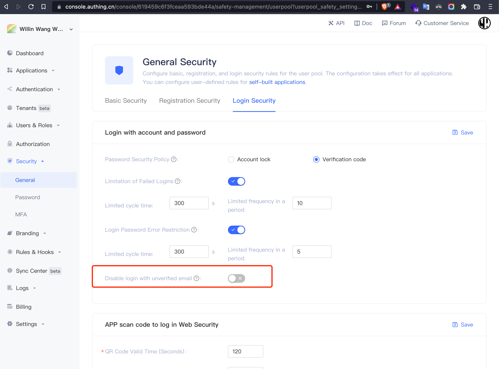
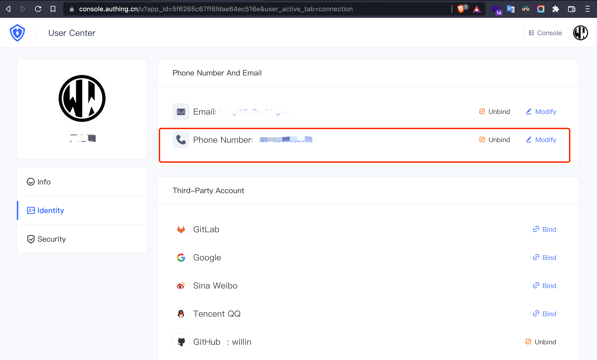
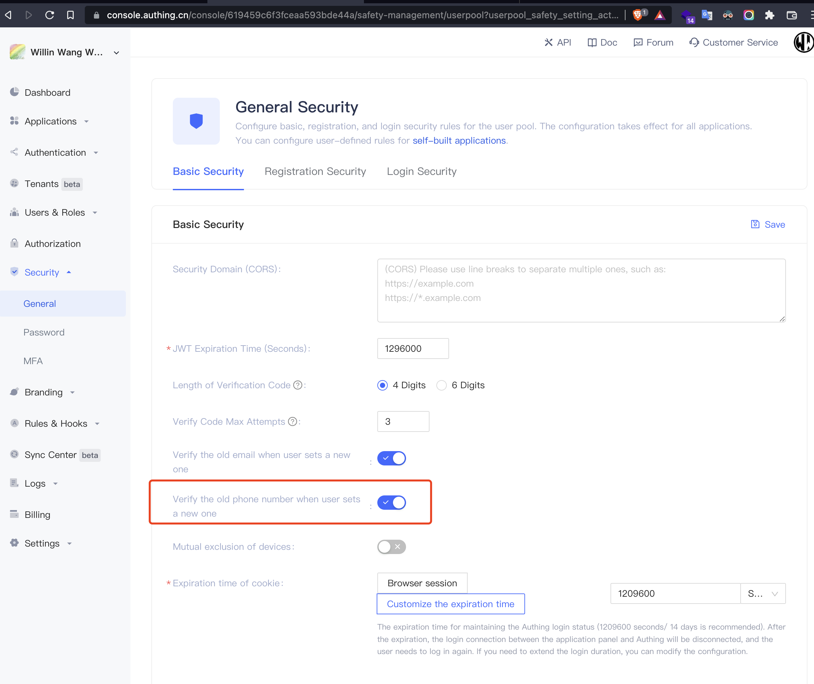
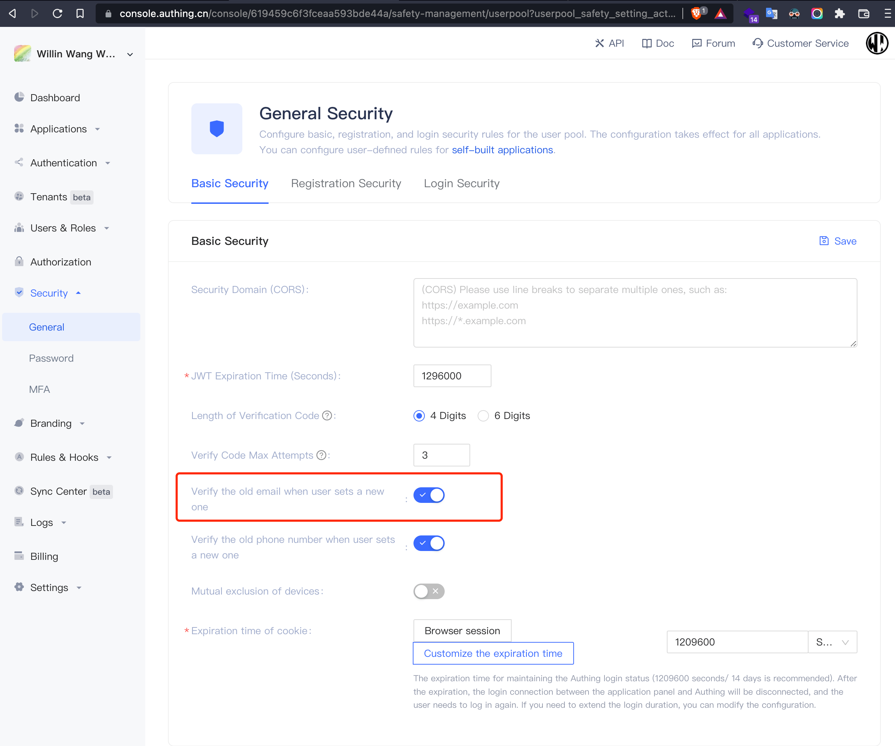

---
meta:
  - name: description
    content: User authentication module
---

# User authentication module

<LastUpdated/>

This module contains registration, resetting the phone number mailbox, modifying account information, etc., is requested by your end user (End user), suitable for use in the case where you need to verify user identity. If you tend to manage users as an administrator, please use [UsersManagementClient](../management/UsersManagementClient.md)。

```python
from authing.v2.authentication import AuthenticationClient, AuthenticationClientOptions

authentication_client = AuthenticationClient(
  options=AuthenticationClientOptions(
    app_id='AUTHING_APP_ID',
    app_host='https://YOUR_DOMAIN.authing.cn'
))
authentication_client.login_by_email # Use the email login
authentication_client.send_sms_code # Send the verification code
authentication_client.get_access_token_by_code # Use the authorization code Code to get the user's Token information.
```

## Use email registration

```python
def register_by_email(
            self,
            email,
            password,
            profile=None,
            force_login=False,
            client_ip=None,
            custom_data=None,
            context=None
    ):
  pass
```

Use the email registration, the mailbox is not case sensitive and the only userpool is unique. This interface does not require the user to verify the mailbox, after the user registration, the emailVerified field will be false. If you want the user who is not verified by the mailbox, you cannot log in, can **setting** in the userpool - **Security Information** open **User Login from the Mailbox**:



#### parameter

- `email` \<str\> Email
- `password` \<str\> Password
- `profile` \<dict\> user information
- `force_login` \<bool\> Whether to take a complete login, it will trigger the Pipeline function before and after login and the login event Webhook, and the number of cumulative logins of the user will add 1. Default is false
- `client_ip` \<str\> Client real IP, if you call this interface in the server side, please be sure to set this parameter as the true IP of the end user.
- `custom_data` \<str\> Client real IP, if you call this interface in the server side, please be sure to set this parameter as the true IP of the end user.
- `context`: \<dict\> Request the context, the `context` set here, you can get it in [pipeline context](/guides/pipeline/context-object.md)

#### Example

- Register with a mailbox password

```python
email = 'test@example.com'
user = authentication_client.register_by_email(
    email=email,
    password='passw0rd'
)
```

- Set user information while registering (nickname and company)

```python
email = 'test@example.com'
user = authentication_client.register_by_email(
    email=email,
    password='passw0rd',
    profile={
      'nickname': 'Nick',
      'company': '蒸汽记忆'
    }
)
```

- Add settings custom data while registering, you need to define a `source` custom field to the user first

```python
email = 'test@example.com'
user = authentication_client.register_by_email(
    email=email,
    password='passw0rd',
    custom_data={
      'source': 'google'
    }
)
```

#### return value

- [用户信息](/guides/user/user-profile.md)

## Register using username

```python
def register_by_username(
        self,
        username,
        password,
        profile=None,
        force_login=False,
        client_ip=None,
        custom_data=None,
        context=None
):
  pass
```

Use the username to register, the username is case sensitive and the only user pool

#### parameter

- `username` \<str\> username
- `password` \<str\> Password
- `profile` \<dict\> user information
- `force_login` \<bool\> Whether to take a complete login, it will trigger the Pipeline function before and after login and the login event Webhook, and the number of cumulative logins of the user will add 1. Default is false
- `client_ip` \<str\> Client real IP, if you call this interface in the server side, please be sure to set this parameter as the true IP of the end user.
- `custom_data` \<str\> Client real IP, if you call this interface in the server side, please be sure to set this parameter as the true IP of the end user.
- `context`: \<dict\> Request the context, the `context` set here, you can get it in [pipeline context](/guides/pipeline/context-object.md)

#### Example

- Use username password registration

```python
username = 'bob'
user = authentication_client.register_by_username(
    username=username,
    password='passw0rd',
)
```

- Set user information while registering (nickname and company)

```python
username = 'bob'
user = authentication_client.register_by_username(
    username=username,
    password='passw0rd',
    profile={
      'nickname': 'Nick',
      'company': '蒸汽记忆'
    }
)
```

- Add settings custom data while registering, you need to define a `source` custom field to the user first

```python
username = 'bob'
user = authentication_client.register_by_username(
    username=username,
    password='passw0rd',
    custom_data={
      'source': 'google'
    }
)
```

#### return value

- [User Info](/guides/user/user-profile.md)

## Use mobile phone number registration

```python
def register_by_phone_code(
        self,
        phone,
        code,
        password=None,
        profile=None,
        force_login=False,
        client_ip=None,
        custom_data=None,
        context=None
):
  pass
```

Use your mobile phone number to register, you can set the initial password of the account at the same time. You can pass [send_sms_code](#发送短信验证码) method sends SMS verification code

#### parameter

- `phone` \<str\> Phone
- `code` \<str\> SMS verification code
- `password` \<str\> Initial password
- `profile` \<dict\> user information
- `force_login` \<bool\> Whether to take a complete login, it will trigger the Pipeline function before and after login and the login event Webhook, and the number of cumulative logins of the user will add 1. Default is false
- `client_ip` \<str\> Client real IP, if you call this interface in the server side, please be sure to set this parameter as the true IP of the end user.
- `custom_data` \<str\> Client real IP, if you call this interface in the server side, please be sure to set this parameter as the true IP of the end user.
- `context`: \<dict\> Request context, set the `context` [pipeline context](/guides/pipeline/context-object.md)

#### Example

- Use the mobile phone number verification code to register

```python
phone = '188xxxx8888'
user = authentication_client.register_by_phone_code(
    phone=phone,
    code='1234',
)
```

- Set password while registering

```python
phone = '188xxxx8888'
user = authentication_client.register_by_phone_code(
    phone=phone,
    code='1234',
    password='passw0rd'
)
```

- Set up user information while registering (nickname and company)

```python
phone = '188xxxx8888'
user = authentication_client.register_by_phone_code(
    phone=phone,
    code='1234',
    password='passw0rd',
    profile={
      'nickname': 'Nick',
      'company': '蒸汽记忆'
    }
)
```

- Add settings custom data while registering, you need to define a `source` custom field to the user first

```python
phone = '188xxxx8888'
user = authentication_client.register_by_phone_code(
    phone=phone,
    code='1234',
    password='passw0rd',
    custom_data={
      'source': 'google'
    }
)
```

#### return value

- [User Info](/guides/user/user-profile.md)

## Use the email login

```python
def login_by_email(
        self,
        email,
        password,
        auto_register=False,
        captcha_code=None,
        client_ip=None,
        custom_data=None,
        context=None
):
  pass
```

Log in with a mailbox, the interface does not limit the unprecedented mailbox by default, if you want the user who does not verify the mailbox, if you want the user who does not verify the mailbox, you can not log in, you can **setting** userpool - **Security Information** Open **User Login to Unrecognizable Mailbox** options:


If your user pool is configured with login failure detection, when logging in with IP, the user will be required to enter graphical verification code(code is 2000)

#### parameter

- `email` \<str\> Email
- `password` \<str\> Password
- `auto_register` \<bool\> Whether it is automatically registered. If the user does not exist, an account will be automatically created according to the login book.
- `captcha_code` \<str\> Captcha
- `client_ip` \<str\> Client real IP, if you call this interface in the server side, please be sure to set this parameter as the true IP of the end user.
- `custom_data` \<str\> Client real IP, if you call this interface in the server side, please be sure to set this parameter as the true IP of the end user.
- `context`: \<dict\> Request context, set the `context` [pipeline context](/guides/pipeline/context-object.md)

#### Example

- Log in with a mailbox password

```python
email = 'test@example.com'
user = authentication_client.login_by_email(
    email=email,
    password='passw0rd',
)
```

- Repeated login failed, when you need to enter a graphic verification code

```python
email = 'test@example.com'
try:
  user = authentication_client.login_by_email(
    email=email,
    password='passw0rd',
  )
except AuthingException as e:
  if e.code == 2000:
    user = authentication_client.login_by_email(
      email=email,
      password='passw0rd',
      captcha_code='xj72'
    )
```

- Setting the custom field while logging in

```python
email = 'test@example.com'
user = authentication_client.login_by_email(
    email=email,
    password='passw0rd',
    custom_data={
      'source': 'google'
    }
)
```

#### return value

- [User Info](/guides/user/user-profile.md)

## Use the username to log in

```python
def login_by_username(
        self,
        username,
        password,
        auto_register=False,
        captcha_code=None,
        client_ip=None,
        custom_data=None,
        context=None
):
  pass
```

Use the username to log in. If your user pool is opened [login failed detection](/guides/security/config-login-fail-limit.md),When the login is logged in with IP, the user will be required to enter graphic verification code (error code 2000)

#### parameter

- `username` \<str\> username
- `password` \<str\> password
- `auto_register` \<bool\> Whether it is automatically registered. If the user does not exist, an account will be automatically created according to the login book.
- `captcha_code` \<str\> Captcha
- `client_ip` \<str\> Client real IP, if you call this interface in the server side, please be sure to set this parameter as the true IP of the end user.
- `custom_data` \<str\> Client real IP, if you call this interface in the server side, please be sure to set this parameter as the true IP of the end user.
- `context`: \<dict\> Request context, set the `context` [pipeline context](/guides/pipeline/context-object.md)

#### Example

- Use your username, password login

```python
username = 'bob'
user = authentication_client.login_by_username(
    username=username,
    password='passw0rd',
)
```

- Repeated login failed, when you need to enter a graphic verification code

```python
username = 'bob'
try:
  user = authentication_client.login_by_username(
    username=username,
    password='passw0rd',
  )
except AuthingException as e:
  if e.code == 2000:
    user = authentication_client.login_by_username(
      username=username,
      password='passw0rd',
      captcha_code='xj72'
    )
```

- Setting the custom field while logging in

```python
username = 'bob'
user = authentication_client.login_by_username(
    username=username,
    password='passw0rd',
    custom_data={
      'source': 'google'
    }
)
```

## Use the mobile phone number verification code to log in

```python
def login_by_phone_code(
  self,
  phone,
  code,
  client_ip=None,
  custom_data=None,
  context=None
):
  pass
```

Use the mobile phone number verification code to log in. You need to use it first[send_sms_code](#发送短信验证码) Method sends SMS verification code

#### parameter

- `phone` \<str\> Phone
- `code` \<str\> Method sends SMS verification code
- `client_ip` \<str\> Client real IP, if you call this interface in the server side, please be sure to set this parameter as the true IP of the end user.
- `custom_data` \<str\> Client real IP, if you call this interface in the server side, please be sure to set this parameter as the true IP of the end user.
- `context`: \<dict\>Request context, set the `context`[pipeline context](/guides/pipeline/context-object.md)

#### Example

- Use the mobile phone number verification code to log in

```python
phone = '188xxxx8888'
# Mobile phone number verification code login, if the user does not exist automatically to create an account
user = authentication_client.login_by_phone_code(
    phone=phone,
    code='1234',
)
```

- Set custom data while logging in

```python
phone = '188xxxx8888'
# Mobile phone number verification code login, if the user does not exist automatically to create an account
user = authentication_client.login_by_phone_code(
    phone=phone,
    code='1234',
    custom_data={
      'source': 'google'
    }
)
```

## Use the mobile phone number password to log in

```python
def login_by_phone_password(
  self,
  phone,
  password,
  auto_register=False,
  captcha_code=None,
  client_ip=None,
  custom_data=None,
  context=None
):
  pass
```

If the user is bound to the phone number and set the password, you can log in to the phone number + password. If your userpool opens [Login Failed Detection](/guides/security/config-login-fail-limit.md), when logging in the same IP multiple times, the user will be required to enter graphical verification code (error code is 2000)

#### parameter

- `phone` \<str\> phone
- `password` \<str\> password
- `captcha_code` \<str\> Captcha
- `client_ip` \<str\> Client real IP, if you call this interface in the server side, please be sure to set this parameter as the true IP of the end user.
- `custom_data` \<str\> Client real IP, if you call this interface in the server side, please be sure to set this parameter as the true IP of the end user.
- `context`: \<dict\> Request context, set the `context` [pipeline context](/guides/pipeline/context-object.md)

#### Example

- Use the mobile phone number password to log in

```python
phone = '188xxxx8888'
user = authentication_client.login_by_phone_password(
    phone=phone,
    password='passw0rd',
)
```

- Repeated login failed, when you need to enter a graphic verification code

```python
phone = '188xxxx8888'
try:
  user = authentication_client.login_by_phone_password(
    phone=phone,
    password='passw0rd',
  )
except AuthingException as e:
  if e.code == 2000:
    user = authentication_client.login_by_phone_password(
      phone=phone,
      password='passw0rd',
      captcha_code='xj72'
    )
```

- Set custom data while logging in

```python
phone = '188xxxx8888'
user = authentication_client.login_by_phone_password(
    phone=phone,
    password='passw0rd',
    custom_data={
      'source': 'google'
    }
)
```

## Log in with an LDAP username

```python
def login_by_ldap(self, username, password):
  pass
```

Log in with an account password using the LDAP identity source. If this account is logged in for the first time, it will import its user information into the user directory of the user pool; after logging in again, will update this account user information based on the latest account information obtained.

Click here to view[Connect the LDAP identity source](/en/connections/ldap/)

#### parameter

- `username` \<str\> username
- `password` \<str\> password

#### Example

```python
username = 'bob'
user = authentication_client.login_by_ldap(
    username=username,
    password='passw0rd'
)
```

#### return value

- [User Info](/guides/user/user-profile.md)

## Login with an AD username

```python
def login_by_ad(self, username, password):
  pass
```

Log in with an account using the AD domain. If this account is logged in for the first time, it will import its user information into the user directory of the user pool; after logging in again, will update this account user information based on the latest account information obtained.

Click here to view[Connect Active Directory Origin](/en/connections/windows-active-directory/)

#### parameter

- `username` \<str\> username
- `password` \<str\> password

#### Example

```python
username = 'bob'
user = authentication_client.login_by_ad(
    username=username,
    password='passw0rd'
)
```

#### return value

- [User Info](/guides/user/user-profile.md)

## Get the user information of current login

```python
def get_current_user(self, token=None):
  pass
```

Get the user information of the current login user, you need authentication_client that is currently logged in to the status. You can set the login status of authentication_client in two ways:

1. Call the login interface (such as password login, mobile phone verification code login, social login), authentication_client Cache user[id_token](/concepts/id-token.md) to remember the login status
2. By user [id_token](/concepts/id-token.md) initialization authentication_client

You can also manually get into the user's [id_token](/concepts/id-token.md), check the login status of this `id_token`

#### parameter

- `token` \<str\> user [id_token](/concepts/id-token.md), optional

#### Example

- Call the login interface to get user information

```python
username = 'bob'
authentication_client.login_by_username(
    username=username,
    password='passw0rd',
)

user = authentication_client.get_current_user()
```

- By user [id_token](/concepts/id-token.md) Once initialization, get user information

```python
from authing.v2.authentication import AuthenticationClient, AuthenticationClientOptions

authentication_client = AuthenticationClient(
  options=AuthenticationClientOptions(
    app_id='AUTHING_APP_ID',
    app_host='https://YOUR_DOMAIN.authing.cn',
    token='ID_TOKEN'
))

user = authentication_client.get_current_user()
```

#### return value

- [User Info](/guides/user/user-profile.md)

## sign out

```python
def logout(self):
  pass
```

Used for users to quit login, will do the following:

1. Empty the user's session session information under the current application
2. Use the current `id_token` mark to have failed, use this `id_token` to call the {{$localeConfig.brandName}} interface Unable to get related data

#### Example

```python
success = authentication_client.logout()
```

#### return value

Whether to quit login success

## sending text verify code

```python
def send_sms_code(self, phone):
  pass
```

Send SMS verification code, currently only support domestic mobile phone number; this interface has interface frequency limit, please do not request frequent

#### parameter

- `phone` \<str\> Phone

#### Example

```python
authentication_client.send_sms_code(
  phone="188xxxx8888",
)
```

## send email

```python
def send_email(self, email, scene):
  pass
```

Actively send mail to users, currently supported 4 types of messages contain: reset password mail, verify mailbox email, modify mailbox verification code mail, MFA verification email. At the same time you can [custom email template and configure third-party mail service providers](/guides/userpool-config/email/)

#### parameter

- `email` \<str\> Email
- `scene` \<str\> Send a scene, optional value contains:
  - RESET_PASSWORD: Send a reset password message, including the verification code
  - VERIFY_EMAIL: Send a verification mailbox
  - CHANGE_EMAIL: Send a modification mailbox message, including the verification code
  - MFA_VERIFY: Send MFA verification email

#### Example

- Send a reset password message, send mail containing the verification code to the user's mailbox

```python
authentication_client.send_email(
  email="test@example.com",
  scene="RESET_PASSWORD",
)
```

- After that, the user can use the mailbox verification code to reset the password.

```python
authentication_client.reset_password_by_email_code(
  email="test@example.com",
  code="1234",
  new_password="new_passw0rd"
)
```

## Get custom data

```python
def get_udf_value(self):
  pass
```

Get all custom data for the user. You need to be in the user pool[Define user-defined data meta information](/guides/users/user-defined-field/)

#### Example

```python
data = authentication_client.get_udf_value()
```

#### Sample data

```json
{
  "school": "华中科技大学",
  "age": 20
}
```

## Set custom data

```python
def set_udf_value(self, data):
  pass
```

Set the user's custom field. You need to be in the user pool[Define user-defined data meta information](/guides/users/user-defined-field/)And the type of incoming value must match the defined type. If the setting fails, it will throw an exception, you need to capture an exception

#### parameter

- `data` \<str\> Enter data, type is a dictionary, please see the example details

#### Example

```python
success = authentication_client.set_udf_value({
  'school': '华中科技大学',
  'age': 22
})
```

#### return value

- Will return a value of a `bool` type, indicating whether it is successful

## Delete custom data

```python
def remove_udf_value(self, key):
  pass
```

Delete a user's custom data

#### parameter

- `key` \<str\> Custom Fields of key

#### Example

```python
success = authentication_client.remove_udf_value('school')
```

## Detect Token login status

```python
def check_login_status(self, token=None):
  pass
```

Detect user [id_token](/concepts/id-token.md) login status

#### parameter

- `token` \<str\> User login credential token

#### Example

```python
# Check the valid status of any token
data = authentication.check_login_status(token="TOKEN")

# Call the login before or initialize access_token
# Check the current user's login status
data = authentication.check_login_status()
```

#### Sample data

- Successful example

```json
{
  "code": 200,
  "message": "logged",
  "status": true,
  "exp": 1620732833,
  "iat": 1619523233
}
```

- Failed example

```json
{
  "code": 2206,
  "message": "Login information has expired",
  "status": false,
  "exp": null,
  "iat": null
}
```

## Reset password via SMS verification code

```python
def reset_password_by_phone_code(self, phone, code, new_password):
  pass
```

Reset your password by SMS verification code, you can pass[send_sms_code](#发送短信验证码) method sends SMS verification code

#### parameter

- `phone` \<str\> phone
- `code` \<str\> code
- `new_password` \<str\> new password

#### Example

```python
authentication_client.reset_password_by_phone_code(
  phone="188xxxx8888",
  code="1234",
  new_password="passw0rd"
)
```

## Reset password via mail verification code

```python
def reset_password_by_email_code(self, email, code, new_password):
  pass
```

Reset password by email verification code, you need to call first [send_email](#发送邮件) Interface Send Reset Password Mail（Scene value is `RESET_PASSWORD`）

#### parameter

- `phone` \<str\> phone
- `code` \<str\> code
- `new_password` \<str\> new password

#### Example

```python
authentication_client.reset_password_by_email_code(
  email="test@example.com",
  code="1234",
  new_password="passw0rd"
)
```

## Modify user profile

```python
def update_profile(self, updates):
  pass
```

Modify user information, this interface cannot be used to modify the mobile phone number, email, password, if you need to call [update_phone](#更新用户手机号)、[update_email](#更新用户邮箱)、[update_password](#更新用户密码)

#### parameter

- `updates` \<dict\> modified user profile
- `updates.username` \<str\> username
- `updates.nickname` \<str\> nickname
- `updates.photo` \<str\> avatar
- `updates.company` \<str\> company
- `updates.browser` \<str\> browser
- `updates.device` \<str\> device
- `updates.lastIP` \<str\> recently logged in IP
- `updates.name` \<str\> Name
- `updates.givenName` \<str\> Given Name
- `updates.familyName` \<str\> Family Name
- `updates.middleName` \<str\> Middle Name
- `updates.profile` \<str\> Profile Url
- `updates.preferredUsername` \<str\> Preferred Name
- `updates.website` \<str\> Personal site
- `updates.gender` \<str\> gender, M（Man）means male, F（Female）means female、Unknown expression U（Unknown）
- `updates.birthdate` \<str\> birthdate
- `updates.zoneinfo` \<str\> Time zone
- `updates.locale` \<str\> language
- `updates.address` \<str\> address
- `updates.streetAddress` \<str\> street address
- `updates.locality` \<str\>
- `updates.region` \<str\> region
- `updates.postalCode` \<str\> postal code
- `updates.city` \<str\> city
- `updates.province` \<str\> province
- `updates.country` \<str\> country

#### Example

- Modify the nickname and the recent login address

```python
user = authentication_client.update_profile({
    'nickname': 'Nick',
    'lastIp': '111.111.111.111',
})
```

- You can't directly modify the mobile phone number, email, password, will report an error

```python
try:
  authentication_client.update_profile({
    'phone': '188xxxx8888'
  })
except AuthingException as e:
  // this will fail, you can't change your phone directly, must verify by phone code
  pass

```

#### return value

- [User Info](/guides/user/user-profile.md)

## Update user password

```python
def update_password(self, new_password, old_password):
  pass
```

Update the user password, you need to provide the original password

#### parameter

- `new_password` \<str\> new password
- `old_password` \<str\> Old password, if the user does not set a password, you can not fill

#### Example

- Registered by mobile phone number, social login, etc., did not set password for the first time, old_password leaves

```python
authentication_client.update_password(
  new_password="passw0rd",
)
```

- The user has set a password before

```python
authentication_client.update_password(
  new_password="passw0rd",
  old_password="123456!"
)
```

#### return value

- [User Info](/guides/user/user-profile.md)

## Binding mobile phone number

```python
def bind_phone(self, phone, phone_code):
  pass
```

The user is bound to bind the mobile phone number, if you need to modify your mobile phone number, please use it.[update_phone](#更新用户手机号) method. If the phone number has been bound, it will be bound to fail. Send verification code, please use [send_sms_code](#发送短信验证码)

Terminal users can also[bind mobile phone number in personal center buffet](/guides/user/manage-profile.md#绑定手机号)：



#### parameter

- `phone` \<str\> phone
- `phone_code` \<str\> Mobile phone number verification code

#### Example

```python
phone = '188xxxx8888'
user = authentication_client.bind_phone(
    phone=phone,
    phoneCode='1234',
)
```

## Solution to the mobile number

```python
def unbind_phone(self):
  pass
```

The user solves the mobile phone number. If the user does not bind other login mode (mailbox, social login account), will not be able to solve the mobile phone number, will prompt the error

End users can also [in the personal center self-service mobile phone number](/guides/user/manage-profile.md#绑定手机号)


#### Example

```python
user = authentication_client.unbind_phone()
```

#### return value

This interface will return the latest user information

- [User Info](/guides/user/user-profile.md)

## Update user mobile phone number

```python
def update_phone(self, phone, phone_code, old_phone=None, old_phone_code=None):
  pass
```

Update the user mobile phone number. Like modifying the mailbox, by default, if the user is currently bound to the mobile phone number, you need to verify the original mobile phone number (the current account binding mobile phone number) and the current mailbox (the mobile phone number to be bound)

That is, the mobile phone number currently binded to the user A is 15888888888, I want to modify to 1589999999, then you need to verify the two mobile phone numbers at the same time.

Developers can also choose not to "verify the original mobile phone number", you can turn off in {{$localeConfig.brandName}} console **setting**,under the directory **security information** .



The user first binds the mobile phone number, please use the [bind_phone](#绑定手机号) interface

#### parameter

- `phone` \<str\> New mobile phone number
- `phone_code` \<str\> New mobile phone number verification code
- `old_phone` \<str\> Old mobile phone number
- `old_phone_code` \<str\> Old mobile phone number verification code

#### Example

- Close "Verify the original mobile number" option

```python
authentication_client.update_email(
  phone="test1@example.com",
  phoneCode="1234",
)
```

- Open "Verify the original mobile number" option

```python
authentication_client.update_email(
  phone="test1@example.com",
  phoneCode="1234",
  oldPhone="test2@exmaple.com",
  oldPhoneCode="1234"
)
```

#### return value

- [User Info](/guides/user/user-profile.md)

## Binding mailbox

```python
def bind_email(self, email, email_code):
  pass
```

Used for the initial binding mailbox for the user, check the mailbox verification code. If you need to modify the mailbox, please use [update_email](#更新用户邮箱). If the mailbox has been bound, it will bind failed. Send an email verification code, please use [send_email](#发送邮件)

Terminal users can also [in the personal center self-help mailbox](/guides/user/manage-profile.md#绑定邮箱):


#### parameter

- `email` \<str\> email
- `email_code` \<str\> email code, by [send_email](#发送邮件) method is obtained, EmailScene is CHANGE_EMAIL

#### Example

```python
email = 'test@example.com'
user = authentication_client.bind_email(
    email=phone,
    email_code='1234',
)
```

#### return value

- [User Info](/guides/user/user-profile.md)

## Menned mailbox

```python
def unbind_email(self):
  pass
```

Users solve the mailbox, if the user does not bind other login mode (mobile phone number, social login account), will not be able to solve the mailbox, will prompt the error

End users can also [in personal center self-help mailbox](/guides/user/manage-profile.md#绑定邮箱)：


#### Example

```python
user = authentication_client.get_current_user()
if user.get('email'):
  user = authentication_client.unbind_email()
```

#### return value

- [User Info](/guides/user/user-profile.md)

## Update user mailbox

```python
def update_email(self, email, email_code, old_email=None, old_email_code=None):
  pass
```

If the user has binds the mailbox, by default, you need to verify the original mailbox (current account binding mailbox) and the current mailbox (the mailbox to be bound). That is, the mailbox currently binded to 123456@qq.com, wants to modify to 1234567@qq.com, then you need to verify these two mailboxes at the same time.

Developers can also choose not to "verify the original mailbox", you can turn off the **security information** module under the {{$localeConfig.brandName}} console **setting**



Use the user first binding the mailbox, please use the [bind_email](#绑定邮箱) interface

#### parameter

- `email` \<str\> email
- `email_code` \<str\> New mailbox verification code
- `old_email` \<str\> Old mailbox
- `old_email_code` \<str\> Old mailbox verification code

#### Example

- Close the "Verify the original mailbox" option

```python
authentication_client.update_email(
  email="test1@example.com",
  email_code="1234",
)
```

- Open "Verify the original mailbox" option

```python
authentication_client.update_email(
  email="test1@example.com",
  email_code="1234",
  old_email="test2@exmaple.com",
  old_email_code="1234"
)
```

## Bind social account

```python
def link_account(self, primary_user_token, secondary_user_token):
  pass
```

Bind a social account (such as WeChat account, github account) to a primary account (mobile phone number, email account)

#### parameter

- `primary_user_token` \<str\> Main account Token
- `secondary_user_token` \<str\> Social account Token

#### Example

```python
primary_user_token = 'xxx'
secondary_user_token = 'xxx'
authentication_client.link_account(
  primary_user_token=primary_user_token,
  secondary_user_token=secondary_user_token
)
```

#### return value

- Will return a value of a `bool` type, indicating whether it is successful

## Solidning the social account

```python
def unlink_account(self, primary_user_token, provider):
  pass
```

Main account unique socialized login account

#### parameter

- `primary_user_token` \<string\> Main account user `id_token`
- `provider` \<string\> You can [View all social login types supported here](/guides/authentication/social/)

#### Example

```python
authentication_client.unlink_account(
  primary_user_token='xxx',
  provider='github'
)
```

#### return value

- Will return a value of a `bool` type, indicating whether it is successful

## Get user account security level

```python
def get_security_level(self):
  pass
```

Get the account security level of this account

#### Example

```python
data = authentication_client.get_security_level()
```

#### Sample data

```json
{
  "score": 65,
  "email": true,
  "phone": false,
  "password": true,
  "passwordSecurityLevel": 1,
  "mfa": false
}
```

Field release:

- `email`: \<bool\>, Whether it is bound to the mailbox
- `mfa`: \<bool\>, Whether it is bound to MFA
- `password`: \<bool\>, Whether the password is set
- `phone`: \<bool\>, Whether it is bound to the mobile phone number
- `passwordSecurityLevel`: \<int | null\>, password security login,`null` Indicates that the password security level has not been detected
  - `1`: Low
  - `2`: middle
  - `3`: high
- `score`: \<int\>, Account security level overall score, up to 100 points

## Get all the list of users authorized to be authorized

```python
def list_authorized_resources(self, namespace, resource_type=None):
  pass
```

Get all resources authorized by users, all resources authorized to include resources inherited from roles, group, organization organization

#### parameter

- `namespace` \<str\> Code of permission grouping, for details, please see [Use Right Limits Group Management Rights Resources](/guides/access-control/resource-group.md)
- `resource_type` \<str\> Resource type, have the following resources type
  - `DATA`: type of data
  - `API`: API type data
  - `MENU`: Menu type data

#### Example

```python
data = authentication_client.list_authorized_resources(
  namespace='default'
)
```

#### Sample data

```json
{
  "totalCount": 12,
  "list": [
    {
      "code": "menu_a",
      "type": "MENU"
    },
    {
      "code": "menu_b",
      "type": "MENU"
    },
    {
      "code": "books:1",
      "type": "DATA",
      "actions": ["books:delete", "books:update"]
    }
  ]
}
```

## Get applications that current users can access

```python
def list_applications(self, page=1, limit=10):
  pass
```

Get applications that current users can access

#### parameter

- `page` \<int\> Page serial number, default is `1`
- `limit` \<int\> The number of times returned each page, the default is `10`

#### Example

```python
data = authentication_client.list_applications()
_list, total_count = data.get('list'), data.get('totalCount')
```

#### Sample data

```json
{
  "list": [
    {
      "id": "5f97fb40d352ecf69ffe6d98",
      "name": "oo",
      "logo": "https://files.authing.co/authing-console/default-app-logo.png",
      "domain": "okokiohutuyfrtd",
      "description": null,
      "createdAt": "2020-10-27T10:49:36.817Z",
      "updatedAt": "2021-03-17T10:39:53.650Z",
      "protocol": "oidc"
    }
  ],
  "totalCount": 1
}
```

## Check password strength

```python
def check_password_strength(self, password):
  pass
```

Check the password strength, please see you for details[https://docs.authing.co/v2/guides/security/config-password.html](https://docs.authing.co/v2/guides/security/config-password.html)

#### parameter

- `password` \<str\> password

#### Example

```python
authentication.check_password_strength('123456')
```

#### Sample data

```json
{
  "message": "Password verification success",
  "valid": true
}
```

## Refresh the current user's token

```python
def refresh_token(self, token=None):
  pass
```

Refresh the current user's Token

#### parameter

- `token` \<str\> user Token

#### Example

```python
user = self.authentication.login_by_email(email,password)
        res = self.authentication.refresh_token()
```

#### Sample data

```json
{
  "iat": 1632467937,
  "token": "newToken",
  "exp": 1633677537
}
```

## Add custom data

```python
def set_udv(self, key, value):
  pass
```

Add custom data

#### parameter

- `key` \<str\> Custom data Key
- `value` \<str\> Custom data Key

#### Example

```python
management.udf.set(
            targetType="USER", key="school", dataType="STRING", label="学校")
authentication.set_udv(key="school", value="ucla")
```

#### Sample data

```json
[
  {
    "dataType": "STRING",
    "value": "ucla",
    "key": "school",
    "label": "学校"
  }
]
```

## Delete custom data

```python
def remove_udv(self, key):
  pass
```

Delete custom data

#### parameter

- `key` \<str\> Custom data Key

#### Example

```python
authentication.remove_udv( key="age" )
```

#### Sample data

```json
[]
```

## Get the organization of the user

```python
def list_orgs(self):
  pass
```

Get the organization of the user

#### Example

```python
authentication_client.login_by_username('username', 'password')
data = authentication_client.list_orgs()
```

#### Sample data

```json
[]
```

## Get the list of roles owned by users

```python
def list_roles(self, namespace=None):
  pass
```

Get the list of roles owned by users

#### parameter

- `namespace` \<str\> Namespaces

#### Example

```python
authentication_client.list_roles()
```

#### Sample data

```json
{
  "totalCount": 1,
  "list": [
    {
      "code": "rdvienjquv",
      "description": null,
      "parent": null,
      "namespace": "default",
      "arn": "arn:cn:authing:61384d3e302f1f75e69ce95a:role:614d7e6fba71103fcf5af5df",
      "updatedAt": "2021-09-24T07:29:51+00:00",
      "id": "614d7e6fba71103fcf5af5df",
      "createdAt": "2021-09-24T07:29:51+00:00"
    }
  ]
}
```

## Get the list of roles owned by users

```python
def has_role(self, code, namespace=None):
  pass
```

Get the list of roles owned by users

#### parameter

- `code` \<str\> Role Code
- `namespace` \<str\> Namespaces

#### Example

```python
authentication_client.has_role(code)
```

#### Sample data

```python
bool
```

## Judging whether the current user has a role

```python
def has_role(self, code, namespace=None):
  pass
```

Judging whether the current user has a role

#### parameter

- `code` \<str\> Role Code
- `namespace` \<str\> Namespaces

#### Example

```python
authentication_client.has_role(code)
```

#### Sample data

```python
bool
```

## Detect the current login status

```python
def check_logged_in(self):
  pass
```

Detect the current login status

#### Example

```python
authentication_client.check_logged_in()
```

#### Sample data

```python
Current user or throw an exception
```

## Login subscriber account

```python
def login_by_sub_account(self,
                          account,
                          password,
                          captcha_code=None,
                          client_ip=None):
  pass
```

Login subscriber account

#### parameter

- `account` \<str\> account
- `password` \<str\> password
- `captcha_code` \<str\> Verification code
- `client_ip` \<str\> Login client IP

#### Example

```python
authentication_client.login_by_sub_account("123456789","8558781")
```

#### Sample data

```json
{
  "username": "123456789",
  "preferredUsername": null,
  "tokenExpiredAt": "2021-10-08T07:43:04+00:00",
  "locale": null,
  "photo": "https://files.authing.co/authing-console/default-user-avatar.png",
  "updatedAt": "2021-09-24T07:43:04+00:00",
  "formatted": null,
  "device": null,
  "gender": "U",
  "id": "613872b19c90be7d4da6",
  "arn": "arn:cn:authing:61384d3e302f1f75e:user:613872b19c90be7d4da",
  "blocked": false,
  "loginsCount": 23,
  "city": null,
  "province": null,
  "userPoolId": "61384d3e302f1f75e",
  "locality": null,
  "middleName": null,
  "country": null,
  "zoneinfo": null,
  "lastIP": "111.202.167.54",
  "website": null,
  "streetAddress": null,
  "externalId": null,
  "isDeleted": false,
  "postalCode": null,
  "email": "",
  "status": "Activated",
  "openid": null,
  "company": null,
  "familyName": null,
  "phone": "18515",
  "registerSource": ["basic:phone-code"],
  "profile": null,
  "address": null,
  "oauth": null,
  "password": "cfdf0fee5f3d1b8f27a507ad98d0",
  "nickname": "子账号",
  "createdAt": "2021-09-08T08:22:09+00:00",
  "givenName": null,
  "name": null,
  "emailVerified": false,
  "region": null,
  "birthdate": null,
  "token": "eyJhbGciOiJIUNDY5Mzg0LCJpc3MiOiJodHRwczovL24xc2o2OC1kZW1vLmF1dGhpbmcuY24vb2lkYyJ9.1-e7ZJfJgRAZeDyGHalqbBUjJ76qUeJzGtzxSfPCCsE",
  "phoneVerified": true,
  "lastLogin": "2021-09-24T07:43:04+00:00",
  "unionid": null,
  "browser": null,
  "signedUp": "2021-09-08T08:22:09+00:00"
}
```

## Reset password through the first login Token

```python
def reset_password_by_first_token(self, token, password):
  pass
```

Reset password through the first login Token

#### parameter

- `token` \<str\> First login Token
- `password` \<str\> password

#### Example

```python
authentication.reset_password_by_first_token(user['token'],password)
```

## Mandatory Update Temporary Token Change Password by password

```python
def reset_password_with_force_reset(self, token, old_password, new_password):
  pass
```

Mandatory Update Temporary Token Change Password by password

#### parameter

- `token` \<str\> First login token
- `old_password` \<str\> Old Password
- `new_password` \<str\> new password

#### Example

```python
authentication.reset_password_with_force_reset(user['token'],password,new_password)
```

## Get all user departments

```python
def list_departments(self):
  pass
```

Get all user departments

#### Example

```python
authentication.login_by_email(
            email='cc@authing.cn',
            password='pwd',
        )
res = authentication.list_departments()
```

#### Sample data

```json
{
  "departments": {
    "totalCount": 1,
    "list": [
      {
        "department": {
          "code": null,
          "description": null,
          "updatedAt": "2021-09-16T06:46:11+00:00",
          "children": [],
          "namePath": ["xx2", "qqqx", "q2"],
          "order": null,
          "descriptionI18n": null,
          "depth": null,
          "orgId": "6142c2c41c6e6c6cc3edf",
          "path": [
            "6142c2c4f8abf18c6c978b",
            "6142c32360021c1a05081579",
            "6142e833716601219e93d813"
          ],
          "nameI18n": null,
          "codePath": ["codes", null, null],
          "root": false,
          "id": "6142e833716601219e93d3",
          "createdAt": "2021-09-16T06:46:11+00:00",
          "name": "q2"
        },
        "joinedAt": "2021-09-16T08:48:23+00:00",
        "isMainDepartment": false
      }
    ]
  }
}
```

## Determine if the user exists

```python
def is_user_exists(self,
                    user_name=None,
                    email=None,
                    phone=None,
                    external_id=None):
  pass
```

Determine if the user exists

#### parameter

- `user_name` \<str\> username
- `email` \<str\> email
- `phone` \<str\> phone
- `external_id` \<str\> data source ID

#### Example

```python
authentication.is_user_exists(email="test@example.com")
```

#### Sample data

```python
bool
```

## Verify ticket through remote service

```python
def validate_ticket_v2(self, ticket, service, format='XML'):
  pass
```

Verify ticket through remote service

#### parameter

- `ticket` \<str\> ticket
- `service` \<str\> Verify service address
- `format` \<str\> Data format value is only XML,JSON

#### Example

```python
authentication.validate_ticket_v2("zxzc","http://localhost:3000")
```

## SSO detection logistics

```python
def track_session(self):
  pass
```

SSO detection logistics

#### Example

```python
authentication.track_session()
```

#### Sample data

```json
{ "session": null }
```

## Login through WeChat

```python
def wechat_login(self, code, country=None, lang=None, state=None):
  pass
```

Login through WeChat

#### parameter

- `code` \<str\> Code
- `country` \<str\> country
- `lang` \<str\> Language
- `state` \<str\> state

#### Example

```python
authentication.wechat_login('code')
```
