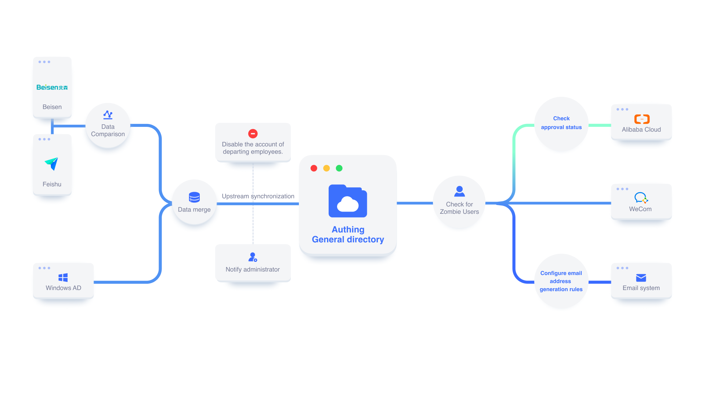
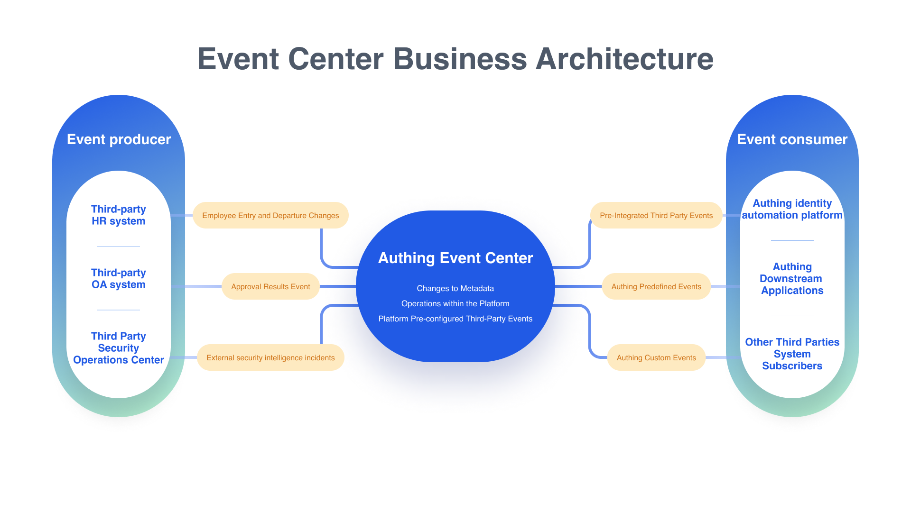

# Overview of Identity Automation

# Summary

The Authing Identity Automation Platform is a visual workflow orchestration platform based on event driven next-generation identity domain business and data strategies. Intended to meet the diverse configuration requirements of the customer side, targeting <strong> users </strong><strong> directories, organizational structure, login authentication, security </strong><strong> management </strong> and other functional flexibility, it can further<strong>design system architecture for change, follow the principles of</strong> agility </strong> iteration </strong>, and support the complex identity and organizational structure automation management needs of customers.

The core design concept of the Authentication identity automation platform is the "<strong>Event driven</strong>" architecture, which effectively supports the real-time, reliability, and maintainability of process operation, and can ensure that workflows have better<strong> concurrency </strong> and <strong> reliability </strong>. Event driven approach can effectively separate events from process processing, thereby achieving flexible task scheduling and execution.

The Authing identity automation platform can help enterprises avoid the complex customized development process in identity and account management. Based on the design concept of the next generation <strong> " </strong><strong> low code </strong><strong> , no code" </strong> and a visual, drag and drop configuration method, it can quickly build and manage your identity management workflow, significantly reducing internal identity management costs and identity security risks.

# Core competencies

## Identity full lifecycle management journey

The platform provides users with an out of the box journey configuration template for user identity and employee identity management. Based on the template, you can quickly achieve flexible configuration of employee entry, transfer, transfer, and departure throughout the entire lifecycle business in the layout canvas. For example, it can assist employees in quickly creating identities, assigning access permissions, and notifying relevant parties in the application when they are hired. And it can automatically lock, freeze, or delete accounts when employees leave.

## Identity data integration and distribution

The platform also provides users with the best data flow integration and distribution template under employee identity management. In addition to inheriting the advantages of Authing APN for comprehensive integration of events and operations with OpenAPI SaaS applications, we also provide out of the box connection and ETL capabilities for mainstream HR applications, OA applications, databases, etc., helping enterprises quickly break through identity data silos.

## Real time monitoring of identity security risks

The platform also provides users with over 20 out of the box security risk control strategies and personalized security strategy orchestration capabilities. Combined with the embedded independent MFA capabilities of Authing, it helps enterprises achieve continuous and adaptive risk control strategy customization throughout the entire identity management lifecycle. For example, administrators can choreograph risk calculation strategies and customize risk disposal behaviors based on contextual information such as network information, device information, geographic location, and access sources, and can flexibly reuse policies in other scenarios, helping enterprises quickly build adaptive and sustainable identity security systems.

## Certified Journey Atomization Arrangement

Based on our API-First philosophy, which provides the most developer friendly user registration and authentication configuration capabilities, as well as our highly decoupled authentication state machine engine, we provide you with a flexible and powerful node based orchestration template for registration, authentication, password forgetting, and other functions. We also provide a comprehensive SDK and sample demos, allowing developers to quickly complete custom configurations of user authentication journeys based on the module and access their own built applications.

## Custom orchestration

Not only that, you can create a "Identity Full Scene Canvas" from scratch. With the pre configured 1000+application API nodes, 500+event nodes, and 50+meta sub operator nodes and sub workflow nesting and cross workflow calling capabilities, you can freely build personalized workflow templates based on real business journeys, fully liberating your productivity through our automation capabilities.

# Platform advantages

### Real time and high performance

The Authing identity automation platform is designed using an "event driven" "Sub/Pub" pattern. The API caller no longer requests the API through "GET/POST/DELETE/PUT", but subscribes to the API and asynchronously consumes it. This not only facilitates developers to quickly carry out secondary development, but also effectively reduces the consumption of full link computing resources.

### Total operator node

The Authing identity automation platform not only provides common data processing nodes such as data filtering, data conversion, and data merging, but also flexible process control nodes such as if/else, Switch, loops, and other common nodes. In addition, there are business operator nodes such as JWT nodes, date event nodes, and file processing nodes that can be used out of the box. Of course, you can also use powerful custom function and node capabilities to further meet more complex business orchestration needs.

### DAG model

The underlying layer of the Authentication identity automation platform is developed based on the DAG (Directed Acyclic Graph) data structure, which meets the processing of complex dependency relationships in workflows and flexible customization of execution rules between nodes, ensuring the flexibility and ease of maintenance of the overall task scheduling of workflows.

### Monitoring alarms

The Authing identity automation platform has powerful visual monitoring and alarm configuration capabilities. Users can customize monitoring indicators and alarm rules, and preset automation processing logic, such as clearing zombie tasks or retrying error tasks, fully ensuring user business security.

# Building real-time applications using the event SDK provided by Authing

The Authoring identity automation engine and event center significantly reduce the burden on developers in business integration, development testing, and code maintenance, perfectly solving the application integration difficulties in real-time business scenarios in the IDaaS industry. You can view the document "Building Real time Applications Using Event Driven SDKs" to experience the development efficiency improvement brought by the event driven SDK.

