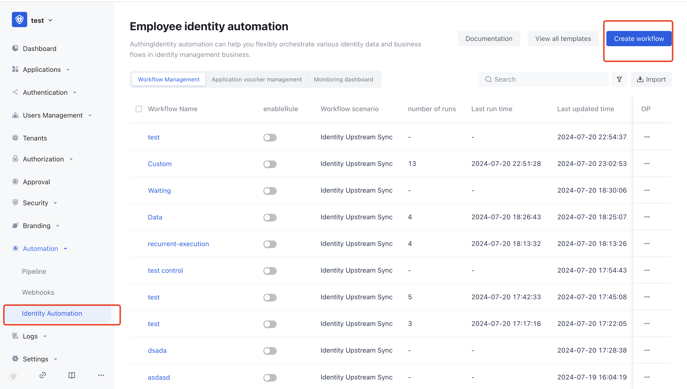
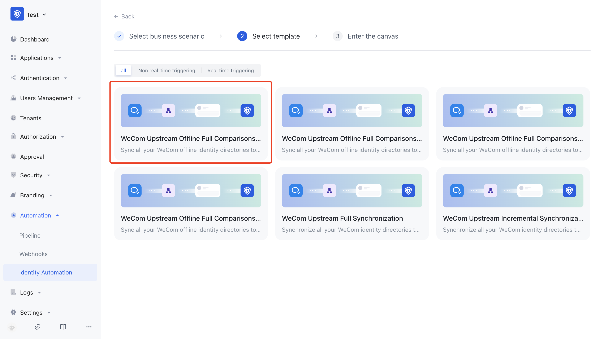
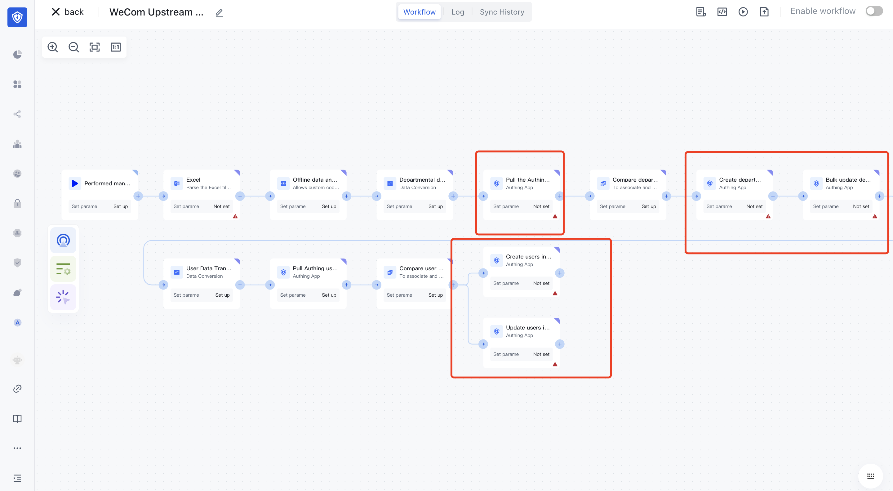
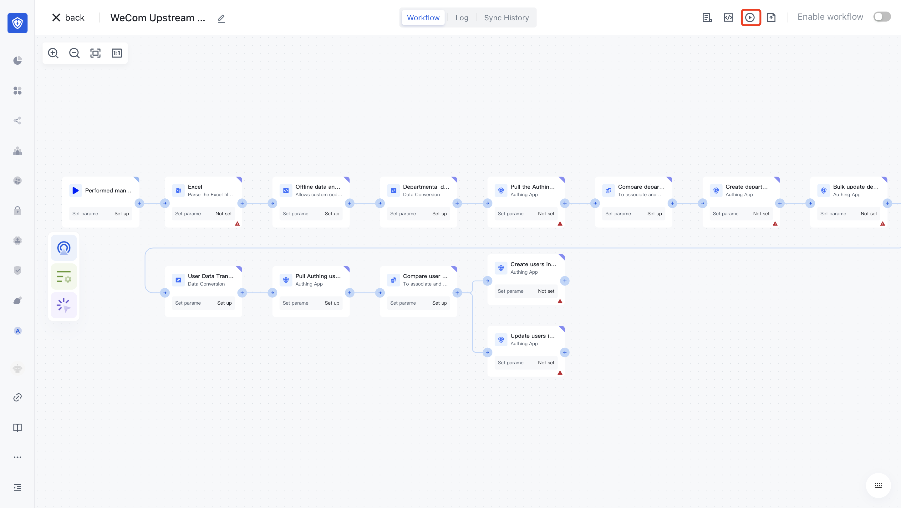
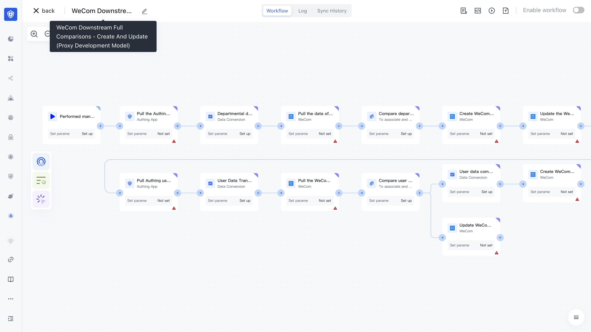
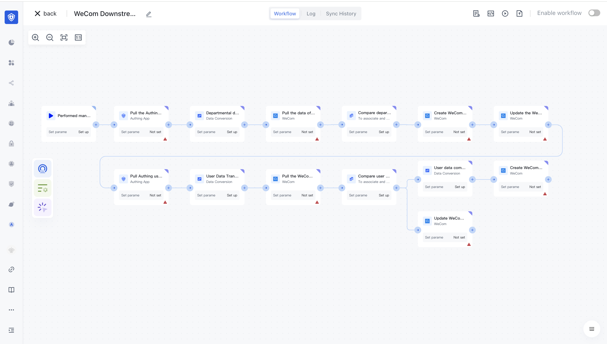

# Enterprise wechat downstream synchronous use document (customer use)

# Background Overview

## Enterprise wechat status

Due to the interface restriction of enterprise wechat to obtain member data, the user's profile picture, gender, mobile phone, email address, enterprise email address, and employee personal QR code are no longer provided through the interface. Below reference to enterprise micro interface ([get department members details](https://developer.work.weixin.qq.com/document/path/90337)) documentation:

:::hint-info

- Starting from 20:00 on June 20, 2022, basic applications other than address book synchronization (such as customer contact, wechat customer service, session archive, schedule, etc.), as well as newly created self-built applications and agent development applications, will no longer return the following fields when calling this interface: Profile picture, gender, mobile phone, email, corporate email, employee's personal QR code, address, Applications need to [oauth2 authorization by hand](https://developer.work.weixin.qq.com/document/path/90337#15232) for the administrator and staff I authorize fields.

- [Important] Starting from 10:00 on August 15, 2022, the new IP address of "Enterprise Management back-management Tool-Address Book Synchronization" will no longer be able to call this interface. Enterprise can through "[list] get member ID (https://developer.work.weixin.qq.com/document/path/90337#40412)" and "[get department ID List](https://developer.work.weixin.qq.com/document/path/90337#36259) "interface for userid and department ID list

:::

Authing Identity automation provides the following solution in this case, providing a synchronization process with low operation and learning costs to ensure that customers can normally maintain the unified upstream and downstream identity data.

The # Authing solution

According to the status quo of enterprise wechat, Authing identity automation provides standard workflow templates for different scenarios, which can be used out of the box:

1. When you need to synchronize enterprise wechat identity data to Authing, we provide "offline file parsing" function and standard workflow template, you only need to follow the following steps (enterprise wechat -> Authing) get the file and simply configure the workflow parameters;

- ** Specific rules: **
- Users that exist in the file but are not in Authing will be created in Authing.
- Some users in the file and some users in Authing will be compared with their attribute values, the same ones will not be updated, and different ones will be updated;
- If a user does not exist in the file but exists in Authing, the Authing Offline full comparison Create and Update template will not be processed. If you want to delete the user in Authing, use the AuThing Offline Full Comparison Delete Only template.
- ** Recommended execution period: **
You are advised to perform this operation once every two days.

2. When you need to synchronize Authing's identity data to enterprise wechat, we provide standard workflow templates to associate data with user name /ID for automatic operations such as creation, update and deletion;

- Recommended execution period:
The value can be adjusted according to service requirements. You are advised to set the value to a timed trigger and execute it every morning.

# Enterprise wechat -> Authing (Upstream Identity Data Synchronization)

## 1. Export enterprise wechat address book (Excel file)

- In the enterprise wechat management background - Contacts:

1. Use the enterprise wechat scan code to log in to the enterprise wechat management background: [https://work.weixin.qq.com/wework_admin/loginpage_wx?from=myhome_help](https://work.weixin.qq.com/wework_admin/loginpag e_wx?from=myhome_help)

(relevant help: [https://open.work.weixin.qq.com/help2/pc/17309] (https://open.work.weixin.qq.com/help2/pc/17309))
2. On the Contacts page, click Batch Import/Export - Export Contacts.
3. Select the department you want to export and click Confirm.
4. Use the enterprise wechat scan code to confirm the administrator's identity;
5. Ensure that the file is exported to a local directory.

## 2. Configure the extension field in Authing

- Configure extended fields on the Authing console to uniquely identify enterprise wechat departments/users:

1. Name: enterprise wechat department id, unique identifier: wechatwork_department_id, single line text, display, editable
2. Name: id of enterprise wechat parent department, unique identifier: wechatwork_parent_department_id, single line text, display, and editable
3. Name: enterprise wechat user id, unique identifier: wechatwork_user_id, single line text, display, editable
4. Name: department id of the user, unique symbol: wechatwork_department_ids, single/multi-line text, display, editable

## 3. Select the template to create the workflow

1. Enter the Authing console "Automation-Identity automation";
2. Click "Create Workflow" and select "Quick Create".
3. Select as shown and click "Next" :

- Data synchronization type: Synchronize the identity data of upstream applications to Authing
- Application type: "Enterprise wechat"

4. Select the workflow template you need;

- You are advised to select "Enterprise wechat Upstream offline full comparison Create and update". If you need to use identity automation to delete unnecessary users in Authing, create a "Delete Only" template.

## 4. Import files in the Excel node

- After entering the workflow editing canvas:

1. Edit the Excel node.
2. Upload the address book file exported from the enterprise's wechat management background in the pop-up window;
3. Configure other options, such as:

- sheet: Indicates the read Sheet. Subscripts or Sheet names are supported, starting from 0. When empty, read all sheets)
- Start/end line (from which line to read the file, coordinates from 0 / read to which line, -1 indicates the last line)

## 5. Configure other nodes

- Most nodes have been configured in advance. You only need to configure the required items in each node. Such as:

1. Pull the Authing department data node: Select the organization and whether to ignore the top department.
2. Batch create/update departments, batch create/update users: select target organizations, etc.

## 6. Execute the workflow

- Currently, you can configure the workflow only by uploading an excel file. Therefore, you need to perform this operation manually

# Authing ->  Enterprise wechat (Downstream identity data synchronization)

- if no enterprise WeChat accounts, first to enterprise WeChat console application WeChat account: https://work.weixin.qq.com/
- This document currently only applies to the Automation-Identity automation module in the B2E user pool of the Authing console, please ensure that it is in the B2E user pool scenario and that the latest version of the "Identity Automation" feature is used;
- If you have the enterprise wechat service provider qualification, you can perform the relevant configuration in the background of the enterprise wechat service provider according to the documentation. If there is no enterprise wechat service provider qualification, it is necessary to authorize the service provider of Beijing Steam Memory Technology Co., Ltd. to create related applications and read contacts;

## 1. Configure and authorize enterprises to develop applications on wechat behalf

- ** When you use Beijing Steam Memory Technology Co., Ltd. as a business service commercial development: **
1. Open wechat on the mobile terminal and scan the QR code below for authorization:
   
2. After successful authorization, please contact the administrator of Beijing Steam Memory Technology Co., Ltd. to develop and launch the application;
3. After the application is launched, please open the enterprise wechat on the mobile terminal and scan the QR code below for authorization (ps: Before authorization, you need to unbind the authorized enterprise from the enterprise wechat background before binding)
   

## 2. Create application credentials

:::hint-info

How do I obtain information such as the enterprise ID and address book key?

:::

Enterprise ID (corpID) :

Address Book key (corpsecret) :

- Create enterprise micro application credentials in Authing:

1. Obtain appid, appsecret and other information from the enterprise micromanagement background according to the guidance in the figure above, and fill in the Authing application certificate to test the connection;
2. If you use Authing's public cloud, be sure to enable "generation Development Mode";

## 3. Configure the extension field

- Configure an extended field that uniquely identifies an enterprise's wechat department/user:

1. Name: enterprise wechat department id, unique identifier: wechatwork_department_id, single line text, display, editable
2. Name: enterprise wechat user id, unique identifier: wechatwork_user_id, single line text, display, editable

## 4. Select the template to create the workflow

- Please confirm whether you are currently using a public cloud or a private cloud:
- For public cloud customers, select: Agent Development mode
- Private customers please select: Self-build application mode
- Agent development mode: Because the sensitive information of the user (such as mobile phone number, email address, etc.) cannot be obtained temporarily, the user's name and ID need to be associated with the data
- Authing users who have but do not have enterprise wechat will be created in enterprise wechat;
- Authing and enterprise micro users can choose not to update or full coverage update (do not judge whether the information has changed, according to the latest data to overwrite)

**When the user is not updated**，Delete the node that updates users in batches and configure the comparison user data node as shown in the following figure:

**Full coverage When updating users**，Reserve the nodes for batch updating users, and configure the comparison user data nodes as shown in the following figure: (You can ignore updating the specified sensitive fields and manually fill them in "Advanced Configuration")

## 5. Configure other nodes

- Most nodes have been configured in advance. You only need to complete the mandatory configuration of the node marked with a red exclamation mark in the lower right corner. Such as:

1. Pull the node of enterprise wechat department/user data: select enterprise micro-application credentials, etc.;
2. Batch create/update departments and batch create/update users: select enterprise micro-application credentials, etc.
3. The trigger can be configured with periodic execution rules.

## 6. Execute the workflow

Workflows can be manually executed;
Or after the workflow is enabled in the upper right corner, the system executes according to the timing rules.

# Other

After the workflow is executed, you can go to the "Run Log" to view the running status and data transmission results of each node;

