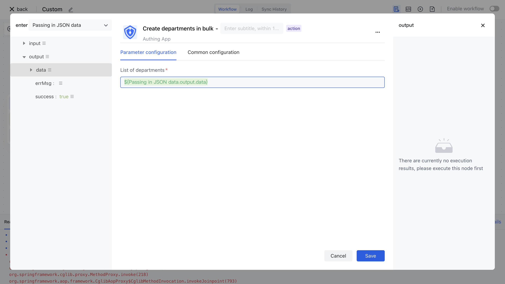

# Create a department node

Upstream synchronous department information entity

- `originalValue` : indicates the data that the department synchronizes
- `data` : indicates department data
- `customData` : indicates the extension field
- `departmentIdInIdp` : indicates the ID of the third-party department
- `departmentIdInIdp` : Details of a third party department
- `parentDepartmentIdInIdp` : indicates the ID of the third-party parent department

The configuration for creating a department node is as follows:

