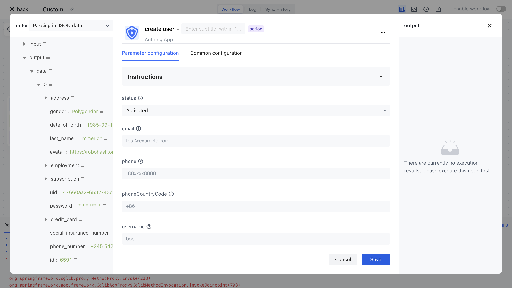

# Create a user node

Upstream synchronous user information entity

- `profile`: indicates user information
- `originalValue` : indicates the original user information
- `customData` : indicates the user-defined data

```json
{
"phone": "13811111111"
}
```

- `userIdInIdp` : indicates the user ID of the third-party system
- `userInfoInIdp` : The original user information in the third party, stored as a JSON string
- `departmentIdsInIdp` : list of department ids in third parties
- `orgId` : indicates the ID of an organization

The configuration for creating user nodes is as follows:



For details please see [Authing API Explorer - Create a user](https://api-explorer.authing.cn/?tag=tag/%E7%AE%A1%E7%90%86%E7%94%A8%E6%88%B7/API%20%E5%88%97%E8%A1%A8/operation/UsersManagementController_createUser)。
