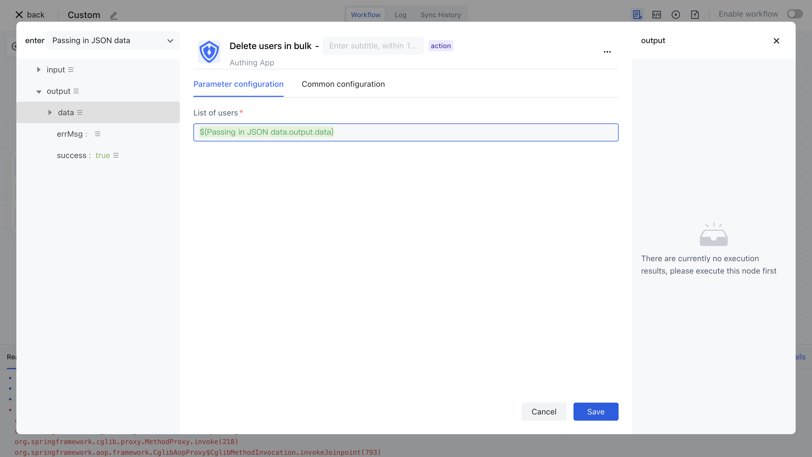

# Delete user nodes

Upstream synchronous user information entity

- `profile` : indicates user information
- `originalValue` : indicates the original user information
- `customData` : indicates the user-defined data

```json
{
"phone": "13811111111"
}
```

- `userIdInIdp` : indicates the user ID of the third-party system
- `userInfoInIdp` : The original user information in the third party, stored as a JSON string
- `departmentIdsInIdp` : list of department ids in third parties
- `orgId` : indicates the ID of an organization

Delete the user node configuration as follows:

