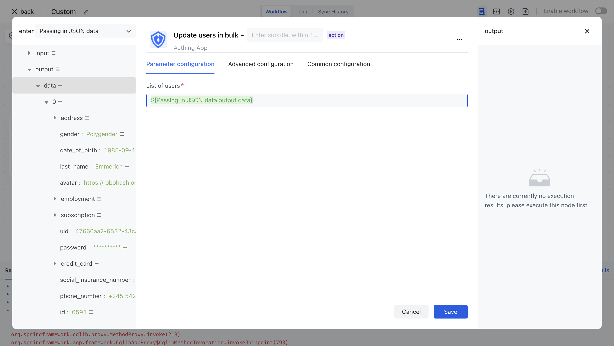

# Update user node

Upstream synchronous user information entity

- `profile` : indicates user information
- `originalValue` : indicates the original user information
- `customData` : indicates the user-defined data

```json
{
"phone": "13811111111"
}
```

- `userIdInIdp` : indicates the user ID of the third-party system
- `userInfoInIdp` : The original user information in the third party, stored as a JSON string
- `departmentIdsInIdp` : list of department ids in third parties
- `orgId` : indicates the ID of an organization

Update the user node configuration as follows:



Each overwrite user password:

When this switch is enabled, if the password field in the incoming user data has a value, the current password of the user is overwritten with this password. If you only want to set the <strong> default password </strong> when the user is created, do not turn this switch on; If you want to use the value of the passed password field to control the user's latest password, you can turn on this switch.

