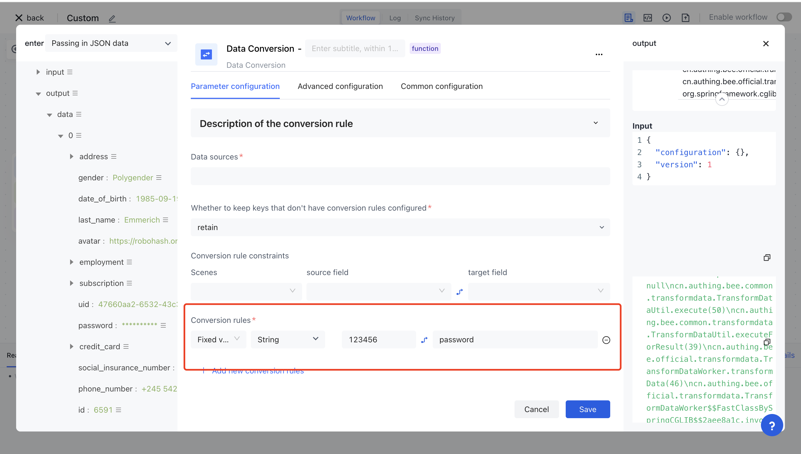
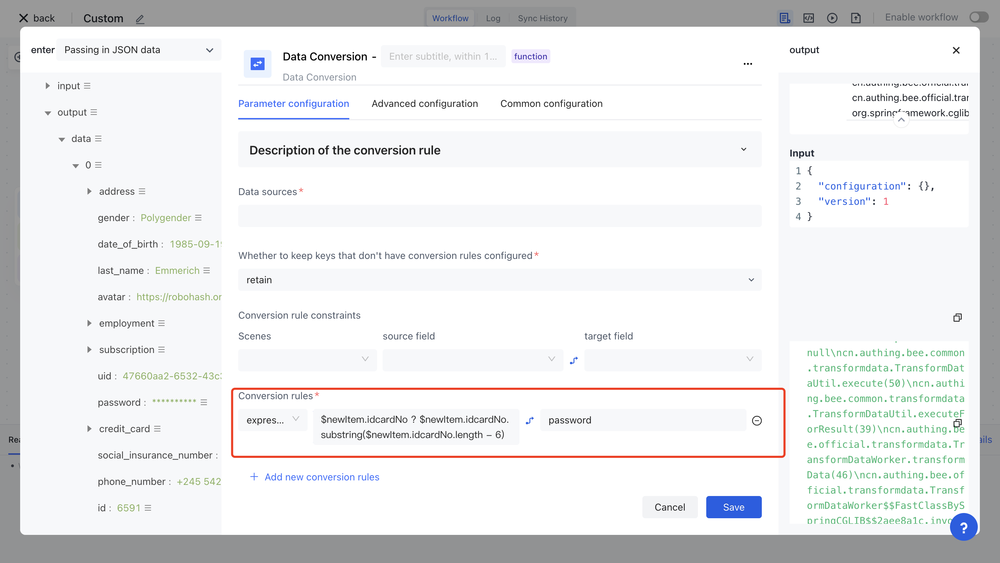
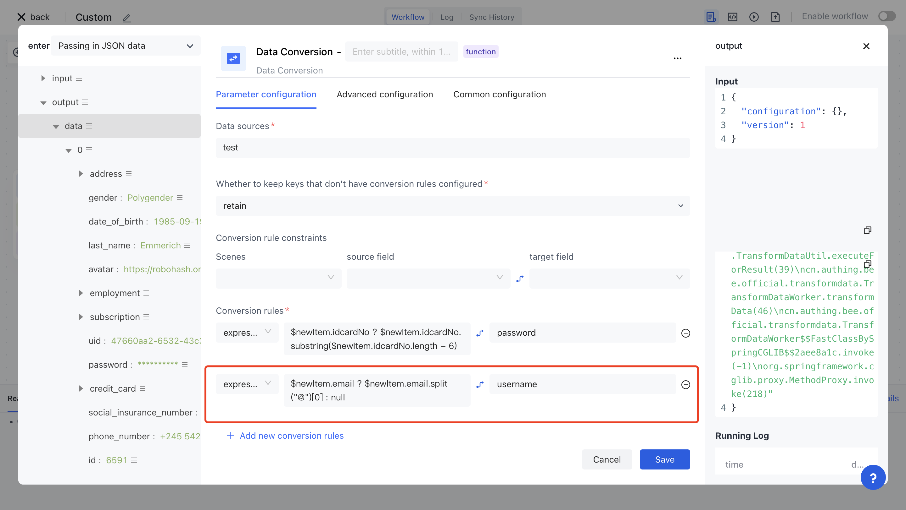
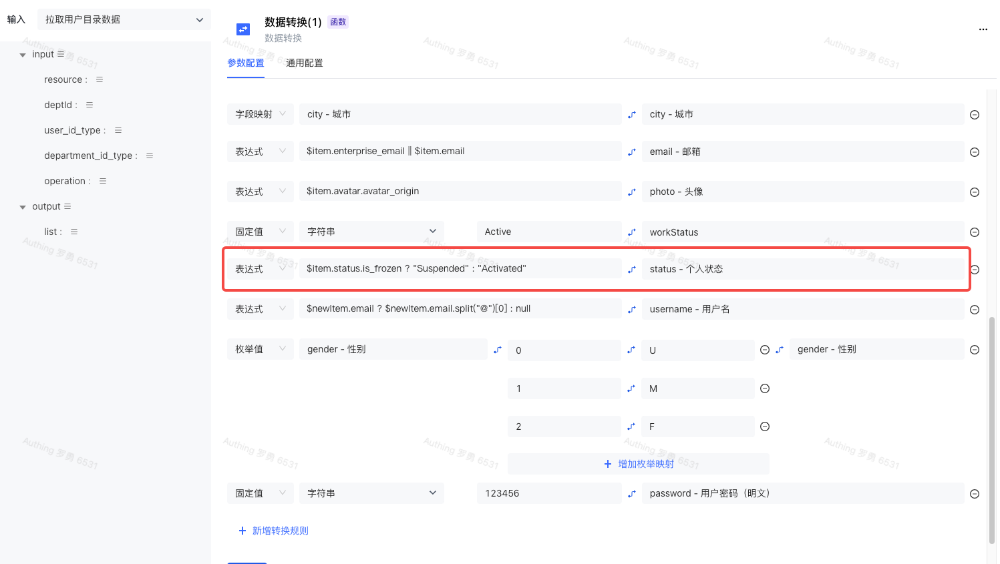
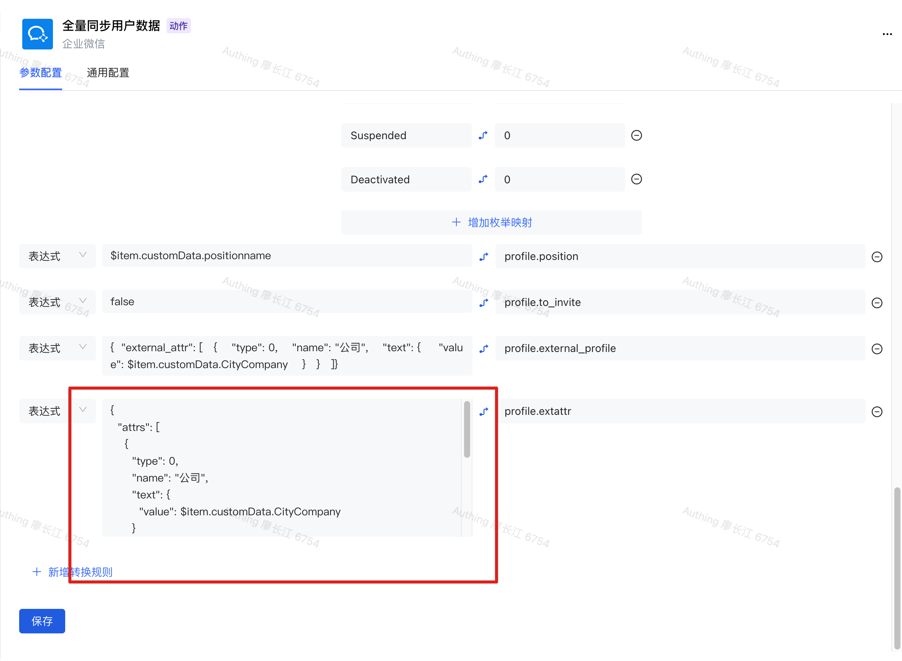

# Frequently Asked Questions

## How to set a password?

In the "Data conversion" node, add a new conversion rule, type select "fixed value", value type select "string", and then enter the password you want to set in the following input box, map the field input or select `password`  can be.

## How to intercept the last six digits of the ID number as a password?

In the Data Conversion node, add a new conversion rule with type "Expression" and enter `$newItem.idcardNo? $newItem. IdcardNo. Substring ($newItem. IdcardNo. Length - 6) : 123456 ` (when there is no id card number, use the default password: `123456`), the mapped field can be entered or select `password`.

## How to intercept email prefix as user name?

In the "Data Conversion" node, find or create a "username username" conversion rule, select "Expression" in the type, and enter `$newItem.email ? $newItem.email.split("@")[0] : null`, enter or select `username`  in the mapped field.

## How to set the user status?

In the Data Conversion node, find or create a conversion rule for Status-Personal status, select Expression from Type, and enter the conversion rule for the corresponding status in the input box.

For example, the state of a flying book is mapped to: `$item.status.is_frozen ? "Suspended" : "Activated"` , enter in the mapped field or select `status `.

User Status Optional values:

- `Activated` : indicates that the device is activated
- `Suspended` : it is suspended

<!-- ## How do I pass dynamic JSON in the "Data Transformation" node? -->

<!-- Select the "Expression" type in the conversion rule and enter the corresponding dynamic JSON in the following input box. -->

<!--   -->

## How do I download the AD Connector to connect to your AD service

You can access [New AD-Connector and Agent installation and deployment document - Identity Automation](https://steamory.feishu.cn/docx/PGctdGnraofyLrxkR2gcllHhn4d) to check the AD Connector Download and configure method.