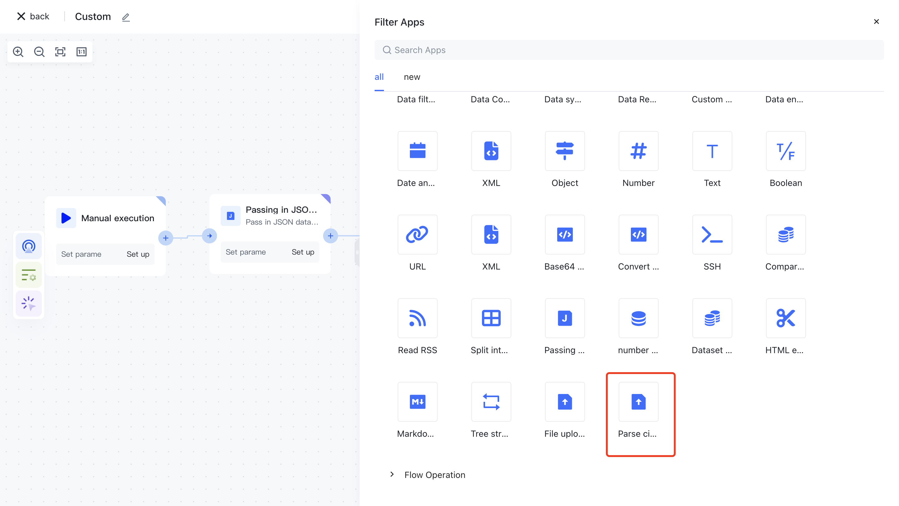
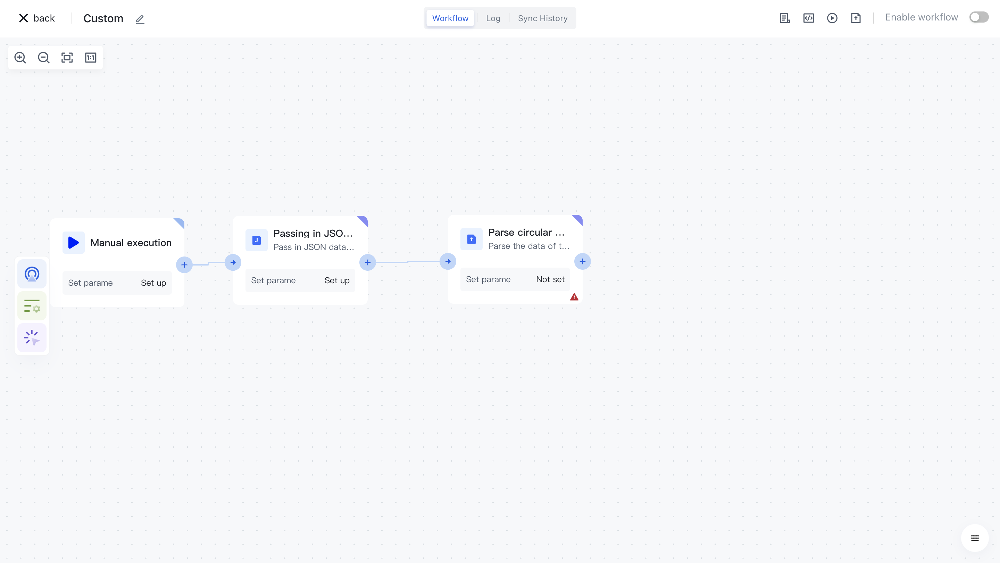
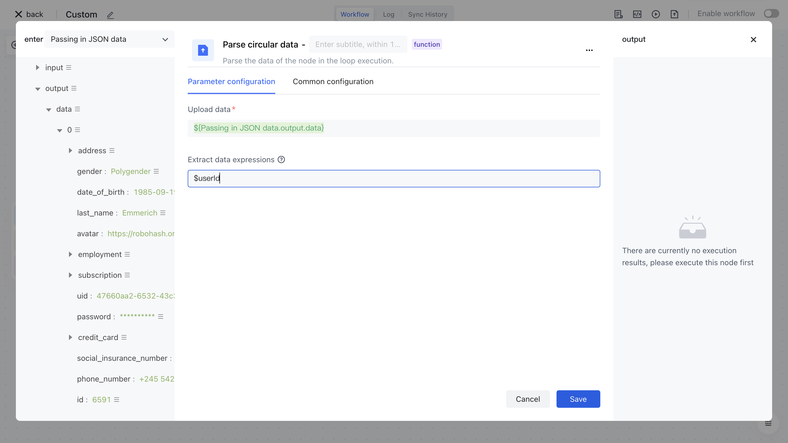
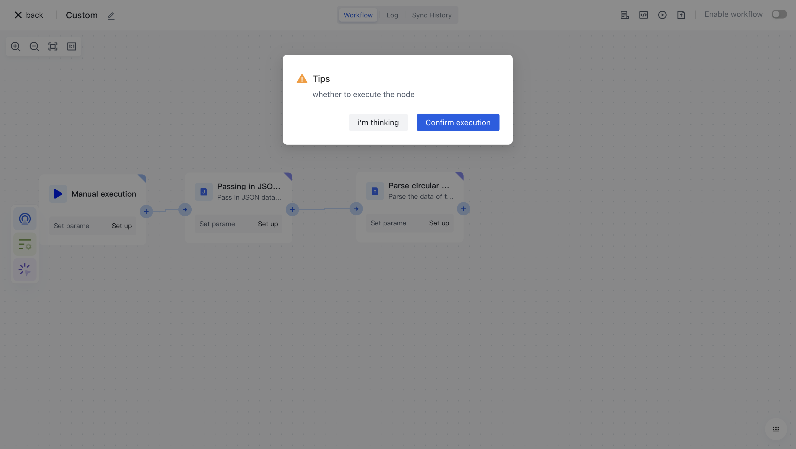
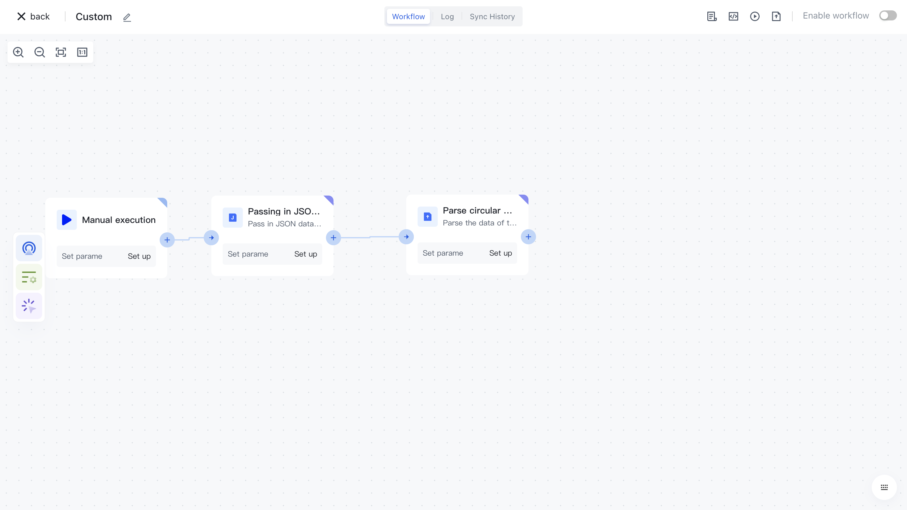

# Analyzing Recurrent Data

# Node Introduction

The "Parse Loop Data" node is mainly used to parse loop data and extract data based on custom data expressions.

The nodes mainly include the following configurations:

- Upload data, upload loop data source.
- Extract data expressions, customize data expressions, and use them to parse and extract target data from loop data.

# Quick Start

## Add node

On the Add Node page, find the "Resolve Recurrent Data" application node in the "Data Processing" category.

Or apply filtering by entering the keyword "parse loop data".

Clicking on a node will automatically add it to the workflow.

## Node configuration

Click on the node in the workflow canvas or click the "Edit" button below to enter the node's configuration page.

按以下方式配置好节点的各个配置项：

Configure the various configuration items of the node as follows:

- "Upload Data" Select the "Data" attribute under "Output" in the "Incoming JSON Data" section on the left for assembly;
- Fill $userId in the "Extract Data Expression" to indicate the extraction of data with the field name userId.

##Test Run

Click the "Execute the previous link of this node" button on the node to execute it.

After reconfirmation, all previous processes of this node will be executed.

After clicking the "Confirm Execution" button, you will see the message prompt "Node in Progress".

Click on the "Run Log" column, then click on the expand button on the left side of the latest "Execution Batch" and "Parse Loop Data" nodes to view the node execution results.

