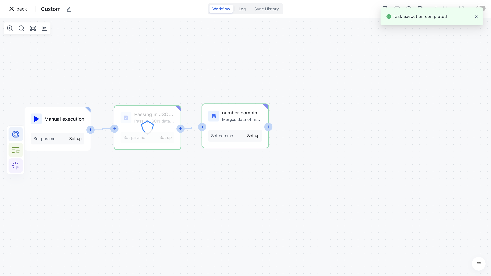

# Array merging

# Node Introduction

The "Array Merge" node is mainly used to merge array data from multiple data sources.

The nodes mainly include the following configurations:

- The arrays that need to be merged, add the array data that needs to be merged.
- Merge method, now supports splicing mode.

# Quick Start

## A dd node

On the Add Node page, find the "Array Merge" application node in the "Data Processing" category.

Or apply filtering by entering the "array merge" keyword.

Clicking on a node will automatically add it to the workflow.

## Node configuration

Click on the node in the workflow canvas or click the "Edit" button below to enter the node's configuration page.

Configure the various configuration items of the node as follows:

- Select the "Data Source" attribute under "Output" in the "Incoming JSON Data" section on the left for assembly;

## Test Run

Click the "Execute the previous link of this node" button on the node to execute it.

After reconfirmation, all previous processes of this node will be executed.

After clicking the "Confirm Execution" button, you will see the message prompt "Node in Progress".

Click on the "Run Log" column, then click on the expand button on the left side of the latest "Execution Batch" and "Array Merge" nodes to view the node execution results.

