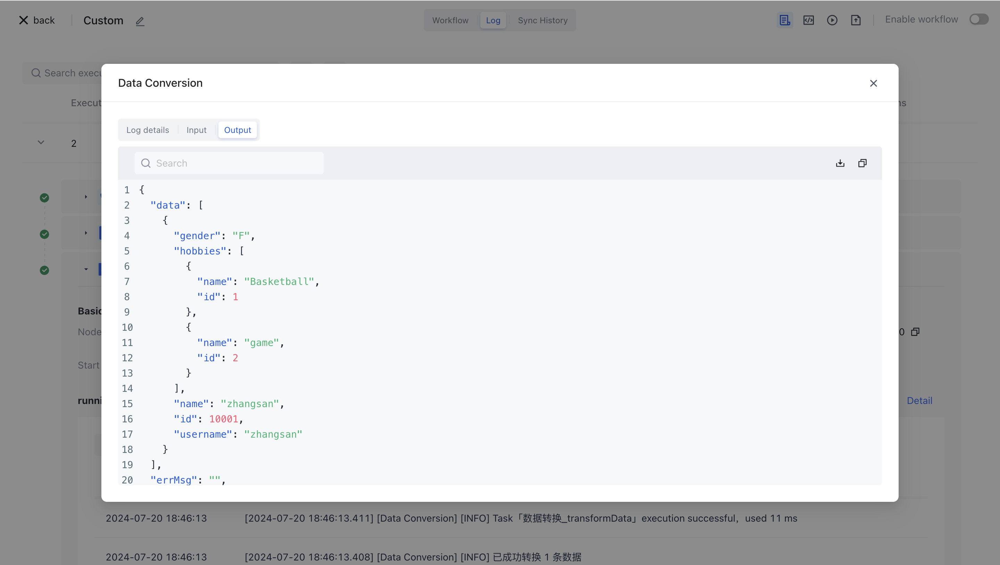

# Data conversion

# Node Introduction

The Data Conversion node can help you convert data from one format or structure to another. If you also have such demand scenarios, you can choose to use data conversion nodes to complete them.

- You are preparing to synchronize data to a third party, and you need to map the fields to the fields of the third party.
- You are preparing to aggregate data from multiple different data sources into a unified format.
- You are preparing to add some fields to the data to enrich it, such as adding some tags or timestamps.

The data conversion nodes include but are not limited to the above scenarios. Usually, when doing data ETL, they can also be completed in conjunction with the [Data Filtering] (/workflow/Data Processing Node/Data Filtering. hl) node.

# Quick Start

## Add node

Click on "Executor" in the canvas, search for "Data Conversion" on the "Filter Applications" card, and click on the Data Conversion node to add a data conversion node to the workflow canvas.


## Configuration explanation

<strong> Data Source </strong>: As the input data for this node, it is usually the output content of the previous node and also the data we are preparing to process.

<strong> Keep unconfigured conversions </strong><strong> Rule </strong><strong> Key </strong>: If you choose to keep, keys that have not been configured with conversion rules below will also be retained and used as output parameters to flow to the next node; If you choose to remove, the key with conversion rules configured will be retained later, and other keys will be discarded.

<strong >Conversion </strong><strong> Rules </strong><strong >Constraints </strong>: Provides some commonly used synchronization conversion templates as auxiliary options.

<strong> Conversion </strong><strong> Rules </strong>: Configure specific conversion rules for data

<strong> Conversion </strong><strong> Rules </strong><strong> Type: </strong>

- Field mapping: Mapping from the original key to a new key can be understood as giving the key a new name.
- Expression: On the basis of field mapping, expression support has been added, which can be converted by writing simple expressions such as variables and triplets.
- Fixed value: Assign a fixed value to a field.
- Delete field: Delete the configured key.
- Enumeration value: The original enumeration value is mapped to a new enumeration value, and both key and value can be mapped.

## Application examples

1. First, add a "Incoming JSON Data" node to simulate the data to be processed.

```json
{
    "id": 10001,
    "name": "zhangsan",
    "gender": "F",
    "hobbies": [
      {
        "id": 1,
        "name": "Basketball"
      },
      {
        "id": 2,
        "name": "game"
      }
    ]
  }
```


1. Add a data conversion node, map name to username, and map gender from "M/F" to "male/female".
2. First assemble the data source and provide the output for the previous "incoming JSON data" node.


1. Configure field mapping rules.


1. Click "Execute Now" and wait for the workflow to complete before you can see the results of data conversion in the running log.



The converted data is:

```json
{
  "data": [
    {
      "gender": "female",
      "hobbies": [
        {
          "id": 1,
          "name": "Basketball"
        },
        {
          "id": 2,
          "name": "game"
        }
      ],
      "name": "zhangsan",
      "id": 10001,
      "username": "zhangsan"
    }
  ]
}
```
