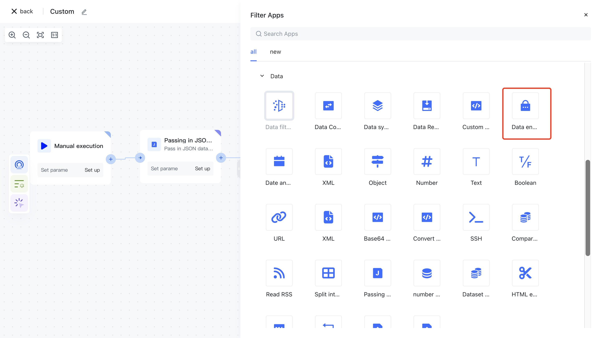
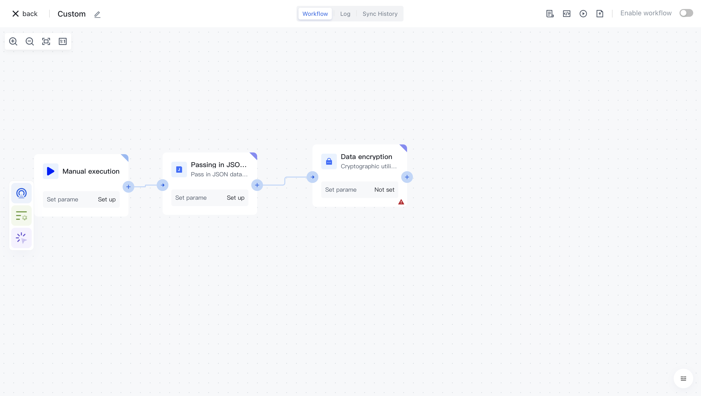
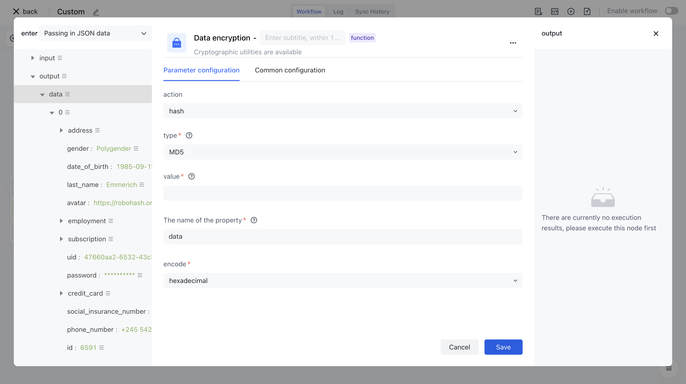

# Data encryption

# Node Introduction

The "Data Encryption" node is mainly used for custom encryption of data sources.

The nodes mainly include the following configurations:

- Action, select different configurations based on different actions, and perform encryption operations on data sources.

# Quick Start

## Add node

On the Add Node page, find the "Data Encryption" application node in the "Data Processing" category.

Or apply filtering by entering the keyword "data encryption".

Clicking on a node will automatically add it to the workflow.

## Node configuration

Click on the node in the workflow canvas or click the "Edit" button below to enter the node's configuration page.

Configure the various configuration items of the node as follows:

- The action list includes generation, hash, Hmac, and flags.
- Select the "Data" attribute under "Output" in the "Input JSON Data" section on the left for assembly;
- Output the attribute name after encrypting the "attribute name" data;

## Test Run

Click the "Execute the previous link of this node" button on the node to execute it.

After reconfirmation, all previous processes of this node will be executed.

After clicking the "Confirm Execution" button, you will see the message prompt "Node in Progress".

Click on the "Run Log" column, then click on the expand button on the left side of the latest "Execution Batch" and "Data Encryption" nodes to view the node execution results.

