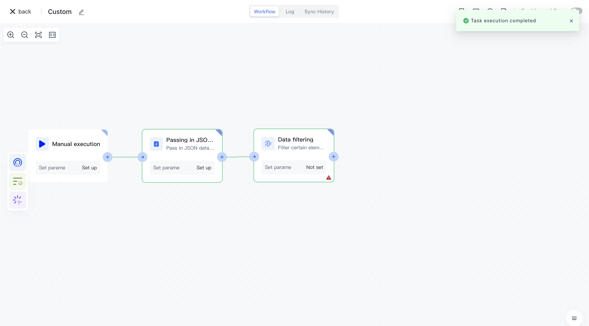
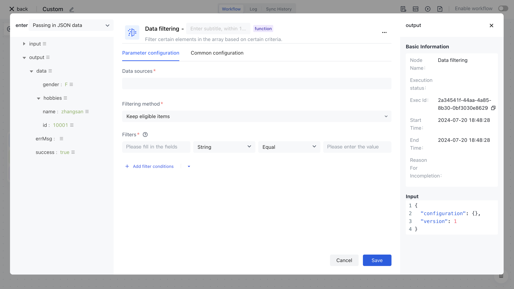
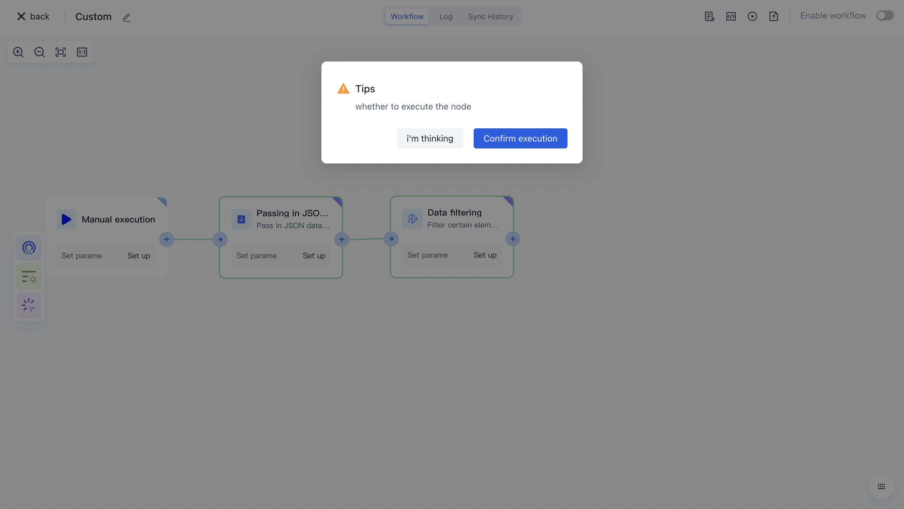
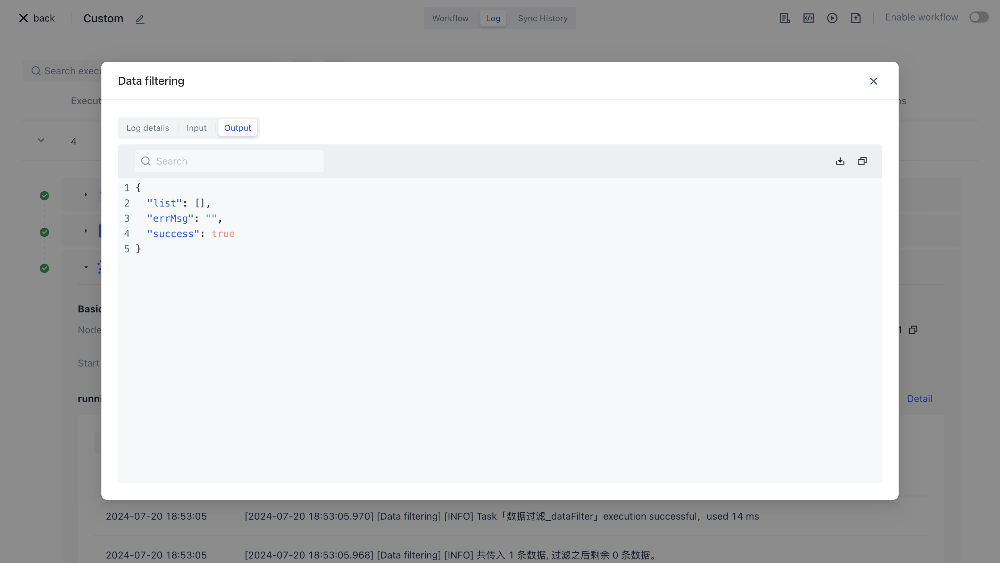

# Data filtering

# Node Introduction

The "Data Filtering" node is mainly used to filter data in the data source based on custom filtering conditions.

The node mainly includes the following three configuration items:

- Data source, the original data source that needs to be filtered, usually in the form of a list.
- Filtering methods include retaining items that meet the criteria and retaining items that do not meet the criteria. "Preserving eligible items" refers to data items that meet the following filtering conditions being retained in the node's output data; "Retain items that do not meet the following filtering conditions" means that data items that do not meet the following filtering conditions will be retained in the node's output data;
- Filter criteria, a set of matching criteria for data filtering, each data filtering criterion includes "field", "field type", "operator", and "field value". Support and/or relationship switching between multiple filtering conditions.

- Field, the name of the field corresponding to the filtering condition.
- Field type, filter condition field type, currently supports: string, number, Boolean, time, date, object, array, and enumeration value.
- Operators, each field type corresponds to a different operator.
- Field values correspond to filtering conditions, and different "field types" support different field values.

# Quick Start

## Add node

On the Add Node page, enter the "Data Filtering" keyword for application filtering, or find the "Data Filtering" node in the "Data Processing" category.

After clicking on this node, it will be automatically added to the workflow node.

## Node configuration

Click on the node in the workflow canvas or click the "Edit" button below to enter the node's configuration page.

We configure the data source, filtering method, and filtering conditions according to the following configuration, and click "Save".

## test run 

Click the "Execute the previous link of this node" button under the node to start testing the workflow node link.

Confirm the execution of the operation again

After successful execution, click on the "Run Log" column, then click on the latest "Execution Batch" and the expand button on the left side of the "Data Filtering" node to view the node execution results.

