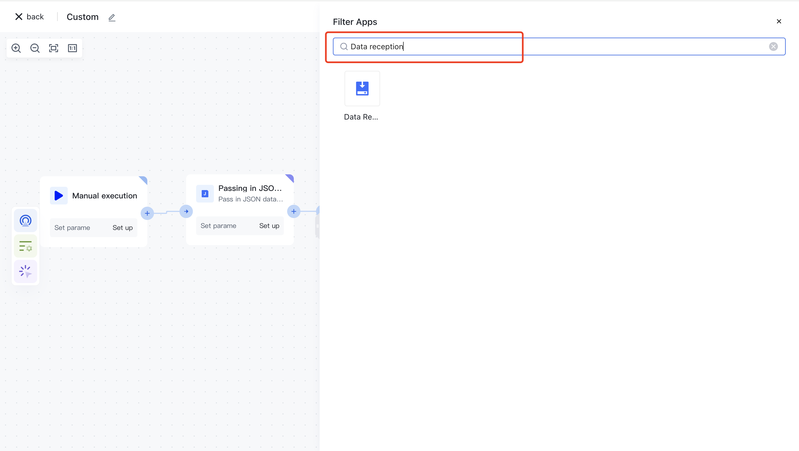
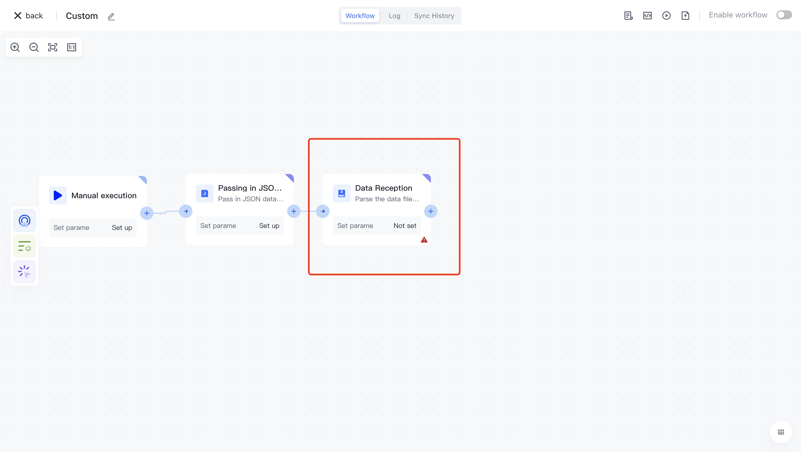
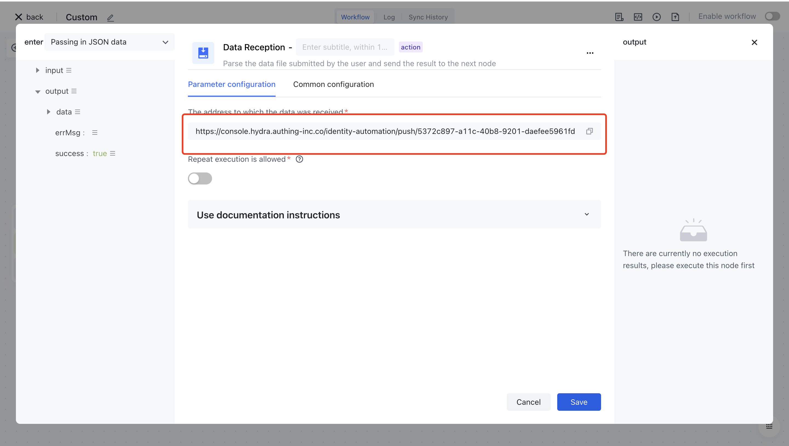
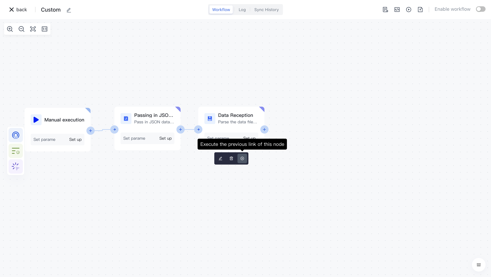

# Data reception

# Node Introduction

The "data receiving" node is mainly used to parse the file of user pushed data and push the result to the next node

- The data receiving address is the address where users push data files. When the workflow runs to this node, it will pull your most recent uploaded data as the output of this node.
- Is it allowed to execute repeatedly? By default, the same upload record is not allowed to be executed repeatedly. If the workflow has consumed the most recent upload record during the execution process, this node will prompt an error and terminate the process..

# Quick Start

## Add node

On the Add Node page, find the "Data Reception" application node in the "Data Processing" category.

Or filter the application by entering the keyword "data reception".

Clicking on a node will automatically add it to the workflow.

## test run 

Copy the data push address and use relevant testing tools to push data to that address.

Click the "Execute the previous link of this node" button on the node to execute it.

After clicking the "Confirm Execution" button, you will see the message prompt "Node in Progress".

Click on the "Run Log" column, then click on the expand button on the left side of the latest "Execution Batch" and "Data Reception" nodes to view the node execution results.

