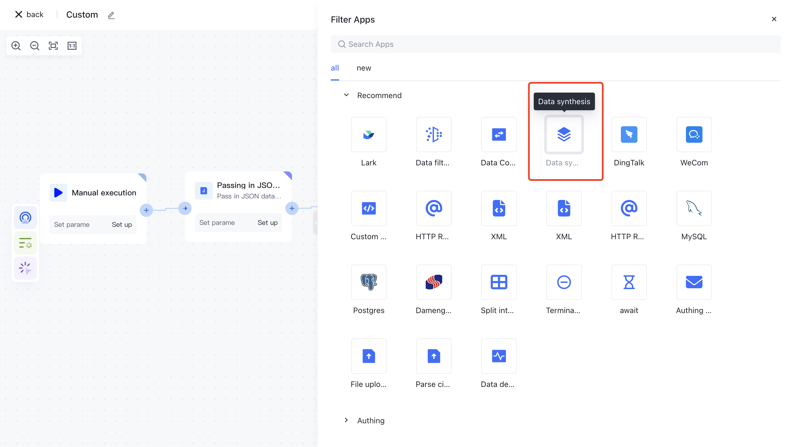
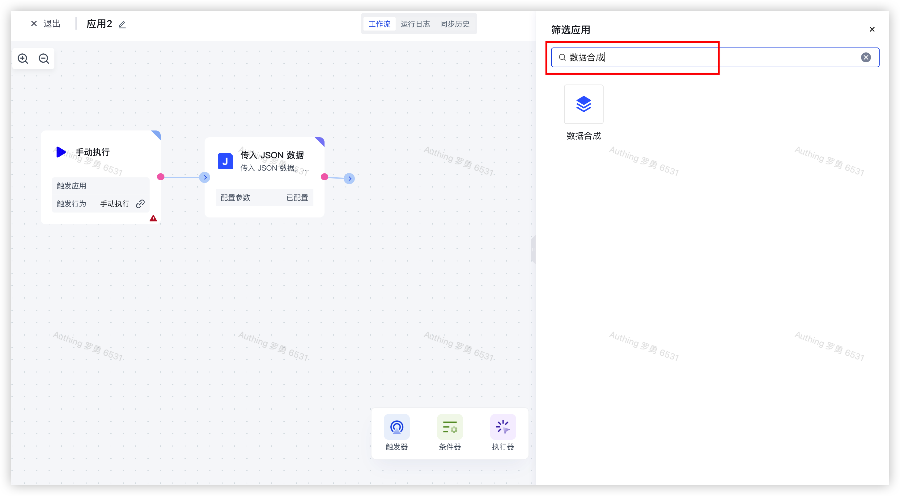
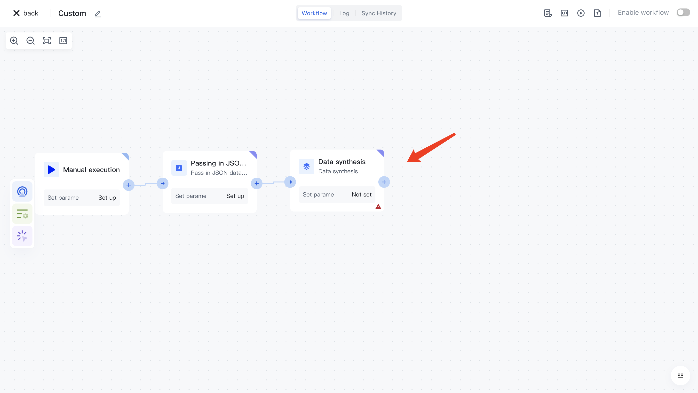
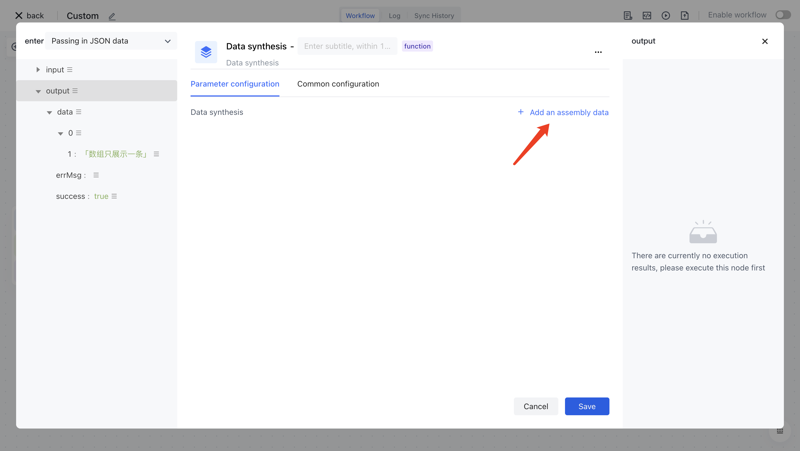
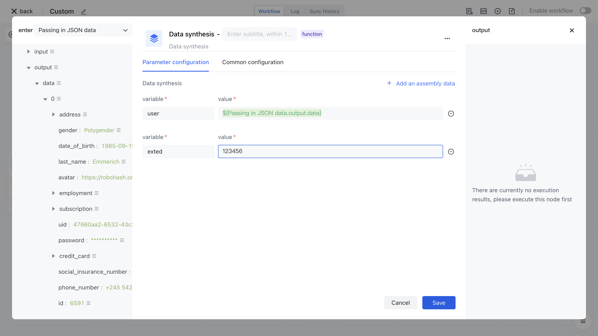
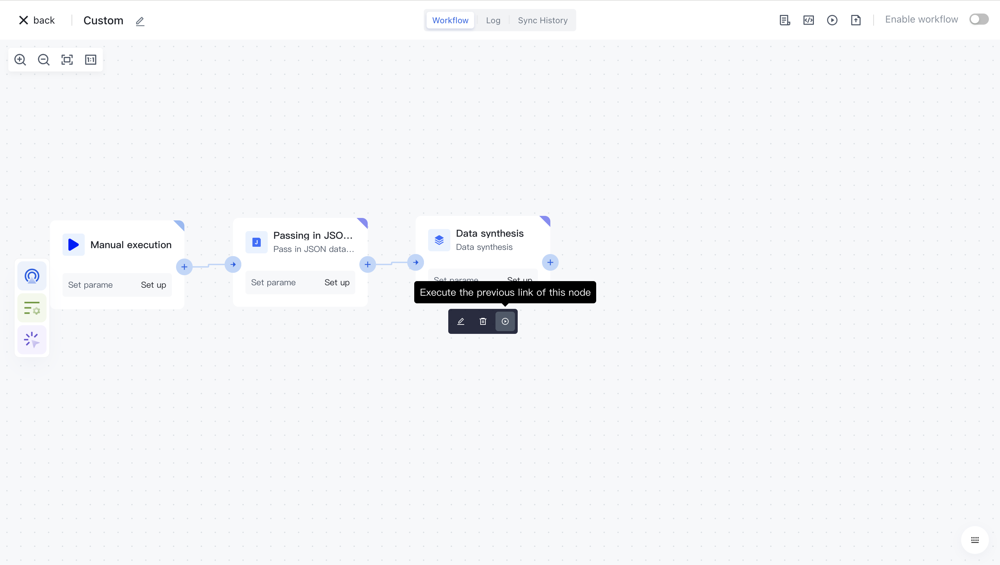
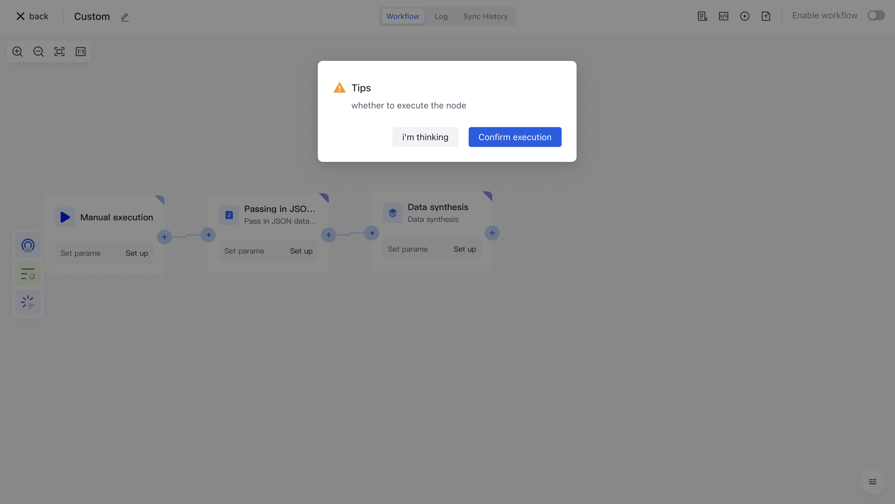
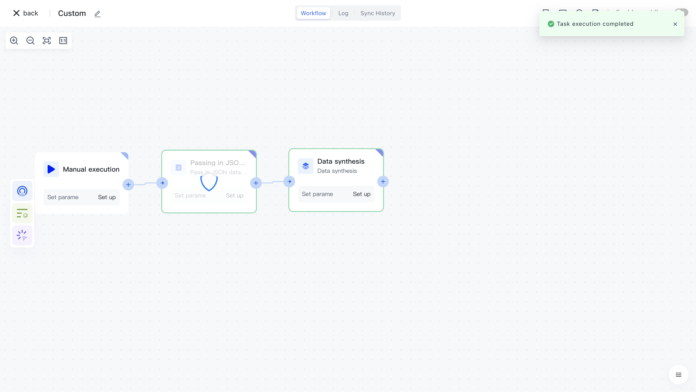
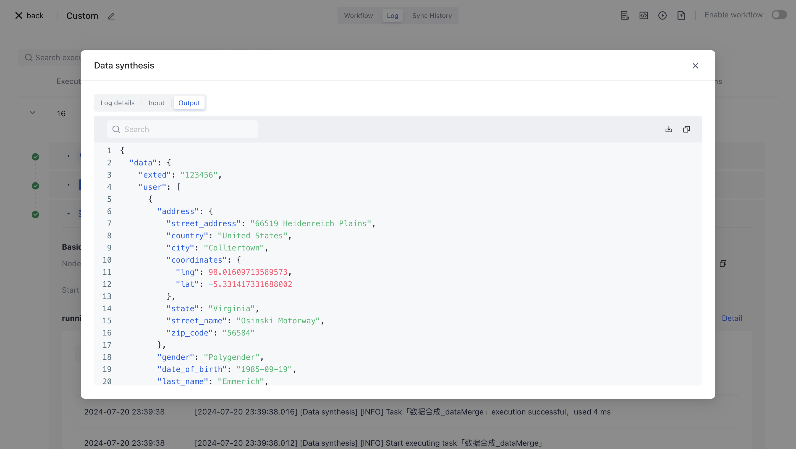

# Data synthesis

# Node Introduction

The "data synthesis" node is mainly used to assemble multiple variable data, in order to combine these variables into one output result for subsequent node processing.

The nodes mainly include the following configurations:

- Data synthesis, which can dynamically assemble multiple variable data and ultimately synthesize them into one data object for output.

# Quick Start

## Add node

On the Add Node page, find the "Data Synthesis" application node in the "Data Processing" category.

Or apply filtering by entering the keyword "data synthesis".

Clicking on a node will automatically add it to the workflow.

## Node configuration

Click on the node in the workflow canvas or click the "Edit" button below to enter the node's configuration page.

Configure the various configuration items of the node as follows:

- Assemble the variable "user" and select the "data" attribute under "output" in the "Incoming JSON Data" section on the left for assembly;
- Assemble the variable "extend", enter the value `123456`, and click the "Save" button.

## Test Run

Click the "Execute the previous link of this node" button on the node to execute it.

After reconfirmation, all previous processes of this node will be executed.

After clicking the "Confirm Execution" button, you will see the message prompt "Node in Progress".

Click on the "Run Log" column, then click on the expand button on the left side of the latest "Execution Batch" and "Data Synthesis" nodes to view the node execution results.

