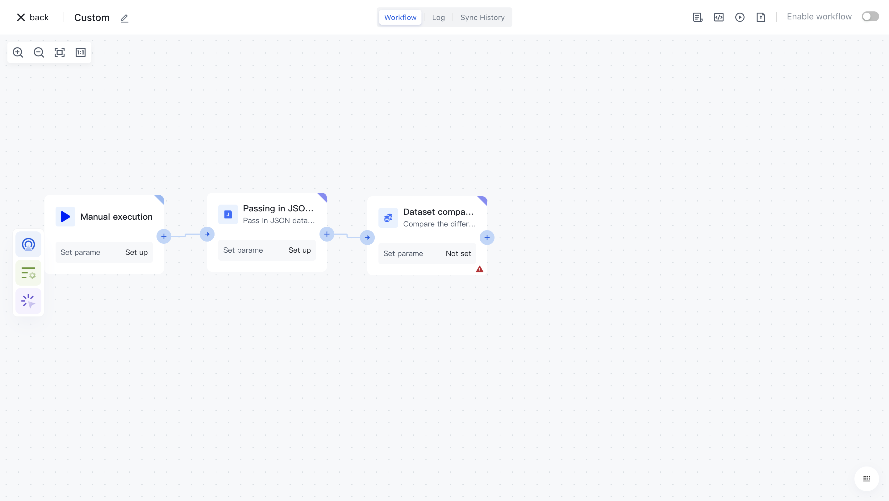
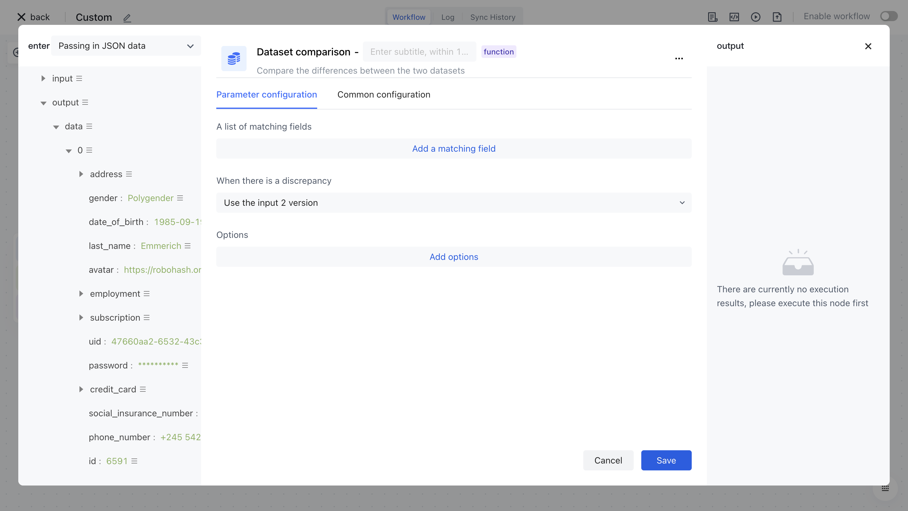

# Dataset comparison

# Node Introduction

The "Dataset Comparison" node is mainly used to split the source array into fixed sizes. After the split is completed, multiple fixed size array data will be returned.

The nodes mainly include the following configurations:

- List of matching fields, fill in fields 1 and 2 to be compared.
- When there are differences, you can choose to use version 1, use version 2, and use a mixture of different versions, including two versions.
- ption: Supports disabling dot symbols and multiple matches.

# Quick Start

## Add node

On the Add Node page, find the "Dataset Comparison" application node in the "Data Processing" category.

Or apply filtering by entering the keyword "dataset comparison".

Clicking on a node will automatically add it to the workflow.

## Node configuration

Click on the node in the workflow canvas or click the "Edit" button below to enter the node's configuration page.

Configure the various configuration items of the node as follows:

- Select the "Data" attribute under "Output" in the "Incoming JSON Data" section on the left to assemble the "Matching Field Values";
- Choose to use Input 2 version when there are differences.

## Test Run

Click the "Execute the previous link of this node" button on the node to execute it.

After reconfirmation, all previous processes of this node will be executed.

After clicking the "Confirm Execution" button, you will see the message prompt "Node in Progress".

Click on the "Run Log" column, then click on the expand button on the left side of the latest "Execution Batch" and "Dataset Comparison" nodes to view the node execution results.

