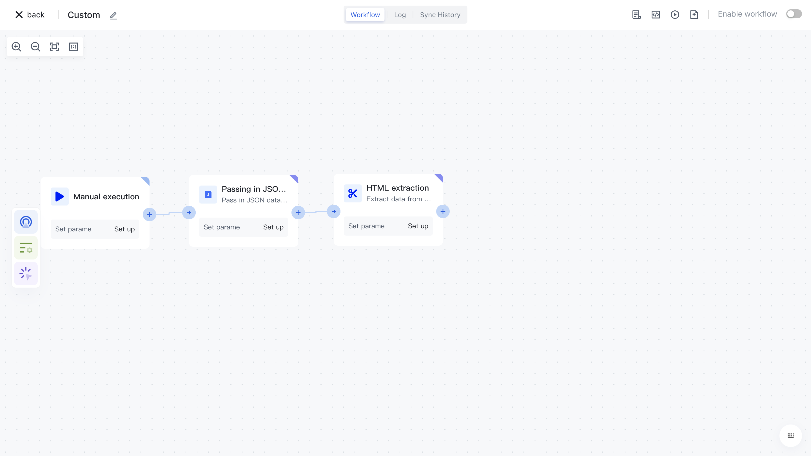
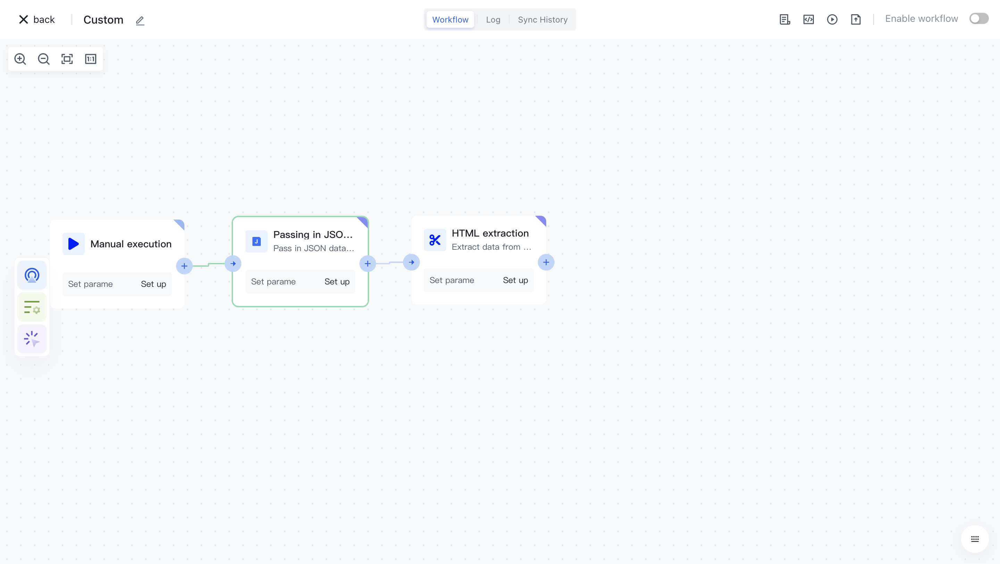

# HTML extraction

# Node Introduction

The HTML extraction node is mainly used to extract relevant attributes from HTML in data.

The nodes mainly include the following configurations:

- Data source, the raw data to be split, can be inputted by oneself or assembled through data assembly to assemble the data source before the current node.
- Binary attribute, where you can find the name of the binary attribute of the HTML where you want to extract data.
- The JSON attribute value allows you to find the name of the JSON attribute of the HTML where you want to extract data. Properties can contain strings or string arrays.
- CSS selector, the CSS selector to be used.
- Return value, supports attribute, html，text，value。

# Quick Start

## Add node

On the Add Node page, find the "HTML extraction" application node in the "Data Processing" category.

Or filter the application by entering the "HTML extraction" keyword.

Clicking on a node will automatically add it to the workflow.

## Node configuration

Click on the node in the workflow canvas or click the "Edit" button below to enter the node's configuration page.

Configure the various configuration items of the node as follows:

- Select the "Data Source" attribute under "Output" in the "Incoming JSON Data" section on the left for assembly;
- Fill in 1 for each batch, indicating that each batch will contain 1 piece of data.

## Test Run

Click the "Execute the previous link of this node" button on the node to execute it.

After reconfirmation, all previous processes of this node will be executed.

After clicking the "Confirm Execution" button, you will see the message prompt "Node in Progress".

Click on the "Run Log" column, then click on the expand button on the left side of the latest "Execution Batch" and "HTML extraction" nodes to view the node execution results.
