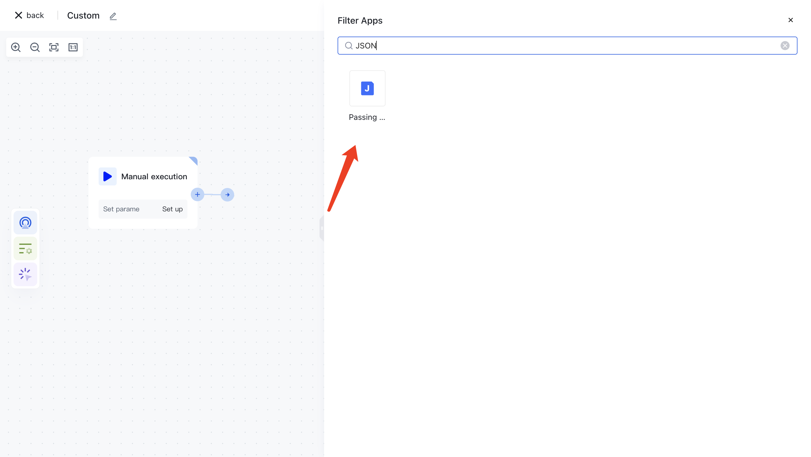
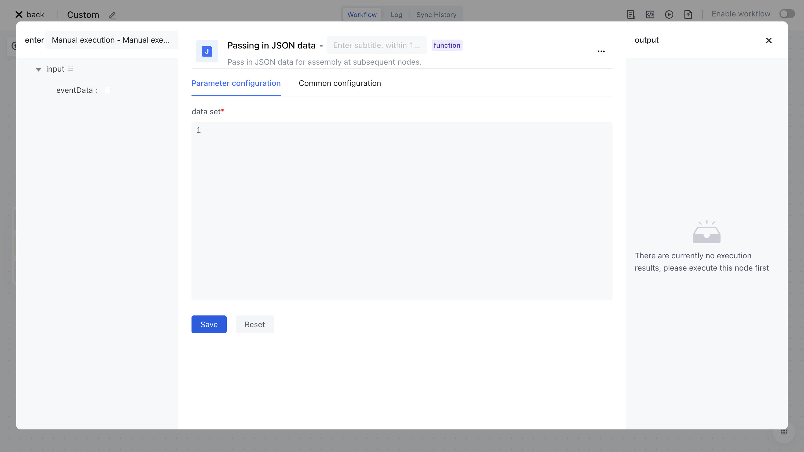

# Node Introduction

The "Incoming JSON Data" node is mainly used to input a custom JSON formatted data object or data list into the workflow for subsequent operations.

The node mainly includes the following configuration items

- Datasets, custom JSON formatted data objects or lists.

# Quick Start

## Add node

On the Add Node page, enter the "JSON" keyword for application filtering, or find the "Incoming JSON" node in the "Data Processing" category.



Find the "Incoming JSON" node, clicking on it will automatically add the node to the workflow canvas.


## Node configuration

Click on the node in the workflow canvas or click the "Edit" button below to enter the node's configuration page.



Enter the following custom JSON dataset and click save. (Note that the correct JSON format dataset needs to be entered)

```json
[
  {
    "name": "myname_01",
    "id": "myid_01"
  },
  {
    "name": "myname_02",
    "id": "myid_02"
  }
]
```


## Test Run

Click the "Execute Now" button on the node to execute it.


After reconfirmation, all previous processes of this node will be executed.


Click on the "Run Log" column, then click on the expand button on the left side of the latest "Execution Batch" and "Incoming JSON Data" nodes to view the node execution results.


