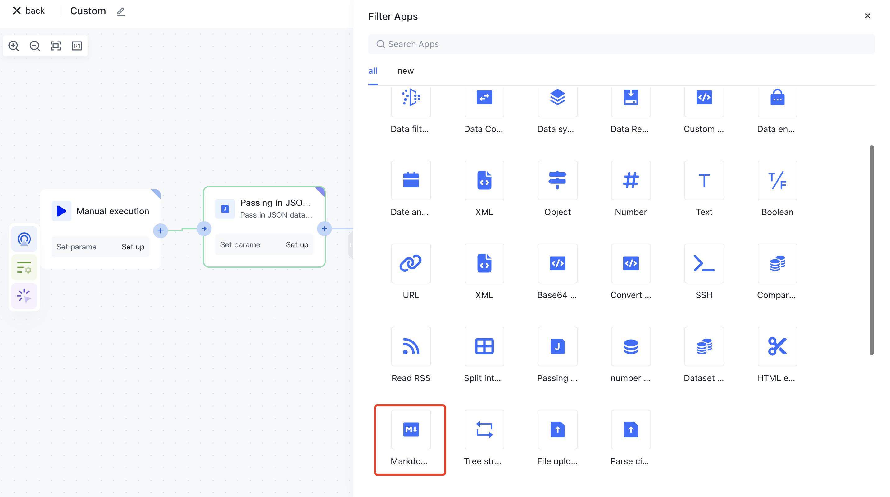
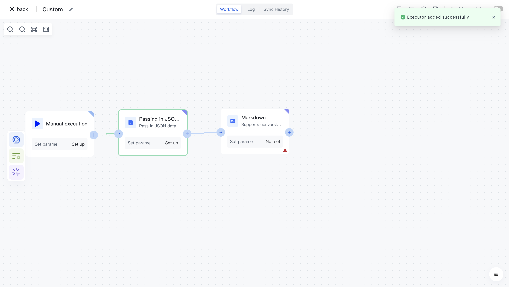

# Markdown

# Node Introduction

The Markdown node is mainly used to convert source data HTML into Markdown and Markdown into HTML.

- Mode, HTML conversion Markdown or Markdown conversion HTML.
- Target attributes, input and output fields. Use points to specify nested fields, such as level1. level2. newKey.

# Quick Start

## Add node

On the Add Node page, find the "Markdown" application node in the "Data Processing" category.

Or filter the application by entering the "Markdown" keyword.

Clicking on a node will automatically add it to the workflow.

## Node configuration

Click on the node in the workflow canvas or click the "Edit" button below to enter the node's configuration page.

Configure the various configuration items of the node as follows:

- Select the "Data" attribute under "Output" in the "Incoming JSON Data" section on the left for HTML assembly;
- "Mode" supports HTML to Markdown and Markdown to HTML conversion.
- Target attribute default value data

## Test Run

Click the "Execute the previous link of this node" button on the node to execute it.

After reconfirmation, all previous processes of this node will be executed.

After clicking the "Confirm Execution" button, you will see the message prompt "Node in Progress".

Click on the "Run Log" column, then click on the latest "Execution Batch" and the expand button on the left side of the "Markdown" node to view the node execution results.
