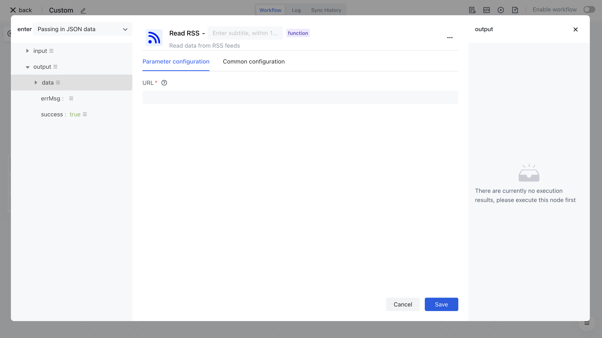
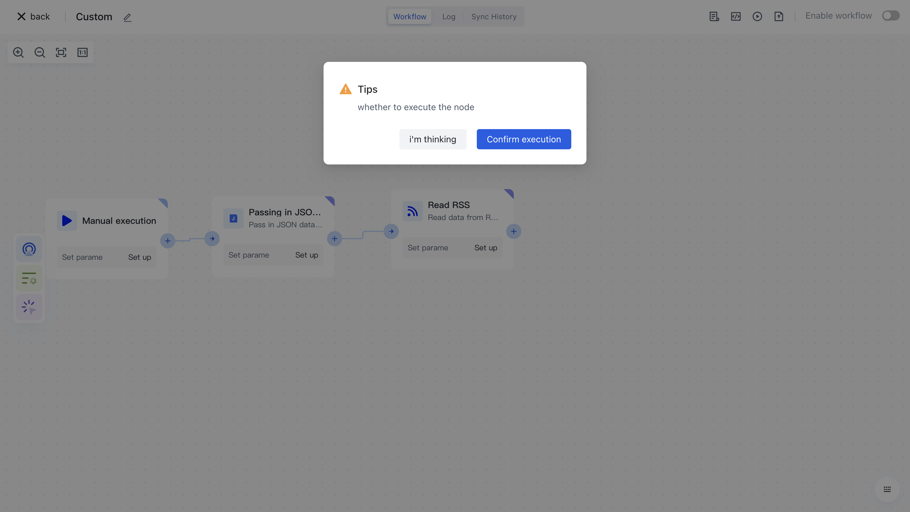

# Read RSS

# Node Introduction

The "Read RSS" node is mainly used to configure RSS paths to obtain subscription resources

- URL, subscription resource resource path.

# Quick Start

## Add node

On the Add Node page, find the "Read RSS" application node in the "Data Processing" category.

Or filter the application by entering the keyword "Read RSS".

Clicking on a node will automatically add it to the workflow.

## Node configuration

Click on the node in the workflow canvas or click the "Edit" button below to enter the node's configuration page.

Configure the various configuration items of the node as follows:

- Select the "Data Source" attribute under "Output" in the "Incoming JSON Data" section on the left for assembly;
- Fill in 1 for each batch, indicating that each batch will contain 1 piece of data.

## Test Run

Click the "Execute the previous link of this node" button on the node to execute it.

After reconfirmation, all previous processes of this node will be executed.

After clicking the "Confirm Execution" button, you will see the message prompt "Node in Progress".

Click on the "Run Log" column, then click on the expand button on the left side of the latest "Execute Batch" and "Read RSS" nodes to view the node execution results.
