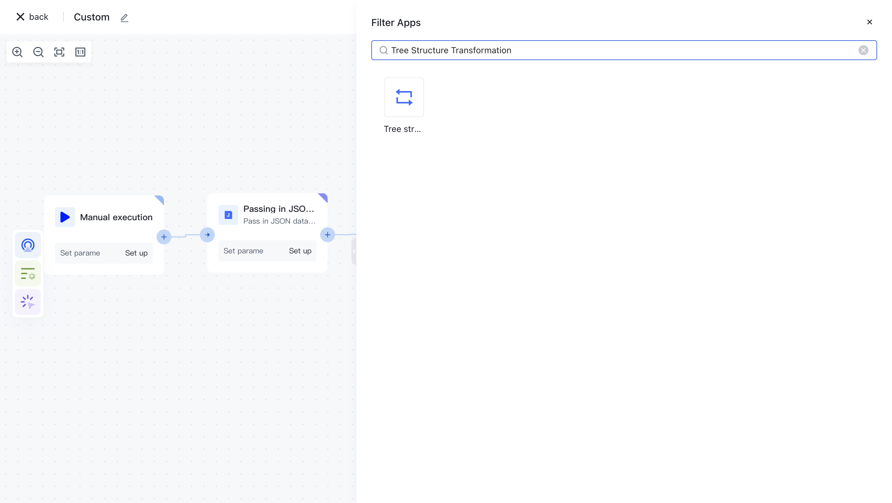
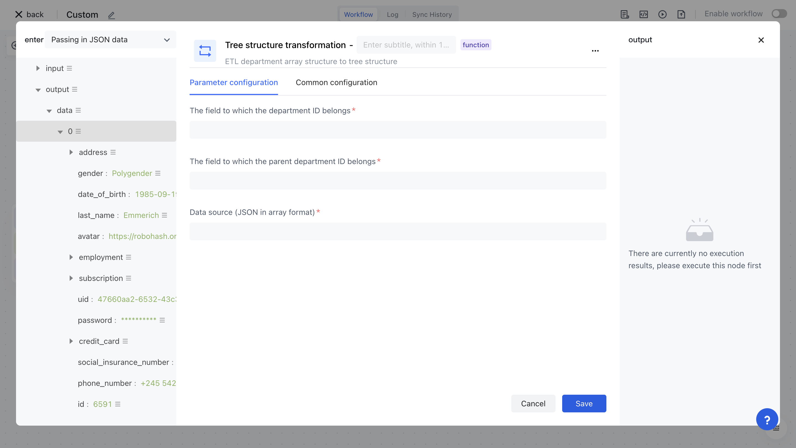
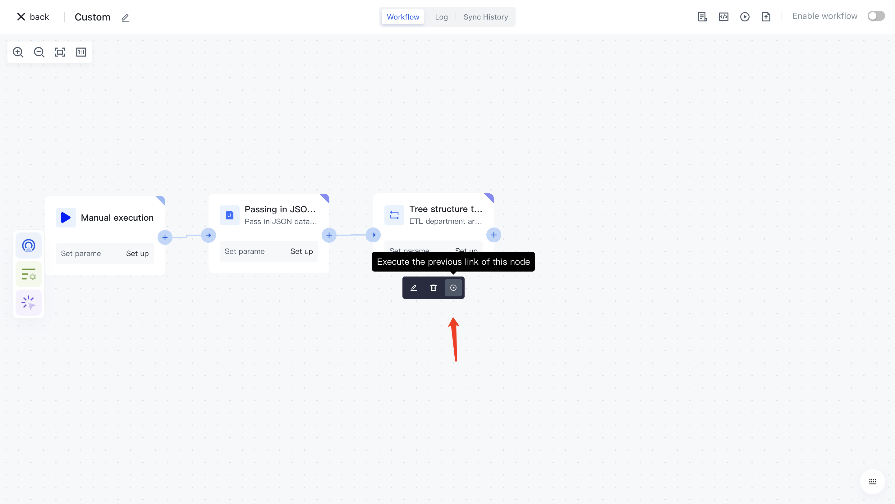
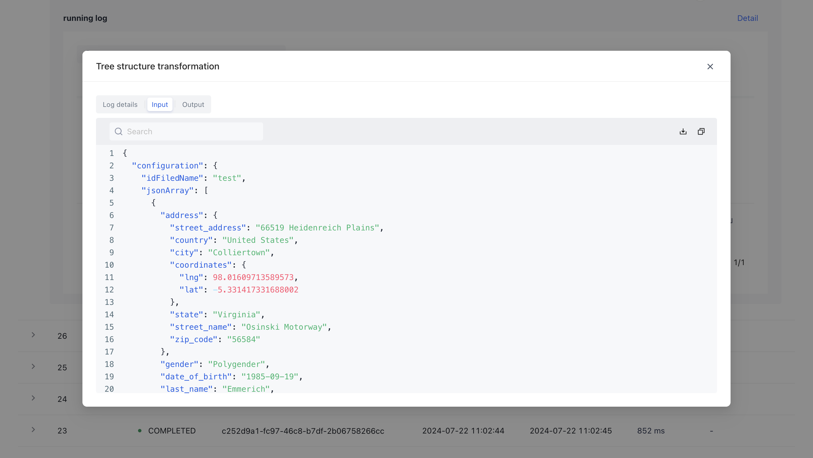

# Tree structure transformation

# Node Introduction

The Tree Structure Conversion node is mainly used to convert the JSON array structure ETL department data into a tree structure.

The nodes mainly include the following configurations:

- Data source, JSON data in array format to be processed.
- The field to which the department ID belongs.
- The field to which the parent department ID belongs.

# Quick Start

## Add node

On the Add Node page, find the "Tree Structure Transformation" application node in the "Data Processing" category.

Or apply filtering by entering the keyword "Tree Structure Conversion".

Clicking on a node will automatically add it to the workflow.

## Node configuration

Click on the node in the workflow canvas or click the "Edit" button below to enter the node's configuration page.

Configure the various configuration items of the node as follows:

- Select the "Data Source" attribute under "Output" in the "Incoming JSON Data" section on the left for assembly;
- Fill in the field that the department ID belongs to.
- Fill in the field that the parent department ID belongs to.

## Test Run

Click the "Execute the previous link of this node" button on the node to execute it.

After reconfirmation, all previous processes of this node will be executed.

After clicking the "Confirm Execution" button, you will see the message prompt "Node in Progress".

Click on the "Run Log" column, then click on the expand button to the left of the latest "Execution Batch" and "Tree Structure Conversion" nodes to view the node execution results.

