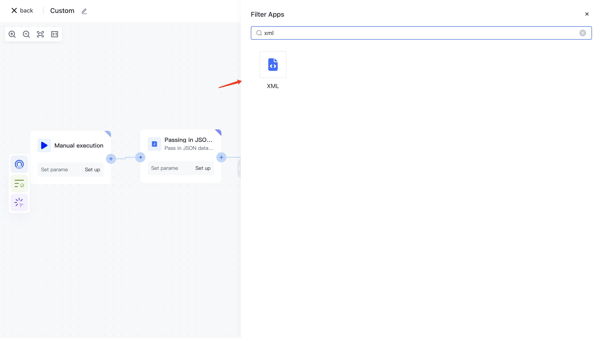
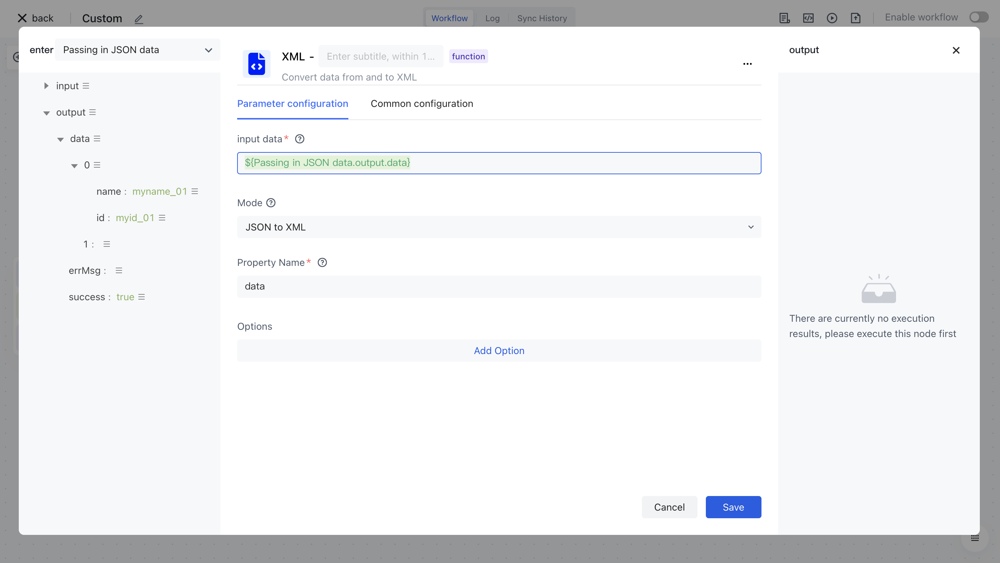
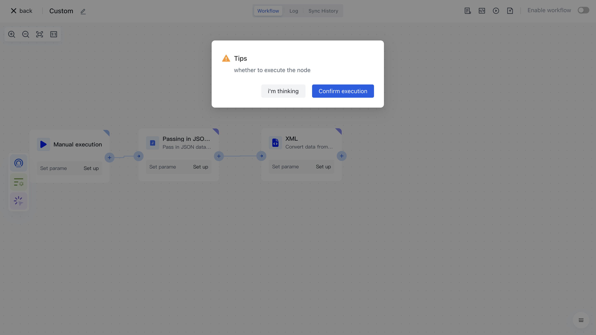

# XML

# Node Introduction

The "XML" node is mainly used to convert JSON format data sources to XML format, or to convert XML format data sources to JSON format.

The nodes mainly include the following configurations:

- Data source, the raw data to be converted, can be inputted by oneself or assembled through data assembly to assemble the data source before the current node.
- The conversion method can be selected, including "XML to JSON" and "JSON to XML".
- Attribute name, the attribute name of the converted data result, defaults to data.
- Options provide multiple option configurations for different conversion methods.

# Quick Start

## Add node

On the Add Node page, find the "XML" application node in the "Data Processing" category.

Or enter the keyword "XML" in the search box for application filtering.

Clicking on a node will automatically add it to the workflow.

## Node configuration

Click on the node in the workflow canvas or click the "Edit" button below to enter the node's configuration page.

Configure the various configuration items of the node as follows:

- Select the "Data" attribute under "Output" in the "Incoming JSON Data" section on the left for assembly.
- Select "JSON to XML" for "Conversion Method" to convert JSON format data in the data source to XML format.

## Test Run

Click the "Execute the previous link of this node" button on the node to execute it.

After reconfirmation, all previous processes of this node will be executed.

After clicking the "Confirm Execution" button, you will see the message prompt "Node in Progress".

Click on the "Run Log" column, then click on the expand button to the left of the latest "Execution Batch" and "XML" nodes to view the node execution results.

