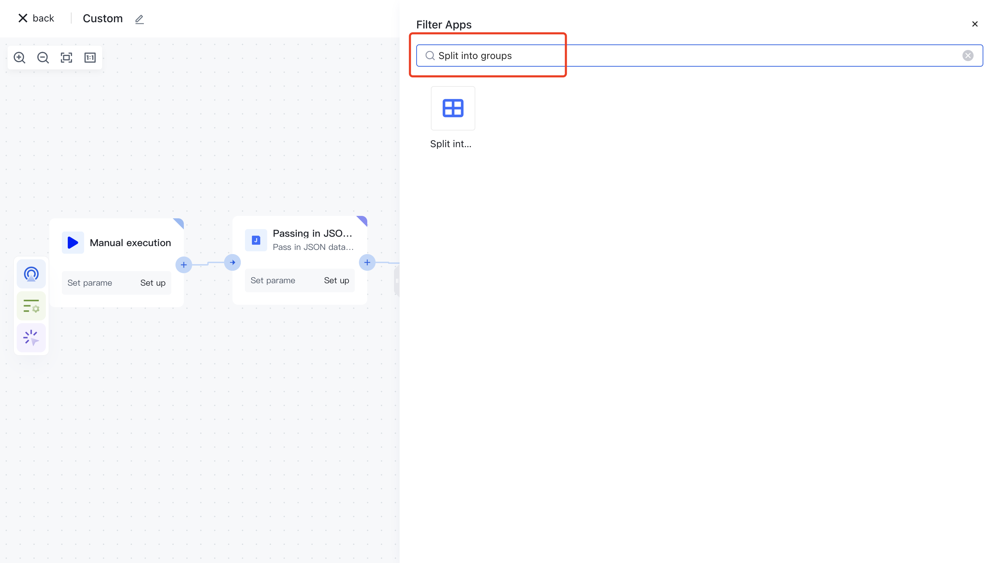
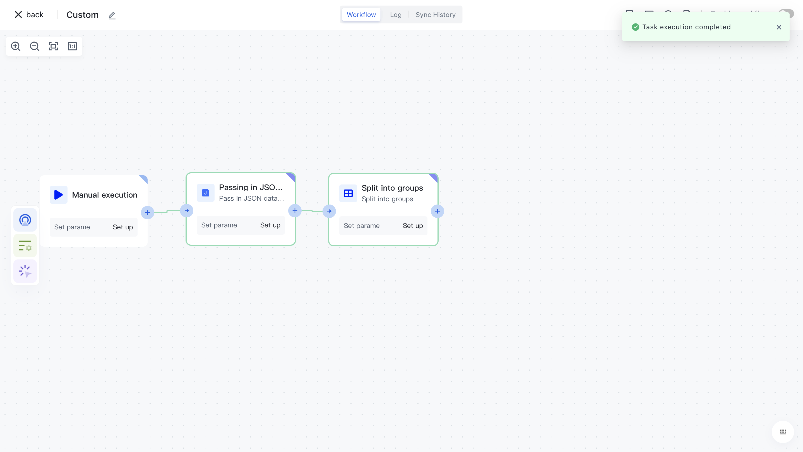

# Split array

# Node Introduction

The "Split Array" node is mainly used to split the source array into fixed sizes. After the split is completed, multiple fixed size array data will be returned.

The nodes mainly include the following configurations:

- Data source, the raw data to be split, can be inputted by oneself or assembled through data assembly to assemble the data source before the current node.
- The number of batches is set by the user to split the source array based on the number of batches.

# Quick Start

## Add node

On the Add Node page, find the "Split Array" application node in the "Data Processing" category.

Or apply filtering by entering the keyword "split array".

Clicking on a node will automatically add it to the workflow.

## Node configuration

Click on the node in the workflow canvas or click the "Edit" button below to enter the node's configuration page.

Configure the various configuration items of the node as follows:

- Select the "Data Source" attribute under "Output" in the "Incoming JSON Data" section on the left for assembly;
- Fill in 1 for each batch, indicating that each batch will contain 1 piece of data.

## Test Run

Click the "Execute the previous link of this node" button on the node to execute it.

After reconfirmation, all previous processes of this node will be executed.

After clicking the "Confirm Execution" button, you will see the message prompt "Node in Progress".

Click on the "Run Log" column, then click on the expand button on the left side of the latest "Execution Batch" and "Split Array" nodes to view the node execution results.

