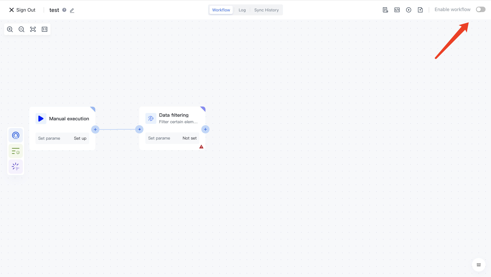

# Activate Workflow

Before executing the workflow in any way, you need to activate the workflow first, otherwise any triggering method you configure will not truly take effect.

You can click the "Activate Workflow" button in the upper right corner of the workflow details to activate this workflow:

