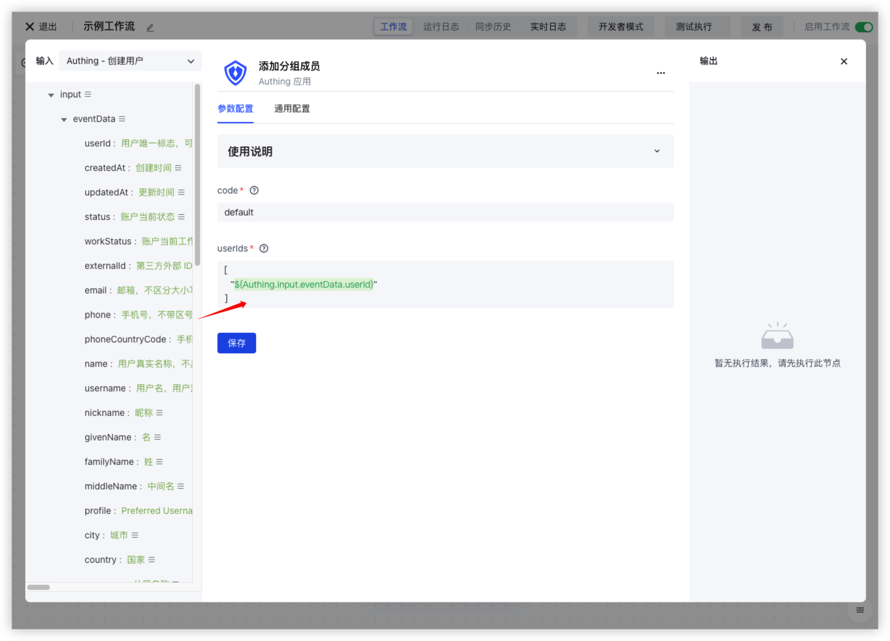

# Trigger Workflow through Events

Unlike the workflow triggering method introduced earlier, this triggering method is "passive" - when an external application system (also known as Authoring) experiences an event, it pushes an event to the Authoring workflow, using the content of the event as an input parameter to trigger the execution of the workflow.


You can see all the third-party events currently supported by Authing identity automation:


## Configure Event Connector

Before listening to external events, you need to configure the event connector. Different third-party configurations may vary, so please refer to the documentation for different event connectors.

## Select the events that need to be monitored

### Listening to third-party application events

Taking Feishu as an example, we integrated all the events supported in the Feishu system(https://open.feishu.cn/document/ukTMukTMukTM/uYDNxYjL2QTM24iN0EjN/event-list) You can choose the events you want to listen to. You can obtain the specific content of the event body through ${workflow.input.eventData}.


### Listening to internal events in Authoring

After selecting the Clothing application, you can see all the events within the Clothing system:


You can obtain the specific content of the event body through ` ${workflow. input. eventData} `:


## 制造应用事件触发 workflow 执行

After selecting the events to listen to, the next step is to create corresponding events in third-party applications (or Authoring) to trigger the execution of the workflow.

## Quick example

Here, we take adding default groups to Authing users after they are created as an example. So we first need to listen to the creation of user events under the Authing application, and then create a default group in the user pool:


Next, we will add an Authoring node in the workflow and select [Add Group Member](https://api-explorer.authing.cn/?tag=tag/%E7%AE%A1%E7%90%86%E7%94%A8%E6%88%B7%E5%88%86%E7%BB%84/API%20%E5%88%97%E8%A1%A8/operation/GroupsManagementController_addGroupMembers) This action, fill in the code of the default group we created earlier - default, and fill in the userIds with:

```typescript
[
  "${workflow.input.eventData.id}"
]
```



After completing the configuration, click on activate and create a user in Authing:


You can see that this user has been successfully added to this default group:


Looking at the execution records of the workflow again, it can be seen that the workflow was successfully triggered:


