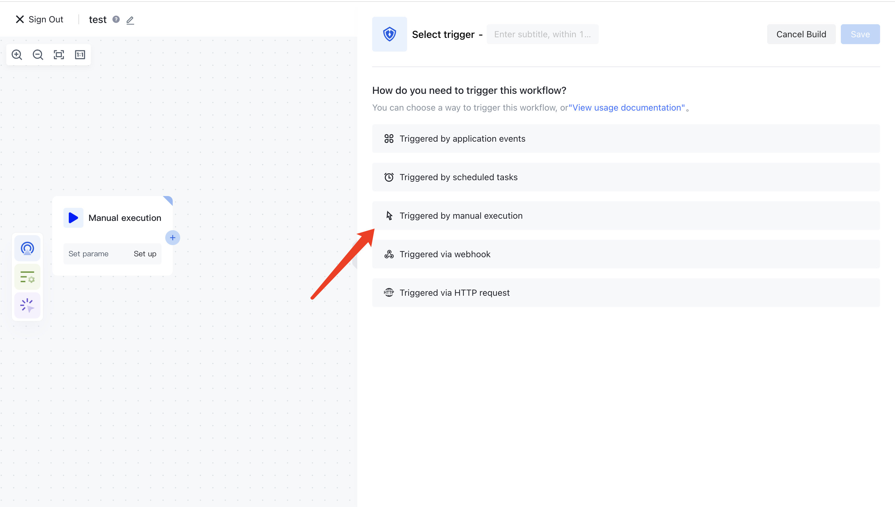
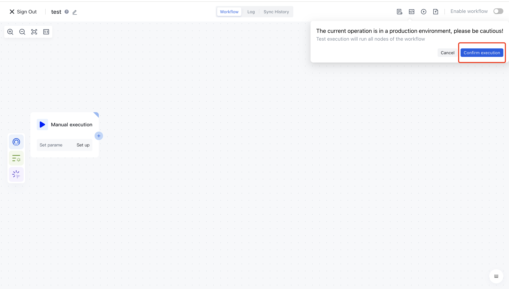

# Manual execution

Manual execution is the simplest way to execute without the need to configure any parameters:

After completing the configuration, simply click the "Test Execution" button in the upper right corner to:

